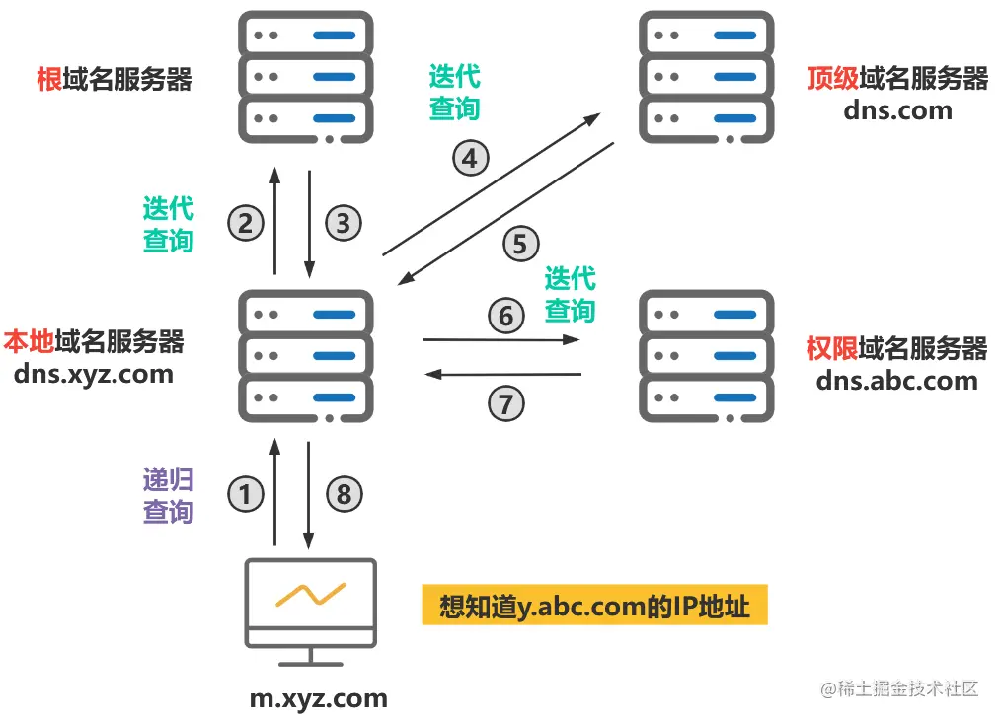

## 🌐 一、什么是 DNS 协议？

**DNS（Domain Name System）** 是互联网的“翻译官”，作用是将人类可读的 **域名（如 www.google.com）** 转换为计算机识别的 **IP 地址（如 172.217.0.0）**。

### ✅ 核心作用：

- 用户访问网站时输入域名 → 浏览器通过 DNS 查找对应的 IP 地址 → 建立连接 → 加载网页

### 🔗 举个例子：


你输入：[www.baidu.com](http://www.baidu.com)
浏览器通过 DNS 获取到对应 IP 地址：220.181.38.148
然后建立 HTTP/HTTPS 连接


---

## 🧠 二、为什么需要 DNS？

| 项         | 说明 |
|------------|------|
| 域名（如 www.baidu.com） | 方便人类记忆 |
| IP 地址（如 220.181.38.148） | 供机器定位和通信使用 |
| DNS 服务器 | 维护了域名和 IP 的映射关系，是互联网的关键基础设施 |

---

## 🔍 三、DNS 查询过程详解

DNS 查询有两种形式：**递归查询** 和 **迭代查询**

---

### 🚦 1. 递归查询（用户侧发起，逐层帮你查询到底）

#### 🧾 查询流程：

1. 主机向本地 DNS 服务器发起“递归查询”，希望它帮我查到完整的 IP。
2. 本地 DNS 服务器收到请求后，**自己不断向根 / 顶级 / 权威服务器继续查**。
3. 最终拿到 IP 后，返回给主机。

#### ✅ 特点：

- 用户 → 本地 DNS：**递归**
- 本地 DNS → 其他 DNS 服务器：也使用**递归**（“一条路问到底”）

---

### 🔁 2. 迭代查询（DNS 服务器自己一层层问，逐层响应）

#### 🧾 查询流程：

1. 主机向本地 DNS 发起递归查询（这一点不变）
2. 本地 DNS 向根服务器发起**迭代查询**，根服务器只告诉它“下一步去哪里查”
3. 本地 DNS 向顶级服务器查询，它再告诉下一跳
4. 本地 DNS 向权威服务器查询，终于拿到 IP
5. 本地 DNS 返回结果给主机

#### ✅ 特点：

- 用户 → 本地 DNS：**递归**
- 本地 DNS → 其他 DNS：**迭代**

#### 📌 图示总结：

```text
[用户] → 本地DNS（递归）  
↓  
根DNS（迭代：告诉顶级）  
↓  
顶级DNS（迭代：告诉权威）  
↓  
权威DNS（查到IP）  
↓  
本地DNS → [用户]
```


---

## 🚀 四、高速缓存机制（DNS 缓存）

为了提升解析效率、减少服务器压力，**本地 DNS 和浏览器都会缓存 DNS 查询结果**。

### 缓存位置：

- 浏览器本地缓存（优先）
- 操作系统 DNS 缓存（如 `ipconfig /displaydns`）
- 本地 DNS 服务器缓存

### TTL（生存时间）：

- 每个 DNS 记录有 TTL 时间
- TTL 到期，缓存将失效，必须重新请求

### 作用：

- 加快网站打开速度
- 减少网络查询流量
- 缓解根 / 顶级域名服务器压力

---

## 📚 五、总结知识点对比

| 项目             | 描述 |
|------------------|------|
| DNS 协议         | 通过域名获取 IP 地址的协议 |
| 查询方式         | 递归查询 / 迭代查询 |
| 缓存机制         | 提高效率，避免重复查询 |
| 根域名服务器     | 全球仅 13 个，维护顶级域名 |
| 顶级域名服务器   | 管理如 `.com`、`.cn` 等 |
| 权威域名服务器   | 提供某个具体域名的最终 IP |
| 本地 DNS 服务器  | 用户接触最频繁的 DNS，一般由 ISP 提供 |

---

## 🎯 六、常见面试问题总结

> ❓ **DNS 查询过程是怎样的？**

- 主机向本地 DNS 发起递归查询
- 本地 DNS 向根服务器迭代查询
- 得到顶级域名服务器地址 → 再次迭代 → 找到权威服务器
- 获取最终 IP 地址后返回结果（同时进行缓存）

> ❓ **为什么 DNS 查询需要缓存？**

- 降低延迟
- 减少网络流量
- 缓解上层服务器压力

> ❓ **浏览器访问网站的完整流程？**
（涉及 DNS）可参阅后续“浏览器输入 URL 到页面加载全过程”笔记。

---

## 📎 七、补充阅读

- [MDN: DNS 原理](https://developer.mozilla.org/zh-CN/docs/Glossary/DNS)
- Wireshark 抓包分析 DNS 报文
- Linux 下使用 `dig` 工具查询 DNS：  
  dig www.google.com


