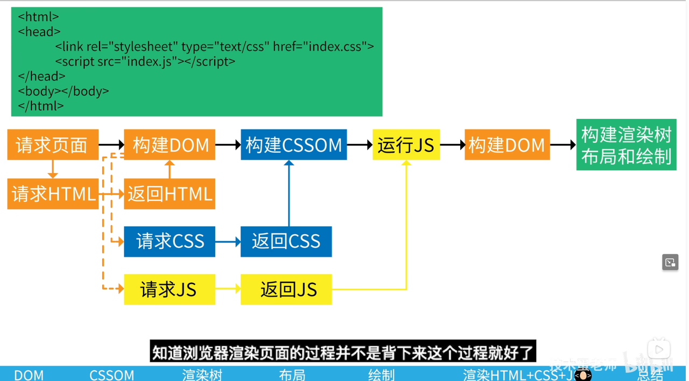
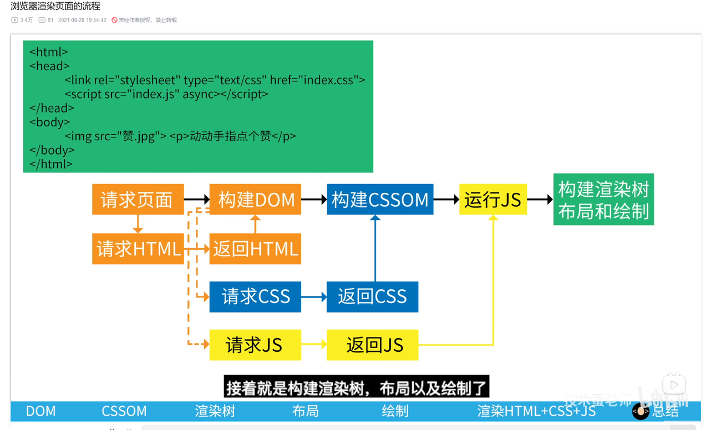
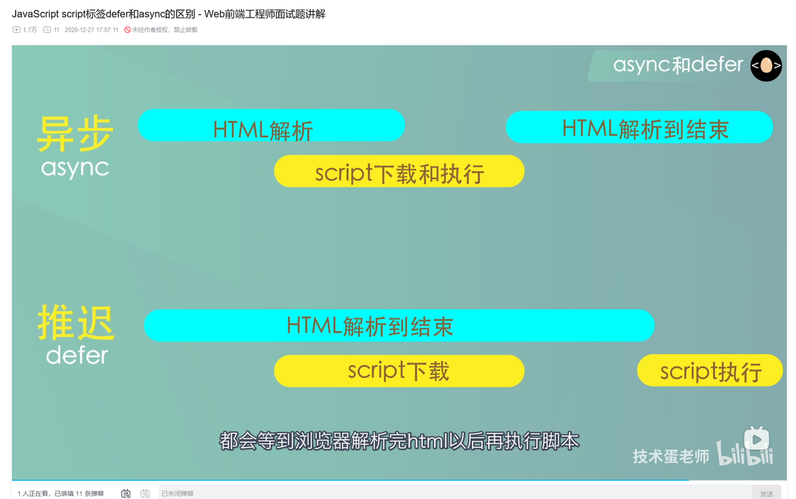

## 📍 一、流程总览图

```text
输入 URL → DNS 查询 → 建立 TCP 连接 → 发送 HTTP 请求 → 服务器响应 → 渲染页面
```




---

## 🌐 二、详细流程拆解

### 1. URL 解析

* 协议：`https`
* 域名：`www.example.com`
* 路径：`/index.html`
* 参数：`?q=test`
* 锚点：`#section`

---

### 2. DNS 查询

* 查找域名对应的 IP 地址
* 查询顺序：浏览器缓存 → hosts → 本地 DNS → 根域名服务器 → TLD → 权威服务器

---

### 3. 建立 TCP 连接（三次握手）

客户端与服务器建立 TCP 连接：

```text
客户端：SYN → 服务器：SYN-ACK → 客户端：ACK
```

> 若为 HTTPS，还需在此后执行 TLS 握手过程

---

### 4. 发送 HTTP 请求

#### 请求结构：

* **请求行**：GET /index.html HTTP/1.1
* **请求头**：User-Agent, Cookie, Accept 等
* **请求体**：仅 POST 等方法存在

---

### 5. 接收 HTTP 响应

#### 响应结构：

* **状态行**：如 HTTP/1.1 200 OK
* **响应头**：Content-Type, Set-Cookie 等
* **响应体**：HTML 页面、JSON、图片等内容

---

### 6. 浏览器渲染页面

#### 渲染流程：

1. 解析 HTML → 构建 DOM 树
2. 加载 CSS → 构建 CSSOM
3. 合并为 Render Tree
4. Layout（计算位置）
5. Paint（绘制像素）
6. GPU 合成 → 显示

---

### ⚠️ 渲染注意点

* `script` 会阻塞 DOM 解析
* CSSOM 未完成时 JS 不可执行（脚本可能依赖样式）
* `defer`：异步加载，DOM 构建后再执行
* `async`：异步加载，下载完成立即执行（不保证顺序）

---

## 💬 总结

> 一次回车，背后数十个技术组件协同工作，这正是现代 Web 的魅力。
