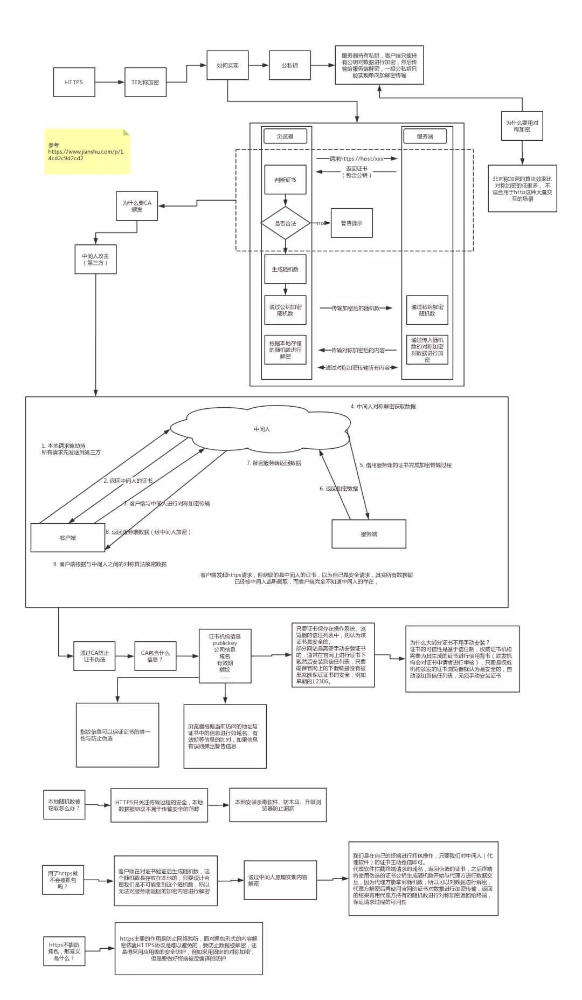

# HTTP/HTTPS 定义和区别

## 一、HTTP 核心概念

### 1. 基本定义
- **HTTP** (HyperText Transfer Protocol) 是应用层协议
- 基于**请求-响应**模型的无状态协议
- 默认端口：**80**

### 2. 重要特性
- **无状态**：每个请求独立，服务器不记录状态（解决方案：Cookie/Session）
- **明文传输**：安全性低
- **灵活可扩展**：支持任意数据类型传输
- **无连接**：早期版本每次请求后断开（HTTP/1.1 默认保持连接）

### 3. 请求方法
| 方法    | 作用                  | 幂等性 | 安全性 |
|---------|-----------------------|--------|--------|
| GET     | 获取资源              | 是     | 是     |
| POST    | 提交数据              | 否     | 否     |
| PUT     | 更新完整资源          | 是     | 否     |
| DELETE  | 删除资源              | 是     | 否     |
| PATCH   | 部分更新资源          | 否     | 否     |

## 二、HTTPS 核心机制

### 1. 安全基础
- HTTPS = HTTP + SSL/TLS 加密层
- HTTPS是HTTP + SSL/TLS，通过 *SSL* 证书来验证服务器的身份，并为浏览器和服务器之间的通信进行加密; *SSL* 位于tcp/ip协议中，浏览器和服务器在使用 SSL 建立连接时需要选择一组恰当的加密算法来实现安全通信，为数据通讯提供安全支持
- 默认端口：**443**
- 核心功能：
   ✓ 数据加密（防窃听）
   ✓ 身份认证（防冒充）
   ✓ 完整性校验（防篡改）
- SSL(Secure Sockets Layer 安全套接字协议),及其继任者传输层安全（Transport Layer Security，TLS）是为网络通信提供安全及数据完整性的一种安全协议​
  机密性：混合算法（对称加密+非对称加密）​
  
  完整性：摘要算法​
  
  身份认证：数字签名（私钥加密，公钥解密）​
  
  不可否定：数字签名​
- CA验证机构：数字证书认证机构处于客户端与服务器双方都可信赖的第三方机构的立场​  

Q: HTTPS 为什么安全？  ​  

A: 因为 HTTPS 保证了传输安全，防止传输过程被监听、防止数据被窃取，可以确认网站的真实性。​  

Q: HTTPS 的传输过程是怎样的？ ​  

A: 客户端发起 HTTPS 请求，服务端返回证书，客户端对证书进行验证，验证通过后本地生成用于改造对称加密算法的随机数，通过证书中的公钥对随机数进行加密传输到服务端，服务端接收后通过私钥解密得到随机数，之后的数据交互通过对称加密算法进行加解密。​  

Q: 为什么需要证书？​  

A: 防止“中间人”攻击，同时可以为网站提供身份证明。​  

Q: 使用 HTTPS 会被抓包吗？ ​  

A: 会被抓包，HTTPS 只防止用户在不知情的情况下通信被监听，如果用户主动授信，是可以构建“中间人”网络，代理软件可以对传输内容进行解密。
### 2. 加密流程
1. **SSL握手**：
   - 客户端发送支持的加密算法
   - 服务器选择算法并返回证书
2. **证书验证**：
   - 客户端验证CA证书有效性
3. **密钥交换**：
   - 通过非对称加密协商对称密钥
4. **加密通信**：
   - 使用对称密钥加密数据传输

### 3. 证书要点
- 由CA机构颁发
- 包含：公钥、所有者信息、有效期
- 浏览器会验证证书链

## 三、关键区别对比

1. **加密方式**：
   - HTTP：明文传输
   - HTTPS：TLS/SSL加密

2. **性能影响**：
   - HTTPS增加约10%的请求时间（握手过程）
   - 需要服务器更多计算资源

3. **SEO影响**：
   - Google将HTTPS作为排名信号
   - 现代浏览器对HTTP页面标记"不安全"

## 四、前端相关考点

### 1. 混合内容问题
```javascript
// 现象：HTTPS页面加载HTTP资源会被浏览器阻止
// 解决方案：
1. 所有资源使用相对协议 
2. 强制升级HTTP请求（HSTS响应头）
```

### 2. 性能优化建议
- 启用HTTP/2（需要HTTPS）
- 会话复用（减少TLS握手开销）
- OCSP Stapling（加速证书验证）

### 3. 开发环境配置
```bash
# 本地开发使用自签名证书
openssl req -x509 -newkey rsa:2048 -nodes -keyout key.pem -out cert.pem -days 365
```

## 五、经典面试题
1. **为什么HTTPS采用混合加密？**
   - 非对称加密保证密钥传输安全
   - 对称加密提高数据传输效率

2. **HTTP/2必须使用HTTPS吗？**
   - 规范不强制，但所有浏览器实现都要求HTTPS

3. **如何防止中间人攻击？**
   - 证书验证 + HSTS预加载列表

4. **描述从输入URL到页面加载的HTTPS过程**
   （考察TCP连接 + SSL握手 + 资源请求全流程）


> 📌 **面试技巧**：结合具体场景回答，如："在我的电商项目中，支付模块必须使用HTTPS来防止..."
