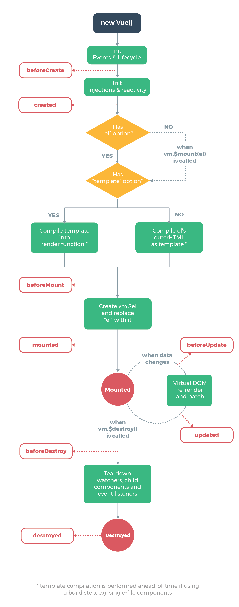

Vue 生命周期详解
================

Vue 的生命周期是组件实例从创建到销毁的过程，每个阶段都会自动调用对应的钩子函数（也称为生命周期钩子），开发者可以在这些钩子中编写逻辑来参与到组件生命周期的管理中。

---

## 一、Vue 生命周期概览（Vue 2 和 Vue 3 通用）

整个生命周期大致可以分为四个阶段：

1. **创建阶段**：初始化事件、数据、生命周期等；
2. **挂载阶段**：将虚拟 DOM 渲染为真实 DOM；
3. **更新阶段**：响应式数据变更后，组件重新渲染；
4. **销毁阶段**：解除绑定、销毁组件。

---

## 二、生命周期钩子详解

### 1. `beforeCreate`

- **调用时机**：实例初始化之后，数据观测 (data observer) 和事件配置之前。
- **常用场景**：无法访问 `data`、`computed`、`watch`、`methods`，很少使用。

```js
beforeCreate() {
  console.log('组件实例刚刚被创建，还未初始化数据');
}
```

---

### 2. `created`

* **调用时机**：实例创建完成后，数据观测和事件配置已完成，但尚未挂载。
* **常用场景**：可以进行数据初始化、发送 AJAX 请求等。

```js
created() {
  console.log('组件实例已创建，数据已可用');
}
```

---

### 3. `beforeMount`

* **调用时机**：在挂载开始之前被调用，`$el` 还未被替换。
* **常用场景**：通常不常用，因为数据已经准备好但页面尚未渲染。

```js
beforeMount() {
  console.log('准备开始挂载 DOM');
}
```

---

### 4. `mounted`

* **调用时机**：挂载完成后，DOM 已渲染到页面。
* **常用场景**：操作 DOM、初始化第三方库（如 ECharts、Swiper）、发送数据请求。

```js
mounted() {
  console.log('DOM 已挂载，可以操作页面元素');
}
```

---

### 5. `beforeUpdate`

* **调用时机**：数据更新，DOM 重新渲染前。
* **常用场景**：查看数据变更前后的状态，进行差异分析。

```js
beforeUpdate() {
  console.log('数据更新前，页面还未重新渲染');
}
```

---

### 6. `updated`

* **调用时机**：数据更新，DOM 重新渲染后。
* **常用场景**：操作更新后的 DOM、进行动画、数据可视化更新等。

```js
updated() {
  console.log('数据已更新，页面也重新渲染完成');
}
```

---

### 7. `beforeDestroy`（Vue 2） / `beforeUnmount`（Vue 3）

* **调用时机**：组件销毁前。
* **常用场景**：取消定时器、清除事件监听、解绑全局状态等。

```js
beforeDestroy() {
  console.log('组件即将销毁');
}
```

---

### 8. `destroyed`（Vue 2） / `unmounted`（Vue 3）

* **调用时机**：组件销毁后。
* **常用场景**：断开与其他组件的连接，释放内存。

```js
destroyed() {
  console.log('组件已销毁');
}
```

---

## 三、Vue 3 生命周期变化

在 Vue 3 中，生命周期钩子名称稍有变化，配合 Composition API 使用如下：

```js
import { onMounted, onUnmounted } from 'vue';

export default {
  setup() {
    onMounted(() => {
      console.log('Vue 3 组件已挂载');
    });

    onUnmounted(() => {
      console.log('Vue 3 组件已卸载');
    });
  }
};
```

完整对照表如下：

| Vue 2 生命周期    | Vue 3 Composition API |
| ------------- | --------------------- |
| beforeCreate  | 不再提供（setup 前）         |
| created       | 不再提供（setup 中）         |
| beforeMount   | onBeforeMount         |
| mounted       | onMounted             |
| beforeUpdate  | onBeforeUpdate        |
| updated       | onUpdated             |
| beforeDestroy | onBeforeUnmount       |
| destroyed     | onUnmounted           |

---

## 四、生命周期可视化图示

> 可配合官方文档图解理解：[https://v2.cn.vuejs.org/v2/guide/instance.html#生命周期图示](https://v2.cn.vuejs.org/v2/guide/instance.html#生命周期图示)
  



---

## 五、常见使用场景总结

| 场景             | 推荐生命周期钩子        |
| -------------- | --------------- |
| 初始化数据          | `created`       |
| DOM 操作 / 初始化图表 | `mounted`       |
| 清除定时器、解绑事件等    | `beforeDestroy` |
| 获取最新 DOM 状态    | `updated`       |
| Vue 3 中使用生命周期  | `onXXX` 组合式 API |

---

## 六、总结

Vue 生命周期钩子为组件提供了灵活的生命周期管理点，不同阶段适合不同操作：

* 数据相关：`created`
* DOM相关：`mounted` / `updated`
* 清理相关：`beforeDestroy` / `destroyed`

