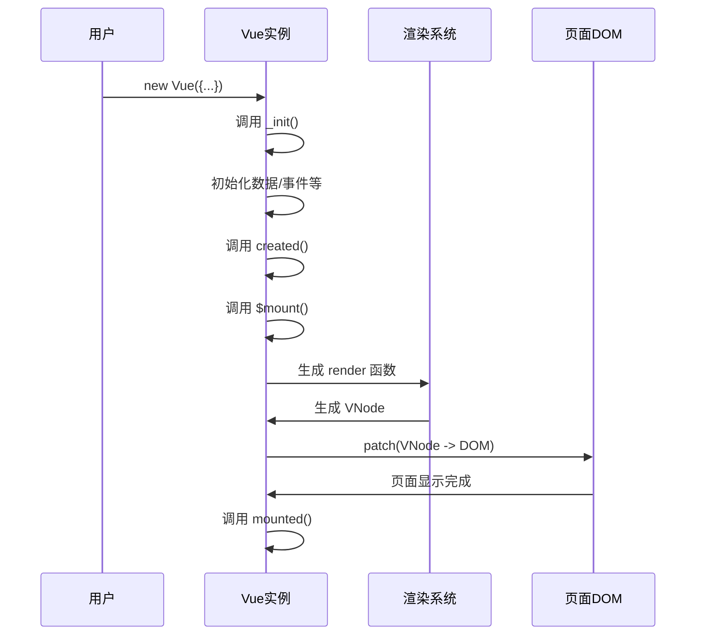

# Vue 实例挂载时发生了什么？

当我们执行 `new Vue({...}).$mount('#app')` 或使用 `el` 选项时，Vue 实例会完成一系列初始化与挂载过程，最终将模板渲染为真实 DOM 节点，并显示到页面上。

---

## 一、创建阶段：new Vue 时发生了什么？

当执行 `new Vue(options)` 时，会调用 Vue 内部的 `_init` 方法，它是 Vue 初始化的起点：

### `_init` 做了哪些事？

- 初始化生命周期相关属性（如 `$parent`, `$children`, `$refs`）
- 初始化事件系统（如 `$on`, `$off`, `$emit`）
- 初始化响应式系统（如 `data`, `props`, `computed`, `watch`, `methods`）
- 调用生命周期钩子函数 `beforeCreate` 和 `created`
- 最后调用 `$mount` 进入挂载阶段

```js
const vm = new Vue({
  data: { msg: 'hello' },
  created() {
    console.log('created called');
  }
}).$mount('#app');
```

---

## 二、挂载阶段：\$mount 做了什么？

当执行 `$mount` 时，Vue 会将组件挂载到 DOM 中，流程大致如下：

### 1. 判断是否存在 `render` 函数

* 如果用户写了 `render`，直接使用它生成虚拟 DOM。
* 如果用户写了 `template` 或指定了 `el`，Vue 会将其编译成 `render` 函数。

> ⚠️ 编译模板为 render 函数是一个耗时过程，建议在构建阶段用 `vue-loader` 预编译。

---

### 2. 调用 `mountComponent` 执行真正挂载逻辑

```js
mountComponent(vm, el);
```

在这个函数中，核心是定义了 `updateComponent` 函数：

```js
const updateComponent = () => {
  const vnode = vm._render();      // 生成虚拟 DOM
  vm._update(vnode);               // 将虚拟 DOM 转换为真实 DOM
};
```

这个函数会被传入观察者（`Watcher`）中：

```js
new Watcher(vm, updateComponent, noop, null, true);
```

这样当依赖的数据发生变化时，会自动触发 `updateComponent` 来更新页面，实现响应式。

---

## 三、渲染过程简要总结

1. **模板编译为 render 函数**（如未指定 render）
2. **执行 render 函数生成 VNode（虚拟 DOM）**
3. **执行 `_update`，将 VNode 转换为真实 DOM**
4. **将真实 DOM 挂载到页面中**

---

## 四、涉及的生命周期钩子

| 阶段    | 生命周期钩子         | 描述            |
| ----- | -------------- | ------------- |
| 初始化   | `beforeCreate` | 初始化前          |
| 数据已注入 | `created`      | 初始化完成，未挂载 DOM |
| 挂载前   | `beforeMount`  | 模板编译完，但未渲染    |
| 挂载后   | `mounted`      | 页面已渲染完毕       |

---

## 五、总结：整个挂载流程图解



---

## 六、关键词速查

* `_init`：Vue 初始化方法，核心入口
* `$mount`：触发挂载流程的方法
* `mountComponent`：真正执行挂载的函数
* `_render`：将模板生成 VNode
* `_update`：将 VNode 渲染为真实 DOM
* `Watcher`：依赖追踪并触发视图更新

---

## 七、常见面试延伸问题

| 问题                                | 简要回答                                                          |
| --------------------------------- | ------------------------------------------------------------- |
| `beforeCreate` 和 `created` 有什么区别？ | `beforeCreate` 时数据和事件未初始化；`created` 时已可访问 `data` 和 `methods`。 |
| render 是干嘛的？                      | 是一个函数，返回虚拟 DOM 树（VNode）结构。                                    |
| 什么是虚拟 DOM？                        | 用 JS 对象描述真实 DOM 树结构，提高渲染性能。                                   |
| `template` 和 `render` 的关系？        | `template` 会编译为 `render` 函数执行。                                |
| \$mount 和 el 区别？                  | `$mount` 是显式挂载，`el` 是配置式自动挂载。                                 |
