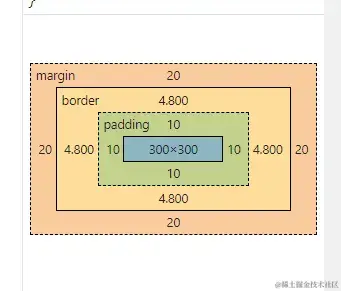

# CSS 中的盒模型（Box Model）

## 一、概念定义

CSS 盒模型是网页中用于处理元素尺寸和布局的核心概念。每个 HTML 元素在页面中都可以被看作一个矩形的盒子，这个盒子由以下几部分组成：

- **Content（内容区域）**：元素的实际内容（如文本、图像）。
- **Padding（内边距）**：内容区域与边框之间的空白区域。
- **Border（边框）**：围绕内边距的边框。
- **Margin（外边距）**：边框与其他元素之间的空白区域。  


  
- margin/padding的值为4个时：margin/padding：上、右 、下 、左；（顺时针方向）
- margin/padding的值为3个时：margin/padding：上 、右= 左 、下；
- margin/padding的值为2个时：margin/padding：上=下 、左=右；
- margin/padding的值为1个时：margin/padding：上=右=下=左；
```css
margin：20px,30px,40px,60px ; (上20px， 右3px， 下 40px，左60px)
margin：20px,30px,40px ; (上20px， 左、右30px， 下40px)
margin：20px,30px;  (上、下20px，左、右30px)
margin：20px；（上、下、左、右各20px）
```
## 二、核心原理

盒模型有两种常见模式：

1. **标准盒模型（W3C 盒模型）**：
   - 元素实际占用的宽度 = `content + padding + border`
   - `width`/`height` 只定义内容区域的大小

2. **怪异盒模型（IE 盒模型）**：
   - 元素实际占用的宽度 = `width`（已包含 padding 和 border）
   - 通过设置 `box-sizing: border-box` 来启用该行为

```css
/* 使用标准盒模型 */
box-sizing: content-box; 

/* 使用怪异盒模型 */
box-sizing: border-box;
```

## 三、应用场景

* **标准模型**：更精确控制内容尺寸，适用于组件开发
* **怪异模型**：更适合响应式布局，避免盒子撑破容器
* 常配合 `reset.css` 或 `* { box-sizing: border-box; }` 统一设置全局盒模型行为

## 四、代码示例

```html
<style>
  .box {
    width: 200px;
    padding: 20px;
    border: 10px solid black;
    margin: 30px;
    box-sizing: content-box; /* or border-box */
    background: lightblue;
  }
</style>

<div class="box">Hello Box Model</div>
```

* `content-box`：实际占用宽度 = 200 + 20*2 + 10*2 = 260px
* `border-box`：实际占用宽度 = 200px（padding 和 border 包含在内）

## 五、常见误区

* **误区一**：只设置 `width: 100%` 就能填满父容器 —— 忽略了 padding 和 border
* **误区二**：忽略不同 box-sizing 对布局的影响，导致元素溢出或偏移
* **误区三**：设置 margin 叠加不明确，尤其是垂直方向（外边距合并）

## 六、面试延伸

### ❓ 1. `box-sizing` 的作用和默认值？

#### ✅ 作用：

`box-sizing` 用于设置元素在计算宽高时是否包含 `padding` 和 `border`。

* `content-box`（默认值）：
  盒子大小 = `content` 宽高，不包括 padding 和 border（需额外加上）。
* `border-box`：
  盒子大小 = `content + padding + border`。设置后 padding 和 border 会“挤占”内容区域。

#### ✅ 默认值：

```css
box-sizing: content-box;
```

#### ✅ 推荐做法（现代项目中）：

开发中通常统一设置所有元素为 `border-box`，可有效避免盒子宽度溢出问题：

```css
*,
*::before,
*::after {
  box-sizing: border-box;
}
```

---

### ❓ 2. 如何解决盒子宽度撑破容器？

常见导致宽度撑破的原因有：

* 子元素设置了 `width`，又加上了 `padding` 和 `border`
* 没有设置 `box-sizing: border-box`

#### ✅ 解决方法：

* **设置 `box-sizing: border-box`**
  让 padding、border 包含在 `width` 内，不会撑破容器。

```css
.box {
  box-sizing: border-box;
  width: 100%;
  padding: 20px;
}
```

* **使用 `overflow: hidden` 或 `auto`**
  用于清除内部浮动，间接防止内容溢出。

---

### ❓ 3. 什么是垂直外边距合并（margin collapsing）？

#### ✅ 定义：

当两个垂直方向相邻的块级元素的 `margin` 相遇时，它们之间的外边距会**合并为一个外边距**，取两者中**较大者**（不是相加）。

#### ✅ 合并场景包括：

1. 相邻兄弟块元素之间的垂直 `margin`：

   ```html
   <div style="margin-bottom: 20px;"></div>
   <div style="margin-top: 30px;"></div>
   <!-- 实际间距是30px 而不是50px -->
   ```

2. 父子元素的垂直 `margin` 合并：
   如果父元素没有 `padding/border/overflow: hidden` 等，子元素的 `margin-top` 会传递给父元素。

#### ✅ 避免合并的方法：

* 设置父元素 `padding-top` 或 `border-top`
* 父元素添加 `overflow: hidden` 或 `overflow: auto`
* 设置 `display: flow-root`（创建BFC）

---

### ❓ 4. 用盒模型原理解释一个三栏布局的实现方式？

#### ✅ 三栏布局目标：

* 左侧固定宽度 `200px`
* 右侧固定宽度 `200px`
* 中间区域自适应宽度

#### ✅ 方法一：Flex 实现（推荐现代方案）

```html
<div class="container">
  <div class="left">左侧</div>
  <div class="center">中间</div>
  <div class="right">右侧</div>
</div>
```

```css
.container {
  display: flex;
}
.left, .right {
  width: 200px;
}
.center {
  flex: 1; /* 占据剩余空间 */
}
```

#### ✅ 方法二：经典浮动 + 盒模型方案（传统做法）

```html
<div class="left">左侧</div>
<div class="right">右侧</div>
<div class="center">中间</div>
```

```css
.left {
  float: left;
  width: 200px;
}
.right {
  float: right;
  width: 200px;
}
.center {
  margin: 0 200px; /* 预留左右宽度 */
}
```

#### ✅ 解释：

* 利用了盒模型中 `margin` 的特性为中间区域预留空间；
* 使用 `float` 将两边元素脱离文档流；
* 中间区域使用正常流、设置 `margin` 防止被覆盖。


## 七、总结

* CSS 盒模型包括：内容、内边距、边框、外边距四部分
* 盒模型决定了元素在页面中的空间占用
* 合理设置 `box-sizing` 可以避免许多布局问题
* 掌握盒模型是理解所有 CSS 布局（如 Flex、Grid、定位等）的基础
