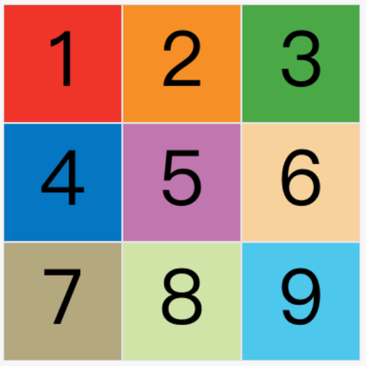
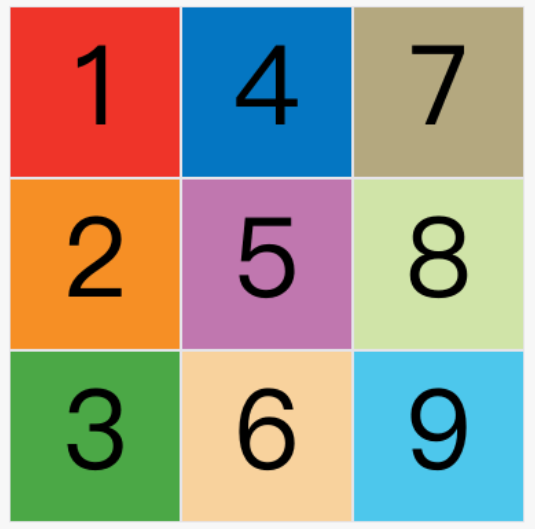

## 🧩 1. 容器属性（Container Properties）

### `display: grid | inline-grid`

创建一个网格容器。

```css
.wrapper {
  display: grid;
}
```

---

### `grid-template-columns` 和 `grid-template-rows`

设置**列宽**与**行高**。

```css
.wrapper {
  display: grid;
  grid-template-columns: 200px 200px 200px;
  grid-template-rows: 50px 50px;
}
```

#### ✅ 简写技巧：`repeat()`

```css
grid-template-columns: repeat(3, 200px); 
grid-template-rows: repeat(2, 50px);
```

#### 🔧 自动填充：`auto-fill`

```css
grid-template-columns: repeat(auto-fill, 200px);
```

#### 📏 比例单位：`fr`

```css
grid-template-columns: 200px 1fr 2fr; 
```

#### 📐 区间长度：`minmax()`

```css
grid-template-columns: minmax(100px, 1fr);
```

#### 🤖 自动计算：`auto`

```css
grid-template-columns: 100px auto 100px;
```

---

### `grid-gap`、`grid-row-gap`、`grid-column-gap`

设置网格单元格之间的**间距**。

```css
grid-gap: 10px;
grid-row-gap: 10px;
grid-column-gap: 20px;
```

---

### `grid-template-areas`

设置命名区域布局，直观可读性高。

```css
.container {
  display: grid;
  grid-template-areas:
    'header header header'
    'sidebar main main'
    'footer footer footer';
}
```

---

### `grid-auto-flow`

控制自动放置元素的方向（默认 row）。  


```css
grid-auto-flow: column;
```

---

### `justify-items` / `align-items` / `place-items`

* `justify-items`: 控制子项**水平**对齐
* `align-items`: 控制子项**垂直**对齐
* `place-items`: 两者简写

```css
place-items: center;
```

---

### `justify-content` / `align-content` / `place-content`

控制整个网格内容在容器中对齐方式。

```css
justify-content: space-between;
align-content: center;
```

---

### `grid-auto-columns` / `grid-auto-rows`

定义隐式生成的行/列尺寸：

```css
grid-auto-rows: 100px;
```

---

## 🧩 2. 子项属性（Item Properties）

### `grid-column-start` / `grid-column-end`

### `grid-row-start` / `grid-row-end`

设置子项在网格中的位置（可实现跨行/跨列）：

```css
.item-1 {
  grid-column-start: 2;
  grid-column-end: 4;
}
```

---

### `grid-area`

可以用于命名区域匹配 `grid-template-areas` 或简写 start/end：

```css
.item-1 {
  grid-area: e;
}
```

或：

```css
.item {
  grid-area: row-start / column-start / row-end / column-end;
}
```

---

### `justify-self` / `align-self` / `place-self`

控制单个子项的对齐方式：

```css
.item {
  place-self: center;
}
```

---

## 🎯 Grid 与 Flex 的对比

| 属性     | Grid         | Flex              |
| ------ | ------------ | ----------------- |
| 布局维度   | 二维（行 & 列）    | 一维（行 或 列）         |
| 主轴方向   | 自定义网格线       | 单一主轴              |
| 控制能力   | 精确控制每个单元格    | 控制元素流动            |
| 项目位置控制 | 支持区域命名和跨行/跨列 | 依赖顺序和 grow/shrink |

---

## 📘 延伸阅读推荐

* [MDN: CSS Grid Layout](https://developer.mozilla.org/en-US/docs/Web/CSS/CSS_grid_layout)
* [CSS-Tricks Grid Guide](https://css-tricks.com/snippets/css/complete-guide-grid/)
