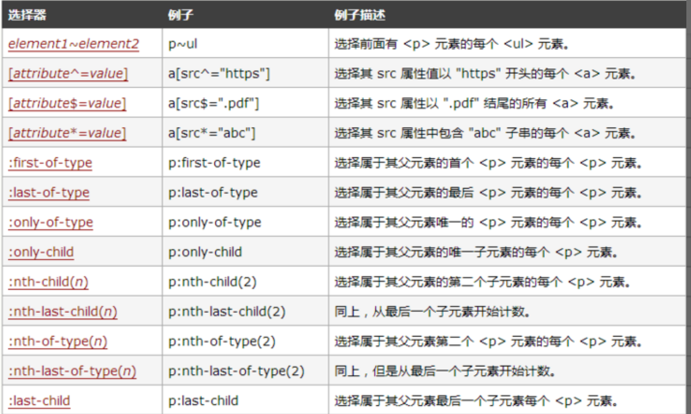

CSS3 是 CSS（层叠样式表）的重要里程碑版本，引入了许多强大且现代的特性，使得网页样式的表达能力更强，动画和布局更易实现，同时提高了前端开发效率。本文将系统性地梳理 CSS3 的核心新特性及其应用场景。

## 一、选择器增强

CSS3 引入了更多高级选择器，使得 DOM 元素选择更加精细。

- `:nth-child(n)`：选中第 n 个子元素
- `:not(selector)`：排除某些元素
- 属性选择器扩展：
  - `[attr^="val"]`：以 `val` 开头
  - `[attr$="val"]`：以 `val` 结尾
  - `[attr*="val"]`：包含 `val`

示例：
```css
li:nth-child(odd) {
  background: #f5f5f5;
}
```  


## 二、边框与背景增强

* `border-radius`：圆角边框
* `box-shadow`：盒子阴影 
    - 水平阴影
    - 垂直阴影
    - 模糊距离(虚实)
    - 阴影尺寸(影子大小)
    - 阴影颜色
    - 内/外阴影
* `background-size`：背景图大小
* 多重背景支持：

```css
background-image: url(bg1.png), url(bg2.png);
```

## 三、颜色与渐变

* `rgba()` 和 `hsla()`：支持透明度与色相
* 渐变：

  * `linear-gradient()`
  * `radial-gradient()`

示例：

```css
background: linear-gradient(to right, #4facfe, #00f2fe);
```

## 四、2D/3D 变换（Transform）

* 平移 `translate(x, y)`
* 缩放 `scale(x, y)`
* 旋转 `rotate(deg)`
* 倾斜 `skew(x, y)`
* 3D 支持：`rotateX()`、`rotateY()` 等

```css
transform: rotate(45deg) scale(1.2);
```

## 五、过渡与动画（Transition & Animation）

* `transition`: 简化 hover 动效
* `@keyframes`：定义动画关键帧
* `animation`：控制动画属性

```css
button {
  transition: background 0.3s ease;
}
```

```css
@keyframes fade-in {
  from { opacity: 0; }
  to { opacity: 1; }
}
```

## 六、弹性盒子（Flexbox）

Flexbox 是 CSS3 中的重要布局机制，用于一维空间布局（行或列）。

* `display: flex`
* `justify-content`
* `align-items`
* `flex-grow / shrink / basis`

示例：

```css
.container {
  display: flex;
  justify-content: space-between;
  align-items: center;
}
```

## 七、媒体查询（Media Queries）

实现响应式设计的基础：

```css
@media (max-width: 768px) {
  .container {
    flex-direction: column;
  }
}
```

## 八、字体与文本增强

* `@font-face`：自定义字体
* `text-shadow`：文本阴影
* 多列文本 `column-count`、`column-gap`

```css
@font-face {
  font-family: 'MyFont';
  src: url('myfont.woff2') format('woff2');
}
```

## 九、盒模型扩展（Box-sizing）

CSS3 中常用 `box-sizing: border-box` 来控制元素尺寸计算方式：

```css
* {
  box-sizing: border-box;
}
```

## 十、其他实用增强

* `calc()`：计算表达式
* `opacity`：设置透明度
* `rem` 和 `em`：单位增强
* `clamp()`：动态限制值大小（CSS4 但被广泛使用）
* `object-fit`：图片裁切控制

---

## 总结

CSS3 的新特性从选择器、布局、动画到响应式设计都带来了革命性的提升，极大增强了前端页面的表现力和可维护性。掌握这些能力是现代前端开发的基础。
