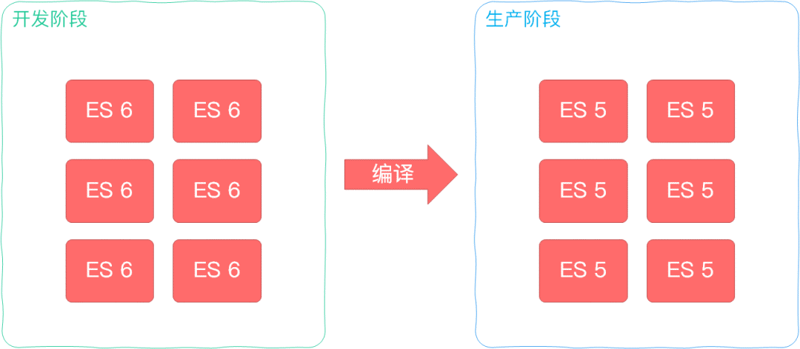

# Webpack 是什么？它解决了什么问题？

在现代前端开发中，**Webpack** 已成为不可或缺的工具。它不仅仅是一个打包工具，更是一整套前端工程化解决方案，旨在高效管理和维护项目中的每一个资源。

## 一、模块化的演进：为什么需要 Webpack？

### ✅ 初代模块化：script 标签手动引入

在最初的开发方式中，我们通过将功能拆分到不同的 JS 文件中，再使用多个 `<script>` 标签手动引入模块：

```html
<script src="module-a.js"></script>
<script src="module-b.js"></script>
```

**缺点：**

* 所有变量和函数都暴露在全局作用域，易污染命名空间。
* 模块间没有明确的依赖关系，顺序靠人为管理。
* 维护困难，容易出错。

### ✅ 命名空间方案

通过将模块内容挂载到一个全局对象中，避免变量冲突：

```js
window.moduleA = {
  method1: function () {
    console.log('moduleA#method1')
  }
}
```

**仍存在的问题：**

* 全局污染未彻底解决
* 依赖管理依旧混乱

### ✅ 立即执行函数（IIFE）+ 参数注入方式

```js
(function ($) {
  const name = 'module-a'

  function method1() {
    console.log(name + '#method1')
    $('body').animate({ margin: '200px' })
  }

  window.moduleA = { method1 }
})(jQuery)
```

这样解决了**私有作用域**的问题，但：

* 依赖关系仍需手动维护
* 模块加载不受代码控制，仍依赖 HTML 中 script 的顺序
* 无法实现自动化优化、合并压缩等工程能力

---

## 二、现代前端开发遇到的问题

随着前端复杂度上升，开发中出现了一系列新的需求：

* 模块化编程（支持 ES Module / CommonJS / AMD 等）
* 使用现代语言（TypeScript, SCSS, Less 等）
* 自动监听文件变化，实现浏览器自动刷新（HMR）
* 前后端资源统一管理
* 项目上线前代码需要压缩、合并、优化（tree shaking、代码分割）

这些场景已经远超传统 script 引入所能解决的范围。

---

## 三、Webpack 登场

**Webpack 是一个现代 JavaScript 应用的静态模块打包器**。
核心能力在于：

> 当 Webpack 处理应用时，它会从一个或多个入口出发，构建起一张依赖图（dependency graph），然后将这些模块打包成一个或多个 bundle 文件。

### ✅ Webpack 能力概览

#### 📦 1. 模块整合能力

* 支持多种模块类型（ESM、CommonJS、CSS、图片、字体等）
* 自动分析依赖，生成依赖图
* 可按需加载，支持懒加载和代码分割（Code Splitting）


#### ⚙️ 2. 编译优化能力

* 自动编译 TypeScript、Sass、Less 等
* 通过 Babel 实现语法转换，解决浏览器兼容问题
* 支持 Tree-shaking、压缩、缓存等优化策略


#### 🔥 3. 开发体验提升

* 热更新（HMR）
* 本地开发服务器 DevServer
* 统一构建流程，配置灵活（支持 Loader、Plugin 插件体系）

#### 🌍 4. 万物皆模块

* HTML、CSS、图片、字体等都可以作为模块引入
* 更统一的资源管理方式
* 所有依赖都由 JavaScript 控制

---

## 四、总结

Webpack 的核心价值在于：**从入口构建模块依赖图，把所有资源打包输出为浏览器可以识别的文件，并提供开发/构建/优化等一系列工程化能力**。

它解决了现代前端开发中：

* 模块化组织代码
* 多资源整合
* 构建自动化
* 浏览器兼容性处理
* 项目体积优化
* 开发效率提升

的问题，是大型前端项目必备的构建工具之一。
