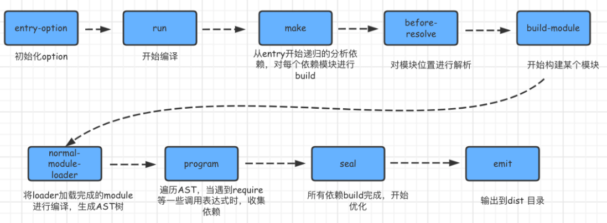

# Webpack 构建流程详解

Webpack 是一个现代化的前端构建工具，其运行过程可以理解为一个**串行的生命周期流程**。Webpack 本身不做具体的编译任务，它通过插件机制将各类操作串联起来，并在内部通过广播事件的方式，将处理流程开放给插件进行干预或拓展。

---

## 一、Webpack 的三大执行阶段

Webpack 的整个构建流程可以划分为三个主要阶段：

### 1. 初始化流程（Initialization）

- 读取并解析配置（如 `webpack.config.js`）
- 合并 CLI 参数与配置文件参数
- 初始化 `Compiler` 对象（Webpack 的核心执行调度器）
- 注册并初始化插件 Plugin

### 2. 编译构建流程（Compilation）

- 从配置的 `entry` 出发，递归解析模块依赖，构建模块图（Module Graph）
- 使用 `Loader` 对每个模块进行转换
- 生成模块间的依赖关系
- 分组生成 Chunk

### 3. 输出流程（Emit）

- 根据模块和 Chunk 生成最终的文件
- 写入输出目录（如 `/dist`）
- 触发最终的 `emit` 钩子，允许插件干预输出内容  


---

## 二、初始化流程详解

Webpack 启动时会先读取配置：

```js
// webpack.config.js 示例
const path = require('path');
const webpack = require('webpack');

module.exports = {
  entry: './src/index.js',
  output: {
    path: path.resolve(__dirname, 'dist'),
    filename: '[name].js',
  },
  resolve: {
    alias: {
      react: path.resolve(__dirname, 'node_modules/react/dist/react.min.js'),
    },
  },
  module: {
    loaders: [
      {
        test: /\.js$/,
        loader: 'babel-loader',
        query: {
          presets: ['es2015', 'react'],
        },
      },
    ],
    noParse: [/react\.min\.js/],
  },
  plugins: [new webpack.HotModuleReplacementPlugin()],
};
````

Webpack 会根据上述配置初始化内部运行所需的参数，并创建 Compiler 对象作为全局调度器。

---

## 三、编译构建流程详解

构建阶段主要发生在 `compiler.run()` 中，包含以下关键步骤：

### 1. `compile`：创建 Compilation 对象

* 用于记录模块、Chunk、依赖关系等核心信息
* 每次构建过程都会创建一个新的 `Compilation` 实例

### 2. `make`：递归分析依赖

* 从 `entry` 出发，调用 `_addModuleChain` 递归处理依赖树
* 为每一个模块创建对应的 Module 对象（通常为 `NormalModule`）
* 利用 Loader 转换代码

```js
// 内部流程（简化）
_addModuleChain(context, dependency, ...) {
  const moduleFactory = this.dependencyFactories.get(dependency.constructor);
  moduleFactory.create(..., (err, module) => {
    this.buildModule(module, ..., () => {
      this.processModuleDependencies(module, ...);
    });
  });
}
```

### 3. `build-module`：构建模块内容

* 执行配置中的 `Loader`（如 Babel、Sass、url-loader 等）
* 把模块源码转换成 JS 模块
* 使用 AST（如 Acorn）分析模块结构与依赖

### 4. `seal`：模块分组生成 Chunk

* 将模块根据入口和依赖关系组合成多个 Chunk
* 每个 Chunk 对应一个输出文件（如 main.js）
* 可以进行优化如 Tree-shaking、SplitChunks、RuntimeChunk 等

### 5. `emit`：生成输出文件

* 最后将 Chunk 转换为实际的文件内容
* 执行插件的 `emit` 钩子，允许拦截或修改最终输出
* 写入磁盘，构建过程结束

---

## 四、Webpack 内部运行图（示意）

```text
       +-------------------+
       |  webpack.config.js|
       +-------------------+
                ↓
         初始化 Compiler
                ↓
       调用 compiler.run()
                ↓
      +---------------------+
      | 创建 Compilation 对象|
      +---------------------+
                ↓
      make（递归构建模块图）
                ↓
        模块解析 & Loader 编译
                ↓
      AST 解析，依赖收集
                ↓
            Chunk 分组
                ↓
         emit 输出结果文件
                ↓
           写入文件系统 ✅
```

---

## 五、总结

Webpack 构建过程本质是一次完整的“模块编译 + 构建 + 输出”的生命周期，它具有以下特点：

* **事件驱动 + 插件架构**：通过 Tapable 触发钩子，使得插件可以接入任意阶段。
* **高度可扩展**：你可以通过 Loader/Plugin 控制构建的任意细节。
* **模块为中心**：一切以模块为基本单位，构建成依赖图，再输出为文件。

通过理解构建流程，可以更好地优化 Webpack 配置，调试构建过程，以及编写 Loader 或 Plugin 扩展其能力。
