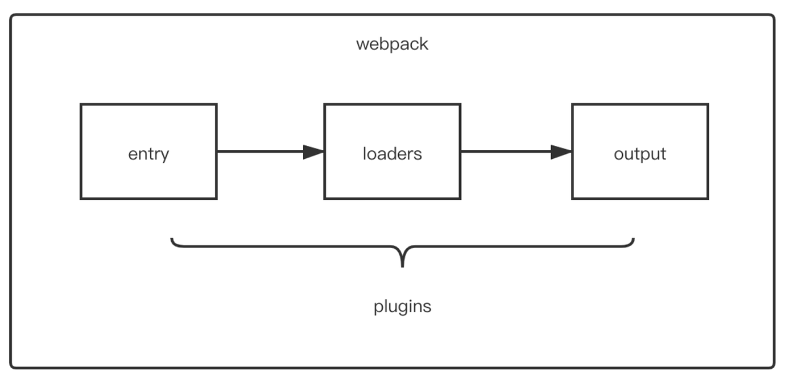

# 🌟 Webpack 中常见的 Plugin 及其作用

## 一、Plugin 是什么？

在 Webpack 中，**Plugin 是用于扩展 Webpack 编译能力的模块**，它们运行在 Webpack 的编译生命周期中，可以在打包前、打包后、输出前、输出后等阶段执行特定逻辑，解决 Loader 无法覆盖的问题，如：

* 资源管理（生成 HTML、拷贝文件等）
* 打包优化（提取 CSS、压缩文件等）
* 环境变量注入
* 自动清理目录
* 构建信息提示等

> 📌 总结一句话：**Loader 负责文件转换，Plugin 负责整个构建过程的拓展和优化。**  


---

## 二、Plugin 的本质与生命周期

Webpack 中的 Plugin 是一个**具有 `apply(compiler)` 方法的 JS 对象**，通过该方法注册生命周期钩子来实现特定行为。

```js
class MyPlugin {
  apply(compiler) {
    compiler.hooks.emit.tap('MyPlugin', compilation => {
      console.log('🎉 在 emit 阶段做点事');
    });
  }
}
```

Webpack 编译生命周期钩子（部分）如下：

| 钩子名             | 触发时机                    |
| --------------- | ----------------------- |
| `entry-option`  | 初始化配置                   |
| `run`           | 开始构建流程                  |
| `compile`       | 开始编译，创建 `compilation` 前 |
| `compilation`   | 创建 `compilation` 对象     |
| `make`          | 构建依赖图                   |
| `after-compile` | 所有模块构建完成                |
| `emit`          | 输出资源写入磁盘前               |
| `after-emit`    | 输出资源写入磁盘后               |
| `done`          | 编译完成                    |
| `failed`        | 编译失败时                   |

---

## 三、常见的 Webpack 插件及用途

### 1️⃣ HtmlWebpackPlugin

**作用**：自动生成 HTML 文件，并注入打包后的 JS 文件

```js
const HtmlWebpackPlugin = require('html-webpack-plugin');

plugins: [
  new HtmlWebpackPlugin({
    template: './src/index.html',
    filename: 'index.html',
    inject: 'body'
  })
]
```

✅ 解决问题：

* 每次打包后自动插入 JS
* 可以配置 favicon、meta 标签
* 支持 HTML 压缩

---

### 2️⃣ CleanWebpackPlugin

**作用**：每次构建前清空上一次的构建目录（如 `dist/`）

```js
const { CleanWebpackPlugin } = require('clean-webpack-plugin');

plugins: [
  new CleanWebpackPlugin()
]
```

✅ 解决问题：

* 避免历史构建文件残留
* 保证输出目录整洁

---

### 3️⃣ MiniCssExtractPlugin

**作用**：将 CSS 提取成独立文件，适用于生产环境

```js
const MiniCssExtractPlugin = require('mini-css-extract-plugin');

plugins: [
  new MiniCssExtractPlugin({
    filename: '[name].[contenthash].css'
  })
]
```

✅ 解决问题：

* 避免 CSS 与 JS 混合输出
* 支持浏览器缓存优化（contenthash）

---

### 4️⃣ DefinePlugin

**作用**：注入全局常量（如环境变量）

```js
const webpack = require('webpack');

plugins: [
  new webpack.DefinePlugin({
    'process.env.NODE_ENV': JSON.stringify('production')
  })
]
```

✅ 解决问题：

* 区分开发 / 生产配置
* 实现代码中的条件编译（如 Vue 的开发模式提示）

---

### 5️⃣ CopyWebpackPlugin

**作用**：将静态文件从 `public/` 拷贝到构建输出目录

```js
const CopyWebpackPlugin = require('copy-webpack-plugin');

plugins: [
  new CopyWebpackPlugin({
    patterns: [
      { from: 'public', to: 'dist' }
    ]
  })
]
```

✅ 解决问题：

* 拷贝不需要打包处理的资源（如 favicon、静态 HTML、图标）

---

## 四、插件配置方式

插件一般配置在 `webpack.config.js` 的 `plugins` 数组中：

```js
module.exports = {
  plugins: [
    new HtmlWebpackPlugin(),
    new MiniCssExtractPlugin(),
    new webpack.DefinePlugin({ ... })
  ]
}
```

也可以**自己手写插件**注册钩子来自定义构建行为（如性能分析、构建报告等）。

---

## 五、总结对比：Loader vs Plugin

| 对比项  | Loader   | Plugin              |
| ---- | -------- | ------------------- |
| 作用阶段 | 加载模块时    | 编译全过程               |
| 用于   | 文件转换     | 构建扩展                |
| 本质   | 函数（链式调用） | JS 对象（含 `apply` 方法） |
| 调用时机 | 模块匹配时    | 生命周期钩子时             |
