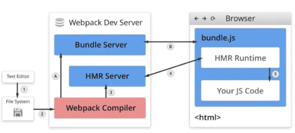
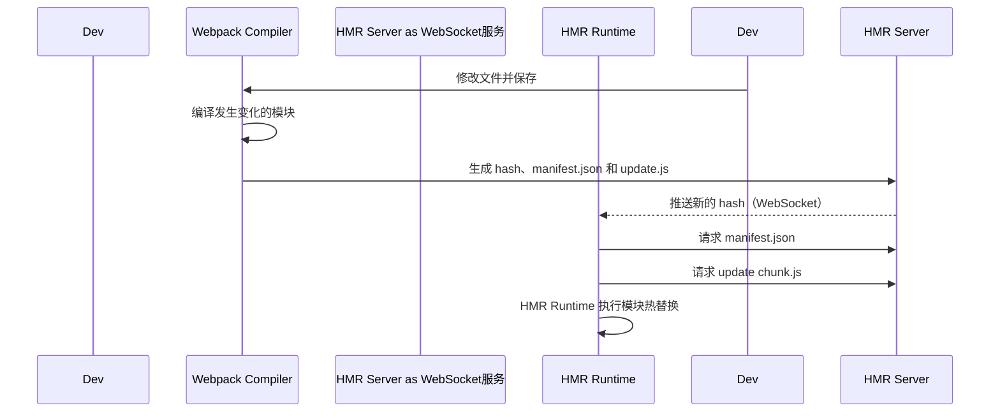

# Webpack 热更新（HMR）原理详解

在现代前端开发中，**热更新（Hot Module Replacement, HMR）** 是一个极大提高开发效率的功能。它可以在代码修改后，**无需刷新页面**，就将更新的模块实时替换进浏览器中。

---

## 一、什么是 HMR？

> **Hot Module Replacement（热模块替换）** 指的是：在应用运行过程中替换、添加或删除模块，而**无需重新加载整个页面**。

相比传统的“LiveReload（自动刷新）”，HMR 能更高效地保留页面状态（如表单数据、滚动位置等），使得前端开发体验更流畅。

---

## 二、HMR 的核心组成



Webpack 热更新的机制可以划分为以下几个模块：

| 组件名           | 作用说明 |
|------------------|----------|
| **Webpack Compiler** | 监听源码变化，重新构建模块 |
| **HMR Server**        | 管理 WebSocket 通信，推送更新 |
| **Bundle Server**     | 提供静态资源服务 |
| **HMR Runtime**       | 注入到浏览器，处理模块替换 |
| **Manifest 文件**     | 描述更新内容（hash、chunkId） |
| **Update Chunk 文件** | 包含实际更新的模块代码 |

---

## 三、HMR 的两个阶段流程

### 1. 启动阶段（初始化）
```text
[1] 源代码 → Webpack 编译 → bundle.js + HMR runtime
[2] 启动 Bundle Server 提供静态资源服务
[3] 建立 WebSocket 链接（HMR Server ↔ 浏览器）
````

### 2. 更新阶段（实时替换）

当你修改了一个模块，HMR 的工作机制如下：



---

## 四、底层机制详解

### 1. Webpack 编译与监听

* 使用 `webpack-dev-server` 启动时，会创建两个服务器：

  * `express server`：负责静态资源的提供（bundle.js 等）
  * `websocket server`：用于推送模块更新（HMR Server）

### 2. 文件变更与重新构建

* Webpack 监听到文件改动时，只**重新编译发生变化的模块**
* 生成：

  * `update.[hash].json`（manifest）
  * `update.[chunkId].[hash].js`（模块 patch）

### 3. WebSocket 通知客户端

* Server 通过 WebSocket 向浏览器推送新的 `hash`
* 浏览器用 `ajax` 请求 `manifest.json` 获取变更列表

### 4. 浏览器热替换流程

* 浏览器根据 manifest 文件拿到变更模块的 chunk.js
* 通过 HMR Runtime 动态执行新模块
* 若模块实现了 `module.hot.accept()`，则会调用回调逻辑
* 未实现热替换逻辑的模块，将导致页面自动刷新

---

## 五、模块更新的完整流程图

```text
1. 开发者修改源码
2. Webpack 重新构建变化模块
3. HMR Server 推送 hash
4. 浏览器请求 update 文件
5. HMR Runtime 应用模块变化
```

---

## 六、开启 HMR 所需配置

```js
// webpack.config.js
module.exports = {
  devServer: {
    hot: true,
  },
  plugins: [
    new webpack.HotModuleReplacementPlugin(), // Webpack 5 中可省略
  ]
};
```

> 提示：在 React / Vue 等框架中，通常配合框架的 HMR 接口使用，例如 `react-refresh`。

---

## 七、总结

| 阶段   | 内容                               |
| ---- | -------------------------------- |
| 构建阶段 | Webpack 编译并输出 bundle、HMR Runtime |
| 监听阶段 | Webpack-dev-server 监听文件变更        |
| 通知阶段 | WebSocket 推送更新 hash              |
| 获取阶段 | 浏览器请求更新内容（manifest + chunk）      |
| 替换阶段 | HMR Runtime 执行模块替换（无需刷新页面）       |

通过 HMR，开发者无需刷新页面即可查看改动效果，在开发大型前端项目时极大提升了效率。

---

## 📌 推荐阅读

* [Webpack 官方文档 - HMR](https://webpack.js.org/concepts/hot-module-replacement/)
