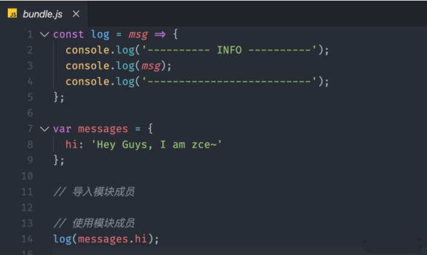
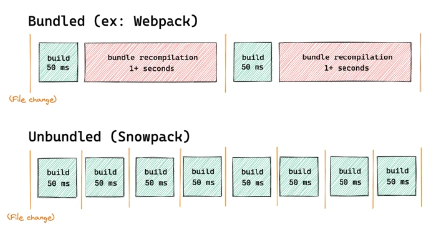
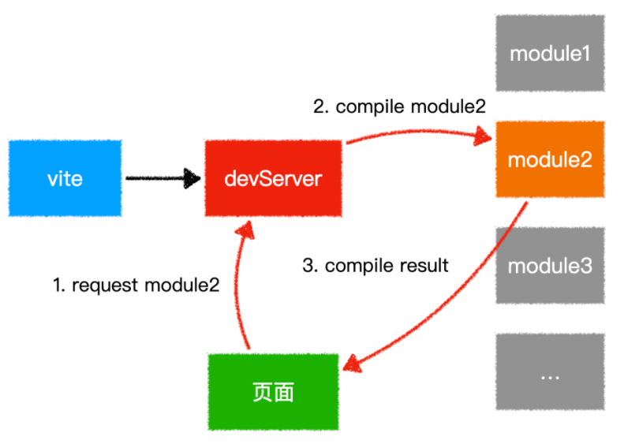

# 前端构建工具对比：Webpack、Rollup、Parcel、Snowpack、Vite

模块化让复杂的系统变得可管理，而模块打包工具则是实现这一目标的重要工具。除了 Webpack，目前前端社区还有多个优秀的构建方案：**Rollup、Parcel、Snowpack、Vite**。它们各有侧重，适用于不同的项目和需求场景。

---

## ⚙️ 1. Rollup

- **定位**：专注于打包 JavaScript 库的 ES Module 打包器  
- **优点**：
  - 配置简洁，打包输出更加轻量
  - 默认支持 Tree-shaking，避免死 code
  - 常用于打包基础库（如 Vue、React、three.js）
- **局限**：
  - 对 CSS、图片等资源支持需借助插件
  - 默认只能解析 ES Modules，不支持 CommonJS
  - 不支持 HMR，开发体验一般
- **适用场景**：构建高性能、体积小的 JS 库或组件

---

## 📦 2. Parcel

- **定位**：零配置、开箱即用的应用级打包工具  
- **特点**：
  - 自动处理各种资源类型（JS、CSS、图片、HTML 等）
  - 内置 Dev Server 支持 HMR，配置简单
  - 支持动态安装依赖，无需重启服务器
- **优点**：
  - 开发体验友好，接近即用
  - 可用作中小型项目快速启动的开发工具
- **劣势**：
  - 插件系统不如 Webpack 丰富
  - 在复杂配置场景下仍需进行较深入调优

---

## 🚀 3. Snowpack

- **定位**：利用浏览器原生 ESM，实现刷新速度快的现代构建工具  
- **设计理念**：
  - 开发阶段无需打包，只构建一次每个模块
  - 支持 HMR，速度快，重构建运行时非常高效
- **优点**：
  - 每次变更只编译单文件，开发效率高
  - 模块缓存机制保障构建不重置
- **局限**：
  - 对大型项目或复杂依赖链可能仍有性能瓶颈
  - 生产构建仍需借助 Rollup 插件配置

---

## 💡 4. Vite

- **定位**：面向现代浏览器和开发体验的新一代构建工具  
- **架构**：
  - 开发服务器基于浏览器原生 ESM 加载
  - 生产构建使用 Rollup 做深度优化
- **优点**：
  - 冷启动快，凭借原生支持跳过全量预编译
  - HMR 精确到模块，秒级更新
  - 开发体验优秀，默认零配置即可用
- **适用场景**：
  - 中小型项目、原型开发、现代前端框架
  - 既想要快速开发，又需要高效生产构建    

---

## 🔧 5. Webpack（参照）

- **定位**：功能全面的前端模块打包器，一切皆模块  
- **优势**：
  - 支持 JS、CSS、图片、字体等多种资源
  - 丰富插件生态（如 HMR、Tree-Shaking、代码分割、SourceMap）
  - 在大型项目中高度配置可定制
- **技术特点**：
  - 兼容 ES/AMD/CommonJS 模块
  - 多级缓存、异步 IO 优化编译速度
- **适用场景**：
  - 应用体量较大、结构复杂、包含高级自定义需求项目

---

## 🎯 工具对比一览表

| 特性               | Webpack     | Rollup       | Parcel       | Snowpack     | Vite           |
|------------------|------------|-------------|-------------|-------------|---------------|
| 零配置体验         | ❌ 需配置    | ⚠️ 简化配置  | ✅ 开箱即用   | ✅ 无需构建   | ✅ 零配置体验   |
| 资源类型支持        | 丰富（Loader插件） | 需插件支持    | 丰富（内置）  | ESM 优先，仅 JS | 丰富（依赖 Rollup） |
| 构建 JS 库         | 支持（较重） | ✅ 最优选择  | 可行但非主流 | 可行，但需配置 | 生产阶段最佳    |
| 开发体验 / HMR     | ⭐⭐⭐⭐       | ❌ 无 HMR     | ⭐⭐⭐⭐         | ⭐⭐⭐⭐         | ⭐⭐⭐⭐⭐          |
| 构建速度（开发）     | 较慢        | ⭐⭐⭐⭐⭐        | ⭐⭐⭐⭐        | ⭐⭐⭐⭐⭐        | ⭐⭐⭐⭐⭐          |
| 构建速度（生产）     | ⭐⭐⭐⭐        | ⭐⭐⭐⭐         | ⭐⭐⭐⭐        | ⭐⭐⭐⭐         | ⭐⭐⭐⭐           |
| 插件生态 & 社区     | ✅ 最丰富     | 较强         | 一般         | 新兴         | 快速增长       |

---

## ✅ 应用场景建议

- **开发 JS 库/组件**：优先选 Rollup（最小输出，Tree-shaking 强）
- **快速启动项目/中小应用**：Parcel 提供即开即用体验
- **追求极致开发速度**：Snowpack 或 Vite 是理想选择
- **大型、定制化复杂项目**：Webpack 依然是最灵活、拓展性最强的工具

---

## 🧩 结论

不同工具各司其职，项目规模与目标决定工具风格：

- **Rollup**：库发布利器  
- **Parcel**：零配置速搭中小项目  
- **Snowpack** + **Vite**：开发体验优先，热更新敏捷  
- **Webpack**：企业级定制与大项目首选

选择工具时，请结合你的项目特点（规模、资源类型、团队习惯等），选取最契合的方案。

