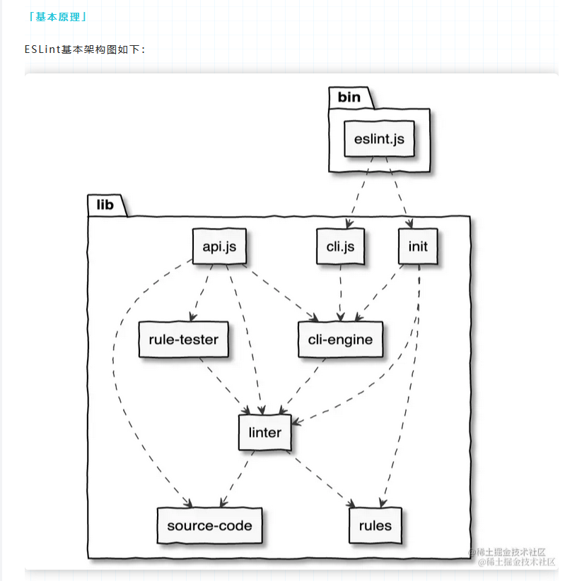

> ESLint 是前端开发中不可或缺的工具，它能自动帮我们发现潜在错误、统一代码风格、提升协作效率。本文将深入了解 ESLint 的核心概念与工作机制。


## 一、什么是 ESLint？

**ESLint** 是一个开源的 JavaScript 代码静态检查工具。它可以：

- 分析 JavaScript/TypeScript 等代码
- 找出潜在的语法错误、逻辑漏洞
- 检查是否符合团队设定的代码规范
- 自动修复部分问题

```bash
npx eslint your-code.js
```

相比于运行时代码检查工具，**ESLint 属于“静态分析”工具**，即不需要执行代码就能发现问题。

---

## 二、什么是 Lint？

**Lint** 是静态分析的总称，最早出现在 C 语言时代，用来帮助开发者发现代码潜在的问题。

在前端领域，常见的 lint 工具有：

* JavaScript: ESLint
* CSS: Stylelint
* HTML: HTMLHint
* Vue/React/TS: ESLint 插件体系支持

---

## 三、ESLint 的核心组成

ESLint 的工作流程大致如下：

```plaintext
源码字符串（如 app.js） ──> parser 解析 ──> AST（抽象语法树）
                                 │
                          plugins/rules 遍历 AST
                                 │
                           得出警告 / 报错 / 自动修复
```  
  

主要组成模块：

| 模块              | 作用              |
| --------------- | --------------- |
| **Linter 类**    | 核心入口，提供 API     |
| **Parser（解析器）** | 将源代码解析为 AST     |
| **Rules（规则集）**  | 用于检查 AST 是否符合规范 |
| **Fixer（修复器）**  | 自动修复部分可修改的问题    |

---

## 四、Linter 类与核心 API

ESLint 的底层由一个 `Linter` 类主导，提供核心 API：

```ts
const linter = new Linter();

linter.verify(code, config);           // 检查代码
linter.verifyAndFix(code, config);     // 检查并自动修复
linter.defineParser("custom", parser); // 自定义解析器
linter.defineRule("no-debugger", rule);// 自定义规则
linter.getRules();                     // 获取所有规则
```

---

## 五、SourceCode 与 AST

### 什么是 AST？

AST（Abstract Syntax Tree，抽象语法树）是将源代码以“语法结构”的方式组织起来的树形结构。

举个例子：

```js
const a = 1 + 2;
```

对应 AST 会长这样：

```
VariableDeclaration
└── VariableDeclarator
    ├── Identifier (a)
    └── BinaryExpression (+)
        ├── Literal (1)
        └── Literal (2)
```

### ESLint 如何利用 AST？

1. 通过 `parser` 将源代码转换为 AST
2. 每个规则注册对应的 “监听钩子”
3. 在遍历 AST 节点时执行规则判断逻辑
4. 如果违规就记录问题，部分支持 `fix()` 自动修改

---

## 六、常见规则工作示例

比如 `no-console` 规则的逻辑是：

```ts
module.exports = {
  create(context) {
    return {
      MemberExpression(node) {
        if (node.object.name === "console") {
          context.report({
            node,
            message: "Unexpected console statement.",
            fix: fixer => fixer.remove(node)
          });
        }
      }
    }
  }
};
```

> ESLint 的每条规则都是以 “访问某类 AST 节点” 的方式实现的，非常灵活。

---

## 七、总结：ESLint 的优势

| 优势        | 说明                                              |
| --------- | ----------------------------------------------- |
| 高度可定制     | 支持自定义规则/插件/配置                                   |
| 支持主流框架    | React、Vue、TS、Next.js 等都有对应生态                    |
| 自动修复功能强   | 对常见错误可一键修复                                      |
| 强大的插件生态系统 | 比如 `eslint-plugin-react`、`eslint-plugin-import` |

---

## 八、使用建议

* 配合编辑器插件（如 VSCode ESLint 插件）进行实时检查
* 配合 Prettier 做格式化（避免冲突推荐使用 [eslint-config-prettier](https://github.com/prettier/eslint-config-prettier)）
* CI 阶段配置 ESLint 检查防止代码污染主干
* 若团队协作，务必在根目录配置 `.eslintrc.js` 做统一规范

---

## 结语

ESLint 是现代前端团队提升质量和效率的基础工具，了解其原理能帮助我们更灵活地定制规则，构建更可靠的代码体系。如果你想深入研究，还可以尝试编写自己的 ESLint 插件或规则。

📘 推荐阅读：

* [AST Explorer](https://astexplorer.net/)：可视化调试 AST
* [ESLint 官方文档](https://eslint.org/docs/latest/)
* [@babel/parser](https://babeljs.io/docs/en/babel-parser)：ESLint 默认解析器之一
