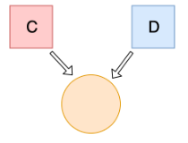

# 1. 输出是什么？

```js
function sayHi() {
  console.log(name)
  console.log(age)
  var name = 'Lydia'
  let age = 21
}

sayHi()
```

- undefined 和 ReferenceError

在函数内部，我们首先通过 var 关键字声明了 name 变量。这意味着变量被提升了（内存空间在创建阶段就被设置好了），直到程序运行到定义变量位置之前默认值都是 undefined。因为当我们打印 name 变量时还没有执行到定义变量的位置，因此变量的值保持为 undefined。

通过 let 和 const 关键字声明的变量也会提升，但是和 var 不同，它们不会被初始化。在我们声明（初始化）之前是不能访问它们的。这个行为被称之为暂时性死区。当我们试图在声明之前访问它们时，JavaScript 将会抛出一个 ReferenceError 错误。

# 2. 输出是什么？

```js
for (var i = 0; i < 3; i++) {
  setTimeout(() => console.log(i), 1)
}

for (let i = 0; i < 3; i++) {
  setTimeout(() => console.log(i), 1)
}
```

- 3 3 3 和 0 1 2

由于 JavaScript 的事件循环，setTimeout 回调会在遍历结束后才执行。因为在第一个遍历中遍历 i 是通过 var 关键字声明的，所以这个值是全局作用域下的。在遍历过程中，我们通过一元操作符 ++ 来每次递增 i 的值。当 setTimeout 回调执行的时候，i 的值等于 3。

在第二个遍历中，遍历 i 是通过 let 关键字声明的：通过 let 和 const 关键字声明的变量是拥有块级作用域（指的是任何在 {} 中的内容）。在每次的遍历过程中，i 都有一个新值，并且每个值都在循环内的作用域中。

# 3. 输出是什么？

```js
const shape = {
  radius: 10,
  diameter() {
    return this.radius * 2
  },
  perimeter: () => 2 * Math.PI * this.radius
}

shape.diameter()
shape.perimeter()
```

- 20 and NaN
  注意 diameter 的值是一个常规函数，但是 perimeter 的值是一个箭头函数。

对于箭头函数，this 关键字指向的是它当前周围作用域（简单来说是包含箭头函数的常规函数，如果没有常规函数的话就是全局对象），这个行为和常规函数不同。这意味着当我们调用 perimeter 时，this 不是指向 shape 对象，而是它的周围作用域（在例子中是 window）。

在 window 中没有 radius 这个属性，因此返回 undefined。

# 4. 输出是什么？

```js
;+true
!'Lydia'
```

- 1 and false
  一元操作符加号尝试将 bool 转为 number。true 转换为 number 的话为 1，false 为 0。

字符串 'Lydia' 是一个真值，真值取反那么就返回 false。

# 5. 哪一个是无效的？

```js
const bird = {
  size: 'small'
}

const mouse = {
  name: 'Mickey',
  small: true
}
```

A: mouse.bird.size
B: mouse[bird.size]
C: mouse[bird["size"]]

- A
  在 JavaScript 中，所有对象的 keys 都是字符串（除非对象是 Symbol）。尽管我们可能不会定义它们为字符串，但它们在底层总会被转换为字符串。

当我们使用括号语法时（[]），JavaScript 会解释（或者 unboxes）语句。它首先看到第一个开始括号 [ 并继续前进直到找到结束括号 ]。只有这样，它才会计算语句的值。

mouse[bird.size]：首先计算 bird.size，这会得到 small。mouse["small"] 返回 true。

然后使用点语法的话，上面这一切都不会发生。mouse 没有 bird 这个 key，这也就意味着 mouse.bird 是 undefined。然后当我们使用点语法 mouse.bird.size 时，因为 mouse.bird 是 undefined，这也就变成了 undefined.size。这个行为是无效的，并且会抛出一个错误类似 Cannot read property "size" of undefined。


# 6. 输出是什么？
```JS
let c = { greeting: 'Hey!' }
let d

d = c
c.greeting = 'Hello'
console.log(d.greeting)
```
- Hello
在 JavaScript 中，当设置两个对象彼此相等时，它们会通过引用进行交互。

首先，变量 c 的值是一个对象。接下来，我们给 d 分配了一个和 c 对象相同的引用。



因此当我们改变其中一个对象时，其实是改变了所有的对象。

# 7. 输出是什么？
```JS
let a = 3
let b = new Number(3)
let c = 3

console.log(a == b)
console.log(a === b)
console.log(b === c)
```
- true false false

new Number() 是一个内建的函数构造器。虽然它看着像是一个 number，但它实际上并不是一个真实的 number：它有一堆额外的功能并且它是一个对象。

当我们使用 == 操作符时，它只会检查两者是否拥有相同的值。因为它们的值都是 3，因此返回 true。

然后，当我们使用 === 操作符时，两者的值以及类型都应该是相同的。new Number() 是一个对象而不是 number，因此返回 false。

# 8. 输出是什么？
```JS
class Chameleon {
  static colorChange(newColor) {
    this.newColor = newColor
    return this.newColor
  }

  constructor({ newColor = 'green' } = {}) {
    this.newColor = newColor
  }
}

const freddie = new Chameleon({ newColor: 'purple' })
freddie.colorChange('orange')
```
- TypeError
colorChange 是一个静态方法。静态方法被设计为只能被创建它们的构造器使用（也就是 Chameleon），并且不能传递给实例。因为 freddie 是一个实例，静态方法不能被实例使用，因此抛出了 TypeError 错误。