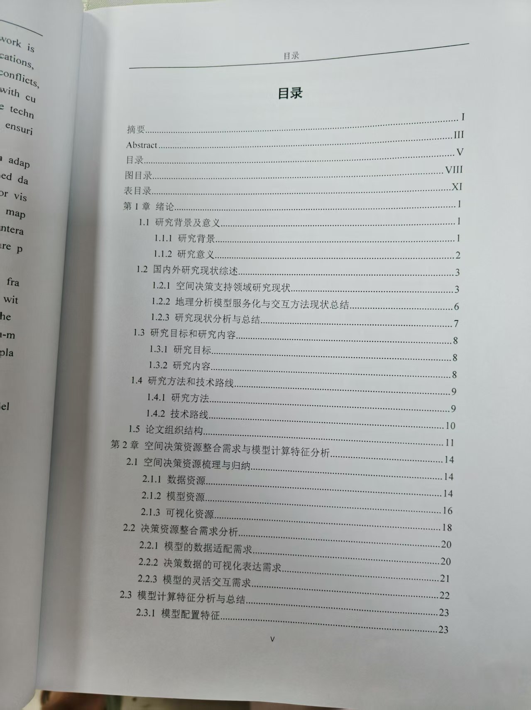
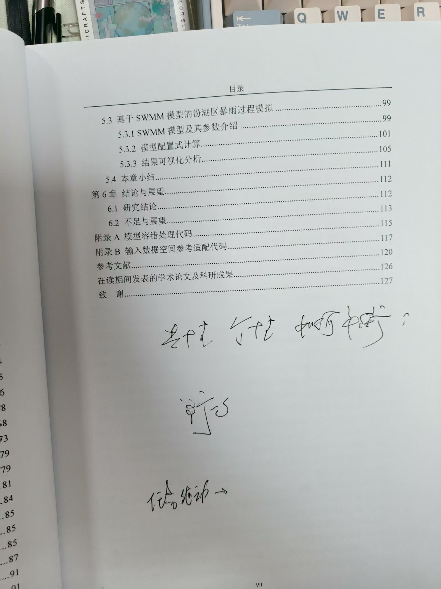

<!-- 面向洲滩崩岸预警/模拟的智能化模型参数配置方法研究 -->

## 开题

亚洲哥论文组织：





复用结果

- 模型参数的描述
- 模型功能的描述
- 多模型组合策略


区域特征 边界 只针对洲滩 时空边界、相关参数都应该根据上下文来 
多层、个agent 过滤 只保留相关的意图--通用的问答
用户提问（带着目标问，而不是直接说某个参数改动）

MCP?
 知识库的组织
 支持智能调用 模型是可更新的 参数和算子的更新，比如一些原本的模型，原本是两个参数 现在是三个参数，需要及时更新
 也包括新的模型、数据 要做到这个知识库是可扩展的
 可控 减少幻觉 （这个主要就是让大模型在调用的时候严格遵照知识库的内容）
 数据 阈值，eg 需要的数据是01bool类型，就不能选一些非bool的数据 去筛选一些数据，比如有些是可以的，但是在某个层面上是不能用的，那么就直接被筛掉 或者说去做预处理 使其变成一个可以用的数据
 数据映射关系 案例：我有的是一个全国的PM2.5数据 还有各个行政区划的边界，然后用户现在想要的是江苏省的，或者南京市的，那就直接从这个PM2.5的数据里去向下做filter
 
    chap2 技术框架 
    chap3 数据描述、模型描述-->参数描述 
    chap4 配置方法，（容器化）运行方法
 chap5 


 情形：数据、模型更新或者数据阈值控制

## model
| 类别                  | 说明       | 可能涉及脚本/模型          |
| ------------------- | -------- | ------------------ |
| erosionmodel        | 力学侵蚀类    | BSTEM、稳定性系数计算      |
| multiple indicators | 崩岸风险指标合成 | 多因子叠加、模糊综合、加权平均等   |
| numericalmodel      | 水动力类     | 流速流向模拟、流场趋势判断、底剪切力 |
| riverbedevolution   | 河床变化     | 冲淤量计算、断面面积变化       |

### BSTEM 河岸侵蚀模型
1. erosionmodel（BSTEM）模型
    计算某断面的稳定性，主要输出为 FOS（安全系数）等指标，用于洲滩崩岸的稳定性分析或预警。

| 参数名                                                        | 说明                   | 是否可配置 | 来源/建议           |
| ---------------------------------------------------------- | -------------------- | ----- | --------------- |
| `x_values`                                                 | 岸坡横向坐标列表             | ✅     | 来源于断面数据/DEM 截取  |
| `z_values`                                                 | 岸坡高程坐标列表             | ✅     | 与 x 成对，形成剖面     |
| `index_toe`                                                | 脚点索引，确定坡脚位置          | ✅     | 通常为 z 最小点       |
| `bankLayerThickNess`                                       | 河岸层厚列表               | ✅     | 可以来自地质勘查数据或默认模板 |
| `flow_elevation`                                           | 水位高程                 | ✅     | 来自水文数据或模拟结果     |
| `channelFlowParams = [130, 0.000025, flow_elevation, 720]` | 渠道水流参数，包括流速、坡度、水位、历时 | ✅     | 可智能化优化/联动水动力模型  |
| `boolTension`                                              | 是否考虑张拉裂缝             | ✅     | 当前默认关闭，可以做参数扩展  |
---
### 多指标类（Multiple Indicators）

水动力类：anti_impact_speed、flow_equivalent、water_level_fluctuation

河床演变类：slope_rate、nearshore_flush、height_difference

地质工程类：soil_composition、slope_protection、load_control

1. Anti-Impact Speed 模型
    评估河岸或河滩边坡在水动力冲击下的稳定性风险，尤其关注流速对边坡结构的冲刷和破坏潜力。
| 参数名              | 类型          | 可配置性        | 来源说明                                     |
| ---------------- | ----------- | ----------- | ---------------------------------------- |
| **输入参数**         |             |             |                                          |
| dem-id           | 字符串 / ID    | 用户配置        | 数字高程模型标识，用于截面视图模型请求                      |
| section-geometry | 数组/几何数据     | 用户配置        | 河岸截面几何信息，传递给截面视图模型                       |
| segment          | 字符串         | 用户配置/映射后可调整 | 研究河段标识，来自用户输入；映射后可能调整为标准名称               |
| year             | 字符串         | 用户配置/映射后可调整 | 计算年份，字符串格式，输入后可能映射为默认或标准年份               |
| set              | 字符串         | 用户配置/映射后可调整 | 配置集名称，用户输入后映射为标准名称                       |
| water-qs         | 字符串或数字      | 用户配置/映射后调整  | 水流量指标，初始来自用户输入，映射为最接近节点数值                |
| tidal-level      | 字符串或数字      | 用户配置/映射后调整  | 潮位等级，原始可为数值或字符串，内部映射为离散等级 'xc'/'zc'/'dc' |
| risk-threshold   | 数组（浮点数）     | 可选，默认从模板读取  | 风险阈值数组，用户可配置；若无配置，使用默认阈值模板中Ky对应的阈值       |
| **中间参数/依赖模型输出**  |             |             |                                          |
| slope\_foot      | 坐标数组        | 计算得出        | 截面视图模型输出的坡脚坐标，用于流场速度匹配                   |
| raw\_paths       | 字符串列表       | 截面模型输出或配置路径 | 水动力模型返回的原始流速数据文件路径列表                     |
| **输出参数**         |             |             |                                          |
| Ky               | 浮点数         | 计算得出        | 通过最大流速计算的抗冲刷速度指数                         |
| risk-level       | 长度4的列表（0/1） | 计算得出        | 根据Ky与风险阈值比较得到的风险等级独热编码（4个等级）             |
| case-id          | 字符串         | 自动生成        | 模型执行案例ID                                 |


2. Flow Equivalent 模型
    读取某断面（segment）某年份（year）的 PQ 值（流量-水位等效指标）
    与风险阈值对比，输出 4 级风险等级
| 参数名              | 类型                    | 可配置性 | 来源说明                        |
| ---------------- | --------------------- | ---- | --------------------------- |
| `segment`        | str                   | ✅    | 断面编号，可从 DEM/区划/遥感自动化生成      |
| `year`           | int                   | ✅    | 目标年份，数据时序分析或模拟范围选定          |
| `risk_threshold` | list\[float] 或 "NONE" | ✅    | 各等级风险对应的 PQ 阈值，支持默认模板或用户自定义 |

3. Height Difference 模型
    提取断面 DEM 中的最深点（Zb）
    根据 Zb 与风险阈值比较，输出风险等级
| 参数名                | 类型                    | 可配置性 | 来源说明               |
| ------------------ | --------------------- | ---- | ------------------ |
| `dem-id`           | str                   | ✅    | DEM 数据的唯一标识        |
| `section-geometry` | list                  | ✅    | 断面坐标点（提取 DEM 的横截面） |
| `risk-threshold`   | list\[float] / "NONE" | ✅    | 阈值，默认从模板读取         |

4. Load Control 模型
    根据防护等级 control-level 判断其对风险的影响
    输出 one-hot 编码的崩岸风险等级
体现的是**人为干预强度（治理工程）对崩岸风险的影响，可作为你多指标融合中“管理类因子”**的一部分
| 参数名             | 类型  | 可配置性 | 来源说明                              |
| --------------- | --- | ---- | --------------------------------- |
| `control-level` | str | ✅    | 输入人为防护等级，共四级：strict、normal、low、no |  

| 保护等级   | 含义     | 输出风险等级           |
| ------ | ------ | ---------------- |
| strict | 严格保护措施 | \[1,0,0,0]（低风险）  |
| normal | 常规保护措施 | \[0,1,0,0]       |
| low    | 低强度保护  | \[0,0,1,0]       |
| no     | 无防护    | \[0,0,0,1]（极高风险） |

5. Nearshore Flush（近岸冲刷模型）
    利用两个时相的地形数据，计算近岸断面最深点变化率（Ln）
    用该速率指标判断洲滩冲刷程度及风险等级
| 参数名                    | 类型                    | 说明           |
| ---------------------- | --------------------- | ------------ |
| `bench-id`             | str                   | 参考地形时间点（旧）   |
| `ref-id`               | str                   | 当前地形时间点（新）   |
| `section-geometry`     | GeoJSON/str           | 分析剖面线        |
| `current-timepoint`    | str (yyyy-mm-dd)      | 当前时相日期       |
| `comparison-timepoint` | str                   | 对比时相日期       |
| `risk-threshold`       | list\[float] / "NONE" | 风险等级分界阈值（Ln） |
```json
{
  "model_name": "NearshoreFlush",
  "category": "Multiple Indicators",
  "inputs": {
    "bench-id": "str",
    "ref-id": "str",
    "section-geometry": "str",
    "current-timepoint": "yyyy-mm-dd",
    "comparison-timepoint": "yyyy-mm-dd"
  },
  "outputs": {
    "Ln": "float",
    "risk-level": "list[int]"
  },
  "dependencies": ["RegionFlush", "SectionView"],
  "updatable": true,
  "configurable": true
}
```

6. Slope Protection（边坡防护）
    根据用户提供的边坡防护等级，快速评估防护措施对河岸边坡稳定性的风险等级。

| 参数名              | 类型    | 可配置性     | 来源说明                                            |
| ---------------- | ----- | -------- | ----------------------------------------------- |
| **输入参数**         |       |          |                                                 |
| protection-level | 字符串   | 用户配置（必填） | 边坡防护等级，支持："systemic"、"normal"、"low"、"no" 四种字符串值 |
| **输出参数**         |       |          |                                                 |
| risk-level       | 长度4列表 | 计算得出     | 对应防护等级的风险独热编码（4个等级，从低风险到高风险）                    |
| case-id          | 字符串   | 自动生成     | 模型执行案例ID                                        |

7. Slope Rate（坡度速率） 模型
    计算给定剖面区域的坡度速率（Slope Rate），评估坡面稳定性相关的风险等级。
| 参数名              | 类型      | 可配置性       | 来源说明                                    |
| ---------------- | ------- | ---------- | --------------------------------------- |
| **输入参数**         |         |            |                                         |
| dem-id           | 字符串     | 用户配置（必填）   | 数字高程模型（DEM）标识，用于截取剖面数据                  |
| section-geometry | 列表/几何数据 | 用户配置（必填）   | 剖面线的空间几何信息，决定坡度计算的区域                    |
| risk-threshold   | 数组或字符串  | 用户可选（可用默认） | 风险阈值，数组形式定义不同风险等级的界限，若为 "NONE" 则从配置文件加载 |
| **输出参数**         |         |            |                                         |
| Sa               | 浮点数     | 计算输出       | 计算得到的坡度速率，取剖面数据中坡度绝对值的最小负值              |
| risk-level       | 长度4列表   | 计算输出       | 根据 Sa 与风险阈值比较后得到的风险独热编码（四级风险）           |
| case-id          | 字符串     | 自动生成       | 模型执行案例ID                                |

8. Soil Composition（土壤组成） 模型
    计算土壤组成比例（Dsed），并根据预设风险阈值评估土壤组成相关风险等级。
    | 参数名            | 类型     | 可配置性       | 来源说明                                   |
| -------------- | ------ | ---------- | -------------------------------------- |
| **输入参数**       |        |            |                                        |
| hs             | 浮点数    | 用户配置（必填）   | 土壤中某成分的厚度（或高度）                         |
| hc             | 浮点数    | 用户配置（必填）   | 土壤总厚度（或高度）                             |
| risk-threshold | 数组或字符串 | 用户可选（可用默认） | 风险阈值数组，若为 "NONE" 则从配置文件加载，定义土壤组成风险等级边界 |
| **输出参数**       |        |            |                                        |
| Dsed           | 浮点数    | 计算输出       | 土壤组成比例，计算公式为 hs/hc                     |
| risk-level     | 长度4列表  | 计算输出       | 风险等级的独热编码（4级风险）                        |
| case-id        | 字符串    | 自动生成       | 模型执行案例ID                               |

9.  Water Level Fluctuation（水位波动）
    评估某一剖面关键点处的水位波动特征，结合水流量映射和水动力数据，计算水位波动指数（Zd），并根据风险阈值评估波动风险等级。
| 参数名                | 类型         | 可配置性       | 来源说明                                 |
| ------------------ | ---------- | ---------- | ------------------------------------ |
| **输入参数**           |            |            |                                      |
| segment            | 字符串        | 用户配置（必填）   | 河段名称或区域标识                            |
| year               | 字符串        | 用户配置（必填）   | 代表年份                                 |
| set                | 字符串        | 用户配置（必填）   | 水动力学数据集名称                            |
| water-qs           | 字符串        | 用户配置（必填）   | 水流量的离散值，用于映射数据节点                     |
| tidal-level        | 浮点数或字符串    | 用户配置（必填）   | 潮汐水位高度或类别（如 "xc", "zc", "dc"）        |
| dem-id             | 字符串        | 用户配置（必填）   | 数字高程模型ID，用于剖面视图模型输入                  |
| section-geometry   | 几何数据（JSON） | 用户配置（必填）   | 剖面线的几何描述，用于生成剖面视图                    |
| risk-threshold     | 数组或字符串     | 用户可选（默认可用） | 风险阈值数组，若为 "NONE" 则从默认配置文件加载，用于风险等级判定 |
| **中间调用模型**         |            |            |                                      |
| section\_view\_mcr | 模型实例       | 自动创建       | 由剖面视图模型生成，用于获取断面关键点（slope\_foot）     |
| hydrodynamic\_mcr  | 模型实例       | 自动创建       | 水动力学模型实例，用于获取水流动力学数据（raw-txts）       |
| **输出参数**           |            |            |                                      |
| Zd                 | 浮点数        | 计算输出       | 计算得到的水位波动指数，基于水位数据及水流流量              |
| risk-level         | 长度4列表      | 计算输出       | 风险等级独热编码（4个等级），根据 Zd 与风险阈值比较得出       |
| case-id            | 字符串        | 自动生成       | 模型执行案例的唯一标识                          |

10.Risk Level 综合风险评估模型

| 类型       | 名称 / 参数               | 说明                                        | 备注                                                      |
| -------- | --------------------- | ----------------------------------------- | ------------------------------------------------------- |
| **输入**   | `segment`             | 河段名称                                      | 用于定位水动力等子模型                                             |
|          | `current-timepoint`   | 当前时间点，格式如 "2023-07-21"                    | 用于提取年份                                                  |
|          | `set`                 | 数据集版本或名称                                  | 水动力等模型的参数                                               |
|          | `water-qs`            | 流量值                                       | 用于水动力模型映射流量节点                                           |
|          | `tidal-level`         | 潮位，可数值或字符串                                | 映射成对应潮位等级                                               |
|          | `risk-thresholds`     | 风险等级阈值数组                                  | 用于将风险分值分级                                               |
|          | `wRE`                 | 河床演变3个指标权重                                | 权重数组，默认从模板加载                                            |
|          | `wNM`                 | 水动力3个指标权重                                 | 权重数组                                                    |
|          | `wGE`                 | 地质工程3个指标权重                                | 权重数组                                                    |
|          | `wRL`                 | 最终3组指标加权权重                                | 权重数组                                                    |
| **依赖模型** | 各子模型的风险等级文件路径         | 包括土壤组成、坡面保护、负载控制、高差、坡率、近岸冲刷、流量、冲击速度、水位波动等 | 每个文件内包含四维独热编码风险等级向量                                     |
| **输出**   | `case-id`             | 模型运行唯一ID                                  | 用于标识当前模型运行                                              |
|          | `multi-indicator-ids` | 各子模型对应ID                                  | 方便结果追踪                                                  |
|          | `result`              | 综合风险值（浮点数）                                | 多组权重加权后的风险值                                             |
|          | `risk-level`          | 风险等级向量（4维独热编码）                            | 表示风险等级分级                                                |
| **计算流程** | 风险矩阵拼接与加权点乘           | 分3组风险指标矩阵拼接，分别加权，再综合加权得最终风险值              | 体现多指标融合与权重配置                                            |
| **默认参数** | 权重和阈值文件               | 若调用中传入“NONE”，自动加载默认配置文件中的权重和阈值            | 配置路径：`config.DIR_RESOURCE_RISKLEVEL_THRESHOLD_TEMPLATE` |

### 水动力类
1. Flow-Field Velocity（流场速度）
    根据输入点的经纬度，从水动力结果中提取 26 个时间点的流速（u、v）序列。
| 参数名称            | 类型            | 来源位置                               | 是否必需  | 描述说明                                 |
| --------------- | ------------- | ---------------------------------- | ----- | ------------------------------------ |
| `lng`           | `float`       | `mcr.request_json`                 | ✅（单点） | 待查询点的经度（WGS84 或投影坐标）                 |
| `lat`           | `float`       | `mcr.request_json`                 | ✅（单点） | 待查询点的纬度（WGS84 或投影坐标）                 |
| `sample-points` | `List[dict]`  | `mcr.request_json`                 | ✅（多点） | 示例点数组，每项为 `{"lng":..., "lat":...}`   |
| `case-id`       | `str`         | `mcr.request_json`                 | ✅     | 上游 **水动力模型（hydrodynamic）** 的 Case ID |
| `raw-txts`      | `List[str]`   | `hydrodynamic_mcr.make_response()` | ✅     | 26 个时间步的 `.txt` 数据文件路径               |
| `DIR_RESOURCE`  | `str`         | `config.DIR_RESOURCE`              | ✅     | 资源根目录，用于拼接 `raw_paths` 路径            |
| `EPSG`（可选）      | `int`         | `geo2proj` 中默认值 / 逻辑判断             | 否     | 输入坐标系默认是 EPSG:4326，也支持 EPSG:3857     |
| `index`         | `int`         | 内部变量                               | ✅     | 离目标点最近的观测点行索引，仅使用第一个文件提取             |
| `us`、`vs`       | `List[float]` | 返回值 result                         | ✅     | 时间序列上 26 个速度分量（u、v）                  |

单点模式输出：
```json
{
  "case-id": "模型任务ID",
  "result": {
    "us": [0.1, 0.2, ..., 0.3],  // 26 个时间步的 u 分量
    "vs": [0.05, 0.07, ..., 0.1] // 26 个时间步的 v 分量
  }
}
```

多点模式输出：
```json
{
  "case-id": "模型任务ID",
  "result": [
    {
      "us": [...], "vs": [...]
    },
    {
      "us": [...], "vs": [...]
    }
  ]
}
```

2. hydrodynamic resource.py：处理 fort.14、fort.63、fort.64 文件并生成：
每个时刻的 .txt 文件（26个）

renderResource目录下的 .bin 文件（供 WebGL 可视化用）

| 参数名            | 类型     | 来源或说明                         |
| -------------- | ------ | ----------------------------- |
| `year`         | `str`  | 年份，如 `'2021'`，用作路径和文件名构成的参数   |
| `segment_name` | `str`  | 河段名，如 `'西段'`                  |
| `set_name`     | `str`  | 工况名（实验方案名），用于组织不同方案的数据目录      |
| `mapped_path`  | `str`  | 映射数据保存路径（`.npy` 文件夹），用于缓存中间结果 |
| `tidal_level`  | `list` | 潮位数据（通常是时间序列），作为输入之一          |
| `water_qs`     | `list` | 流量数据（时间序列），与潮位按时间匹配后用于后续计算    |

| 文件名或变量名                                 | 类型         | 内容说明                   |
| --------------------------------------- | ---------- | ---------------------- |
| `mapped_tidal_level.npy`                | `np.array` | 匹配并格式化后的潮位数据           |
| `mapped_water_qs.npy`                   | `np.array` | 匹配并格式化后的水流量数据          |
| `(mapped_tidal_level, mapped_water_qs)` | `tuple`    | 如果已经存在，则直接从 `.npy` 中加载 |


3. hydrodynamic 
| 参数名           | 类型         | 含义           | 来源说明             |
| ------------- | ---------- | ------------ | ---------------- |
| `segment`     | str        | 河段名          | 用户选择输入，如 `Mzs`   |
| `year`        | str        | 模拟年份         | 如 `2021`         |
| `set`         | str        | 工况设置名        | 如 `standard`     |
| `tidal-level` | float\|str | 潮位值或分类标识     | 如 `1.4` 或 `'xc'` |
| `water-qs`    | int\|str   | 流量值（单位 m³/s） | 如 `12000`        |
将 tidal-level 映射为 'xc'、'zc'、'dc'（对应低潮、中潮、高潮）

将 water-qs 映射为最接近已有目录命名的数值（如 12000zc 对应已有目录）
输出字段（作为中间结果给 flow_field_velocity 用）：
| 字段名                              | 类型         | 含义说明                       |
| -------------------------------- | ---------- | -------------------------- |
| `raw-txts`                       | list\[str] | 26 个时间步长的 txt 文件路径（用于流速提取） |
| `visualization-uv-bin`           | list\[str] | 二进制 UV 可视化结果路径             |
| `visualization-station-bin`      | str        | 站点数据路径                     |
| `visualization-description-json` | str        | 描述当前流场信息的 json 文件          |
| `case-id`                        | str        | 当前 hydrodynamic 工况 ID      |

4. real
使用的数值模型框架：ADCIRC
input
| 参数名          | 类型       | 描述             | 来源说明                       |
| ------------ | -------- | -------------- | -------------------------- |
| `segment`    | str      | 河段名称           | 用户定义输入，如 `Mzs`             |
| `year`       | int\|str | 模拟年份           | 如 `2022`                   |
| `set`        | str      | 工况设置名          | 如 `standard`、`typhoon2021` |
| `name`       | str      | 工况名称（即目录名）     | 通常是 `12000zc` 类似的组合        |
| `temp`       | bool     | 是否是临时工况（供结果标识） | 一般传 `false` 或 `true`       |
| `boundary`   | str      | 边界条件设置名        | 可能与 `fort.19/20` 相关        |
| `fort.13-20` | File     | ADCIRC 所需输入文件  | 包括网格、边界、初值等文件              |


### 河床演变（Riverbed Evolution） 
1. flushcontour.py
| 功能            | 说明                              |
| ------------- | ------------------------------- |
| **全局冲淤等高线生成** | 从 DEM 文件 `flush.tif` 中提取等高线（全域） |
| **区域裁剪冲淤等高线** | 根据传入 GeoJSON 区域裁剪出区域内的冲淤等高线     |
| **输出格式**      | `.shp`（原始）、`.geojson`（可视化）      |

Input
| 参数名                     | 类型               | 来源 / 配置性       | 说明                         |
| ----------------------- | ---------------- | -------------- | -------------------------- |
| `flush_all_path`        | `str`            | 模型路径依赖（传入）     | 上游全局冲淤计算结果目录，含 `flush.tif` |
| `region_geometry`       | `dict` (GeoJSON) | 用户上传 or `NONE` | 用于裁剪区域的几何信息（Polygon类型）     |
| `output_path`           | `str`            | 自动构造           | 模型结果目录，存放等高线输出             |
| `contour_interval`      | `float`（默认 5.0）  | 固定配置           | 等高线间隔值                     |
| `flush_contour.shp`     | `Shapefile`      | 输出             | 输出的原始等高线文件                 |
| `flush_contour.geojson` | `GeoJSON`        | 输出             | 用于可视化的标准等高线数据              |

2. regionflush.py
| 模块名称                   | 类型   | 功能概述                                                |
| ---------------------- | ---- | --------------------------------------------------- |
| `global_flush_func`    | 数据处理 | 计算两个 DEM（参考 vs. 当前）之间的全区域冲淤差值（全江差值）                 |
| `region_flush_func`    | 数据裁剪 | 在全江差值图上，提取指定几何区域的子区域冲淤差值                            |
| `run_global_flush_mcr` | 调度器  | 启动全区域冲淤任务，生成 `flush.tif`, `flush.png`, `flush.json` |
| `run_region_flush_mcr` | 调度器  | 启动区域冲淤任务，依据上面结果进行裁剪                                 |
input
| 参数名               | 来源 / 类型     | 是否必填        | 含义                                 |
| ----------------- | ----------- | ----------- | ---------------------------------- |
| `bench-id`        | JSON中指定资源ID | ✅           | 基准时期的 DEM 文件路径（早期）                 |
| `ref-id`          | JSON中指定资源ID | ✅           | 参考时期的 DEM 文件路径（近期）                 |
| `region-geometry` | GeoJSON 字典  | ❌           | 指定的裁剪区域（Polygon），如果为 `NONE` 表示全江分析 |
| `default_value`   | float       | ❌（默认：-9999） | 用于填充无效像素的默认值                       |
| `mcr.directory`   | 模型调度器提供     | ✅           | 输出目录，用于写入结果文件                      |
output
| 文件名          | 类型      | 说明                                   |
| ------------ | ------- | ------------------------------------ |
| `flush.tif`  | GeoTIFF | DEM 差值图（单位：米）正值为淤积，负值为冲刷             |
| `flush.png`  | PNG     | 差值图的可视化结果（基于 Jet colormap 着色）        |
| `flush.json` | JSON    | 四至范围坐标（经纬度），包含 `ul, ur, ll, lr` 四个角点 |

3. rivervolumn.py
根据 DEM 和指定区域，计算河道中水体的体积，并输出体积值、掩膜图、可视化图和空间边界坐标。
| 名称                         | 功能说明                                       |
| -------------------------- | ------------------------------------------ |
| `compute_volume()`         | 主函数，依据 DEM + 区域 + 水深，计算水体体积并输出多种结果文件       |
| `run_river_volume_mcr()`   | 模型运行器，读取参数，调用 `compute_volume()`，生成响应 JSON |
| `tif_to_colorPng()`        | 将计算后的体积栅格图转为 RGBA 彩色图                      |
| `get_bound_coords()`       | 获取计算结果 TIF 文件的四至范围                         |
| `geo2lonlat()`             | 坐标系转换：投影 → 经纬度                             |
| `delete_temporary_files()` | 清理中间产生的临时文件                                |
input
| 参数名               | 类型               | 是否必填 | 含义                        |
| ----------------- | ---------------- | ---- | ------------------------- |
| `dem-id`          | string           | ✅    | DEM 栅格文件资源 ID（栅格值表示河床高程）  |
| `water-depth`     | float            | ✅    | 水深阈值（单位：米），高于此深度的区域参与体积计算 |
| `region-geometry` | GeoJSON（Polygon） | ✅    | 多边形区域，表示分析区域（只在这个区域裁剪计算）  |
output
| 输出键名                 | 类型              | 说明                   |
| -------------------- | --------------- | -------------------- |
| `raw-tif`            | `"volume.tif"`  | 符合条件的区域提取出来的体积区域（掩膜） |
| `visualization-png`  | `"volume.png"`  | 彩色渲染图，表示体积图的空间分布     |
| `extent-json`        | `"volume.json"` | TIF 文件的四至边界坐标（经纬度）   |
| `volume-summary-txt` | `"volume.txt"`  | 体积数值的最终结果（单位：立方米）    |
| `case-id`            | string          | 模型运行任务的唯一 ID         |

4. 河道断面对比分析模型 section_contrast
| 模型名称 | Section Contrast                      |
| ---- | ------------------------------------- |
| 模型类别 | 河床断面变化分析（属于河床演变类）                     |
| 核心功能 | 提取指定断面上的高程序列，对比两个 DEM，输出断面变化数据（含冲淤信息） |
| 输出内容 | 断面高程对比数据（TXT），每一点间距                   |
input：
| 参数名                | 类型                  | 是否必填 | 含义                      |
| ------------------ | ------------------- | ---- | ----------------------- |
| `bench-id`         | string              | ✅    | 基准期 DEM 文件资源 ID（早期 DEM） |
| `ref-id`           | string              | ✅    | 对比期 DEM 文件资源 ID（晚期 DEM） |
| `section-geometry` | GeoJSON（LineString） | ✅    | 横断面线几何，表示断面所在位置         |
output
| 输出键        | 类型     | 说明                                                  |
| ---------- | ------ | --------------------------------------------------- |
| `case-id`  | string | 本次模型运行的 ID                                          |
| `raw-txt`  | string | 结果路径，`section_contrast.txt`，按行写入三个序列（早期高程、晚期高程、冲淤量） |
| `interval` | float  | 横断面点的间距（米）                                          |

5. "断面视图"(Section View)  
分析和可视化地形断面

| 参数类型 | 名称                  | 格式 / 类型                     | 说明                                            |
| ---- | ------------------- | --------------------------- | --------------------------------------------- |
| 输入   | `dem-id`            | `str`                       | DEM 栅格文件路径（在 `config.DIR_RESOURCE` 目录下）       |
| 输入   | `section-geometry`  | `dict` (GeoJSON LineString) | 输入的断面线（只允许 `Feature`，不支持 `FeatureCollection`） |
| 输出   | `visualization-txt` | `str`                       | 文件名：包含高程和坡度的文本数据，便于可视化                        |
| 输出   | `raw-json`          | `str`                       | 文件名：包含所有计算结果的 JSON 数据                         |
| 输出   | `interval`          | `float`                     | 采样点之间的空间间距（米）                                 |


## 目录
第1章 引言
1.1 研究背景与意义
1.2 国内外研究现状综述
    洲滩崩岸模拟的传统模型方法
    参数配置的难点与人工经验问题
    大模型+智能建模的前沿探索
1.3 本文研究目标与内容概述
1.4 技术路线与论文结构安排

第2章 技术体系与总体架构设计
2.1 面向洲滩崩岸的模拟需求分析
    时空边界、参数耦合、区域异质性
2.2 模型资源与数据资源的结构化描述
    模型分类体系设计（numerical、erosion、...）
    参数与输入输出维度抽象（Dimensions Schema）
    数据源的类型标准与约束条件（Data Constraints）
2.3 面向智能配置的模型 Agent 结构
    Agent 定义方式（input/output/prompt/interface）
    Prompt 模板库与意图识别机制设计
2.4 系统架构设计
    Agent 管理器与调度模块
    多 Agent 工作流组装机制
    大模型调用与知识库联动流程图

第3章 模型与数据资源库构建
3.1 模型库构建与结构化封装方法
    BSTEM、FLOW3D、河床演化模型等
    模型运行接口标准化与容器化处理
3.2 数据库构建
    地形、流速、土壤、岸线观测等数据源
    数据预处理与筛选逻辑（如 bool 阈值控制、区域 clip）
    数据映射关系定义（多尺度、多分辨率映射）
3.3 模型参数与功能抽象
    参数层级结构与依赖关系
    参数默认值、推荐值、合法值范围的设计
    功能与适用场景描述模块（支持模型选择）
第4章 智能化模型参数配置方法
4.1 智能配置方法总体框架
    Prompt驱动配置流程
    多模型组合策略与推理机制
4.2 配置意图识别与Agent调用策略
    任务意图与相关 Agent 筛选（多层过滤）
    参数自动推荐、模型推荐、多模型联动
4.3 配置执行过程与约束控制
    数据与模型版本更新机制
    参数合法性约束与容错机制（防幻觉）
4.4 容器化执行与结果解释模块
    模型执行容器封装与并发调度
    输出结果解释、可视化与反馈循环

第5章 案例验证与系统评估
5.1 研究区域与实验数据说明
5.2 多模型配置情景实验设计
    数据缺失情形、参数冲突情形、模型不一致情形
5.3 模型配置效率与效果对比
    与人工配置对比
    可解释性与配置正确率指标
5.4 系统适应性与扩展性分析
    新模型接入、新参数扩展、新数据处理测试
第6章 总结与展望
6.1 研究成果总结
6.2 不足与挑战
6.3 未来研究方向
    面向图形化配置、联动可视化
    基于知识图谱的模型调度
    多智能体协同建模与泛化模拟 

 
| 类型                         | 描述                           |
| -------------------------- | ---------------------------- |
| 📦 **模型结构知识库（结构化 JSON）**   | 每个模型或子模块的输入输出、逻辑、影响因子、适用范围   |
| 🤖 **参数智能配置系统**            | 给定目标区域或历史数据，自动推荐合适参数         |
| 🗺️ **时空崩岸预测/预警系统（可视化平台）** | 支持参数输入、模型执行、结果可视化            |
| 🧪 **模型评估实验框架**            | 针对不同区域/事件复现、分析模型表现（准确率、鲁棒性等） |

当然可以，以下是为你整理好的完整**带三级标题编号**的论文目录结构：

---

## 第1章 引言

### 1.1 研究背景与意义

### 1.2 国内外研究现状综述

#### 1.2.1 洲滩崩岸模拟的传统模型方法

#### 1.2.2 参数配置的难点与人工经验问题

#### 1.2.3 大模型+智能建模的前沿探索

### 1.3 本文研究目标与内容概述

### 1.4 技术路线与论文结构安排


## 第2章 技术体系与总体架构设计

### 2.1 面向洲滩崩岸的模拟需求分析

#### 2.1.1 时空边界

#### 2.1.2 参数耦合

#### 2.1.3 区域异质性

### 2.2 模型资源与数据资源的结构化描述

#### 2.2.1 模型分类体系设计（numerical、erosion 等）

#### 2.2.2 参数与输入输出维度抽象（Dimensions Schema）

#### 2.2.3 数据源的类型标准与约束条件（Data Constraints）

### 2.3 面向智能配置的模型 Agent 结构

#### 2.3.1 Agent 定义方式（input/output/prompt/interface）

#### 2.3.2 Prompt 模板库与意图识别机制设计

### 2.4 系统架构设计

#### 2.4.1 Agent 管理器与调度模块

#### 2.4.2 多 Agent 工作流组装机制

#### 2.4.3 大模型调用与知识库联动流程图


## 第3章 模型与数据资源库构建

### 3.1 模型库构建与结构化封装方法

#### 3.1.1 BSTEM、FLOW3D、河床演化模型等

#### 3.1.2 模型运行接口标准化与容器化处理

### 3.2 数据库构建

#### 3.2.1 地形、流速、土壤、岸线观测等数据源

#### 3.2.2 数据预处理与筛选逻辑（如 bool 阈值控制、区域 clip）

#### 3.2.3 数据映射关系定义（多尺度、多分辨率映射）

### 3.3 模型参数与功能抽象

#### 3.3.1 参数层级结构与依赖关系

#### 3.3.2 参数默认值、推荐值、合法值范围的设计

#### 3.3.3 功能与适用场景描述模块（支持模型选择）

## 第4章 智能化模型参数配置方法

### 4.1 智能配置方法总体框架

#### 4.1.1 Prompt驱动配置流程

#### 4.1.2 多模型组合策略与推理机制

### 4.2 配置意图识别与 Agent 调用策略

#### 4.2.1 任务意图与相关 Agent 筛选（多层过滤）

#### 4.2.2 参数自动推荐、模型推荐、多模型联动

### 4.3 配置执行过程与约束控制

#### 4.3.1 数据与模型版本更新机制

#### 4.3.2 参数合法性约束与容错机制（防幻觉）

### 4.4 容器化执行与结果解释模块

#### 4.4.1 模型执行容器封装与并发调度

#### 4.4.2 输出结果解释、可视化与反馈循环

## 第5章 案例验证与系统评估

### 5.1 研究区域与实验数据说明

### 5.2 多模型配置情景实验设计

#### 5.2.1 数据缺失情形

#### 5.2.2 参数冲突情形

#### 5.2.3 模型不一致情形

### 5.3 模型配置效率与效果对比

#### 5.3.1 与人工配置对比

#### 5.3.2 可解释性与配置正确率指标

### 5.4 系统适应性与扩展性分析

#### 5.4.1 新模型接入测试

#### 5.4.2 新参数扩展测试

#### 5.4.3 新数据处理能力测试

## 第6章 总结与展望

### 6.1 研究成果总结

### 6.2 不足与挑战

### 6.3 未来研究方向

#### 6.3.1 面向图形化配置、联动可视化

#### 6.3.2 基于知识图谱的模型调度

#### 6.3.3 多智能体协同建模与泛化模拟

## Unified Structured Model Schema（待修改）
```json
{
  "id": "erosionmodel_BSTEM_01",
  "name": "Bank Stability and Toe Erosion Model (BSTEM)",
  "category": "erosionmodel",
  "spatio_temporal_structure": {
    "time": ["daily", "event-based"],
    "space": ["cross-section", "bank profile", "2D river segment"]
  },
  "semantic_description": {
    "overview": "BSTEM is a deterministic model for simulating streambank stability and toe erosion processes. It integrates geotechnical stability and hydraulic erosion components.",
    "model_type": "semi-empirical + mechanistic",
    "core_mechanism": ["limit equilibrium method", "bank material stratification", "toe erosion threshold modeling"],
    "theoretical_basis": ["Mohr-Coulomb failure criterion", "shear strength theory"]
  },
  "data_view": {
    "input": [
      { "name": "soil_layer_properties", "type": "table", "description": "Including cohesion, friction angle, unit weight, etc." },
      { "name": "bank_geometry", "type": "profile", "description": "Cross-sectional shape and stratification" },
      { "name": "hydraulic_data", "type": "timeseries", "description": "Water level, flow velocity near toe" }
    ],
    "output": [
      { "name": "factor_of_safety", "type": "scalar", "description": "Bank stability index" },
      { "name": "critical_slip_surface", "type": "geometry", "description": "Shape of the predicted failure plane" },
      { "name": "toe_erosion_rate", "type": "value", "description": "Erosion intensity at toe" }
    ]
  },
  "parameters": [
    { "name": "soil_cohesion", "type": "float", "range": [0, 50], "unit": "kPa", "impact": "high" },
    { "name": "friction_angle", "type": "float", "range": [10, 45], "unit": "degree", "impact": "high" },
    { "name": "erosion_rate_constant", "type": "float", "range": [0, 1], "unit": "-", "impact": "medium" },
    { "name": "pore_pressure_ratio", "type": "float", "range": [0, 1], "impact": "high" }
  ],
  "dependency_graph": {
    "depends_on": ["hydrodynamic_model", "soil_survey_data"],
    "feeds": ["risk_level_model", "riverbank_morphology_model"]
  },
  "evolutionary_role": {
    "stage": "stage1_bankfailure_prediction",
    "used_in": ["early-warning", "retrospective analysis", "calibration"]
  },
  "agent_adaptability": {
    "parameter_candidates": ["soil_cohesion", "friction_angle", "toe_erosion_rate"],
    "optimization_methods": ["Bayesian optimization", "gradient-free search"],
    "prompt_structure": "Given the observed bank profile and soil properties, estimate the optimal [parameter_name] to fit failure history in [region_name]."
  },
  "sample_application": {
    "region": "Lower Yangtze River - Jiangning section",
    "application_type": "event calibration",
    "results_summary": "BSTEM accurately captured the observed failure in the March 2023 high-flow period with FoS below 0.95."
  }
}
```
| 字段                          | 含义与用途                              |
| --------------------------- | ---------------------------------- |
| `spatio_temporal_structure` | 明确模型的时间粒度与空间尺度（e.g., 1D、2D、事件型）    |
| `semantic_description`      | 描述模型本质，包括核心理论与原理                   |
| `data_view`                 | 明确输入输出数据类型，支持数据准备与自动对接             |
| `parameters`                | 可调参数及其范围，用于智能化配置或敏感性分析             |
| `dependency_graph`          | 显示该模型与其他模型的依赖与供给关系                 |
| `evolutionary_role`         | 明确模型在“崩岸模拟生命周期”中处于哪个阶段             |
| `agent_adaptability`        | 预设适合用于 agent 控制与 prompt 构建的参数及优化策略 |
| `sample_application`        | 提供典型应用场景，便于训练 LLM 回答、构建知识图谱等       |
