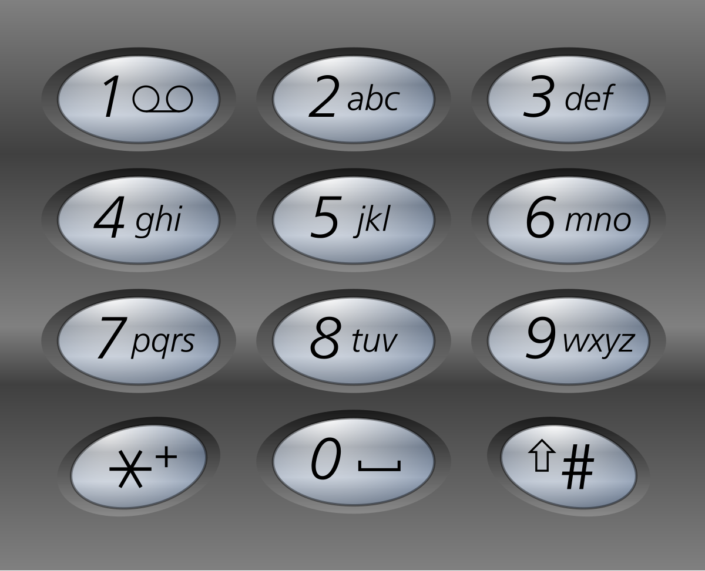

46. 全排列
    给定一个不含重复数字的数组 nums ，返回其 所有可能的全排列 。你可以 按任意顺序 返回答案。

- 回溯

```js
var permute = function (nums) {
  const res = [],
    path = []
  const backtracking = (path, used) => {
    // 终止条件
    if (path.length === nums.length) {
      res.push([...path])
      return
    }
    // 遍历选择
    for (let i = 0; i < nums.length; i++) {
      if (used[i]) continue // 跳过已使用的元素
      // 做选择
      path.push(nums[i])
      used[i] = true
      // 递归进入下一层
      backtracking(path, used)
      // 撤销选择
      used[i] = false
      path.pop()
    }
  }
  backtracking([], new Array(nums.length).fill(false))
  return res
}
```

78. 子集
    给你一个整数数组 nums ，数组中的元素 互不相同 。返回该数组所有可能的子集（幂集）。

解集 不能 包含重复的子集。你可以按 任意顺序 返回解集。

- 回溯

```js
var subsets = function (nums) {
  const res = []
  const backtracking = (start, path) => {
    res.push([...path])

    for (let i = start; i < nums.length; i++) {
      path.push(nums[i])
      backtracking(i + 1, path)
      path.pop()
    }
  }
  backtracking(0, [])
  return res
}
```

17. 电话号码的字母组合
    给定一个仅包含数字 2-9 的字符串，返回所有它能表示的字母组合。答案可以按 任意顺序 返回。

给出数字到字母的映射如下（与电话按键相同）。注意 1 不对应任何字母。


- 做一个映射表，对每一个字母按键的组合进行回溯

```js
var letterCombinations = function (digits) {
  if (!digits.length) return []
  const digitToLetters = {
    2: 'abc',
    3: 'def',
    4: 'ghi',
    5: 'jkl',
    6: 'mno',
    7: 'pqrs',
    8: 'tuv',
    9: 'wxyz'
  }
  const res = []
  const backtracking = (path, index) => {
    if (index === digits.length) {
      res.push(path.join(''))
      return
    }

    const letters = digitToLetters[digits[index]]
    for (let i = 0; i < letters.length; i++) {
      path.push(letters[i])
      backtracking(path, index + 1)
      path.pop()
    }
  }
  backtracking([], 0)
  return res
}
```

131. 分割回文串
     给你一个字符串 s，请你将 s 分割成一些 子串，使每个子串都是 回文串 。返回 s 所有可能的分割方案。

- 写一个辅助函数 判断是否为回文串；按照题意对字符串进行分割

```js
var partition = function (s) {
  const res = []
  const backtrack = (start, path) => {
    if (start === s.length) {
      // 已分割完整个字符串
      res.push([...path])
      return
    }

    for (let end = start + 1; end <= s.length; end++) {
      const substr = s.substring(start, end)
      if (isPalindrome(substr)) {
        // 当前子串是回文
        path.push(substr)
        backtrack(end, path) // 从end开始继续分割
        path.pop() // 回溯
      }
    }
  }

  backtrack(0, [])
  return res
}

// 判断是否为回文串
function isPalindrome(s, left = 0, right = s.length - 1) {
  while (left < right) {
    if (s[left++] !== s[right--]) return false
  }
  return true
}
```

39. 组合总和
    给你一个 无重复元素 的整数数组 candidates 和一个目标整数 target ，找出 candidates 中可以使数字和为目标数 target 的 所有 不同组合 ，并以列表形式返回。你可以按 任意顺序 返回这些组合。

candidates 中的 同一个 数字可以 无限制重复被选取 。如果至少一个数字的被选数量不同，则两种组合是不同的。

对于给定的输入，保证和为 target 的不同组合数少于 150 个。

- 主要去判断组合的 sum 和 target 的关系

```js
var combinationSum = function (candidates, target) {
  const res = []
  candidates.sort((a, b) => a - b)
  const backtracking = (path, start, sum) => {
    if (sum === target) {
      res.push([...path])
      return
    }
    for (let i = start; i < candidates.length; i++) {
      if (sum + candidates[i] > target) break
      path.push(candidates[i])
      backtracking(path, i, sum + candidates[i])
      path.pop()
    }
  }
  backtracking([], 0, 0)
  return res
}
```

22. 括号生成
    数字 n 代表生成括号的对数，请你设计一个函数，用于能够生成所有可能的并且 有效的 括号组合。

- 每一步的选择：在任意位置，可以添加 '(' 或 ')'，但需满足括号的有效性。

- 约束条件：

**左括号数量不能超过 n**（否则无法闭合）。

**右括号数量不能超过左括号**（否则无效，如 ")("）。

```js
var generateParenthesis = function (n) {
  const res = []
  const backtracking = (str, left, right) => {
    if (str.length === 2 * n) {
      res.push(str)
      return
    }
    // 左括号数量不能超过 n
    if (left < n) {
      backtracking(str + '(', left + 1, right)
    }
    // 右括号数量不能超过左括号
    if (right < left) {
      backtracking(str + ')', left, right + 1)
    }
  }
  backtracking('', 0, 0)
  return res
}
```

79. 单词搜索
    给定一个 m x n 二维字符网格 board 和一个字符串单词 word 。如果 word 存在于网格中，返回 true ；否则，返回 false 。

单词必须按照字母顺序，通过相邻的单元格内的字母构成，其中“相邻”单元格是那些水平相邻或垂直相邻的单元格。同一个单元格内的字母不允许被重复使用。


- 回溯对其上下左右四个方向进行搜索
- 对四个方向进行搜索时，需要注意边界条件
- 对四个方向进行搜索时，需要注意是否访问过

```js
var exist = function (board, word) {
  const m = board.length
  const n = board[0].length
  const backtracking = (i, j, index) => {
    if (index === word.length) return true
    if (i < 0 || i >= m || j < 0 || j >= n) return false
    if (board[i][j] !== word[index]) return false

    const temp = board[i][j]
    board[i][j] = 'x'
    const found =
      backtracking(i + 1, j, index + 1) ||
      backtracking(i - 1, j, index + 1) ||
      backtracking(i, j + 1, index + 1) ||
      backtracking(i, j - 1, index + 1)
    board[i][j] = temp
    return found
  }
  for (let i = 0; i < m; i++) {
    for (let j = 0; j < n; j++) {
      if (backtracking(i, j, 0)) return true
    }
  }
  return false
}
```

51. N 皇后
    按照国际象棋的规则，皇后可以攻击与之处在同一行或同一列或同一斜线上的棋子。

n 皇后问题 研究的是如何将 n 个皇后放置在 n×n 的棋盘上，并且使皇后彼此之间不能相互攻击。

给你一个整数 n ，返回所有不同的 n 皇后问题 的解决方案。

每一种解法包含一个不同的 n 皇后问题 的棋子放置方案，该方案中 'Q' 和 '.' 分别代表了皇后和空位。

- 辅助函数判断同一列，对角线，反对角线的皇后是否冲突

```js
var solveNQueens = function (n) {
  const res = []
  const board = new Array(n).fill().map(() => new Array(n).fill('.'))
  const isValid = (row, col, board) => {
    // 检查同一列是否有皇后
    for (let i = 0; i < row; i++) {
      if (board[i][col] === 'Q') return false
    }
    // 检查左上对角线是否有皇后
    for (let i = row - 1, j = col - 1; i >= 0 && j >= 0; i--, j--) {
      if (board[i][j] === 'Q') return false
    }
    // 检查右上对角线是否有皇后
    for (let i = row - 1, j = col + 1; i >= 0 && j < n; i--, j++) {
      if (board[i][j] === 'Q') return false
    }
    return true
  }
  const backtracking = row => {
    // 终止条件：所有行已放置皇后，保存当前棋盘布局
    if (row === n) {
      res.push(board.map(row => row.join(''))) // 将每一行拼接成字符串（如 "Q..."）
      return
    }
    // 尝试在当前行的每一列放置皇后
    for (let col = 0; col < n; col++) {
      if (isValid(row, col, board)) {
        // 如果当前位置合法
        board[row][col] = 'Q' // 放置皇后
        backtracking(row + 1) // 递归处理下一行
        board[row][col] = '.' // 回溯：撤销皇后
      }
    }
  }
  backtracking(0)
  return res
}
```
