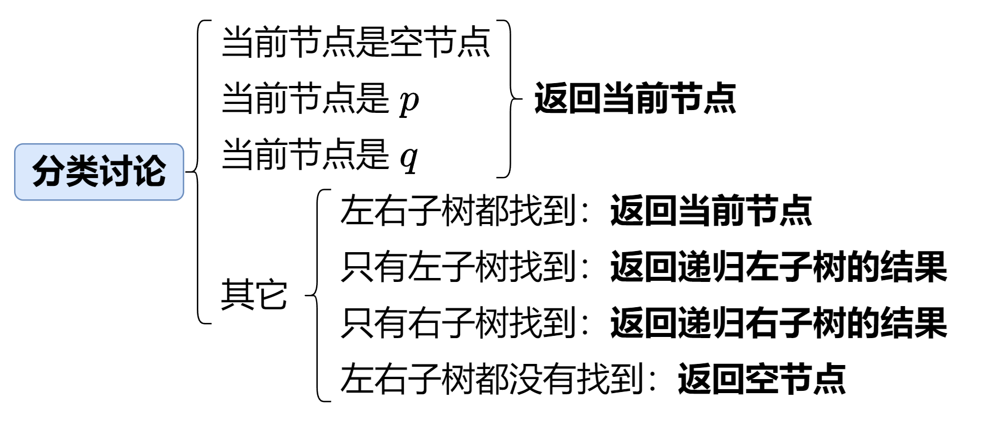
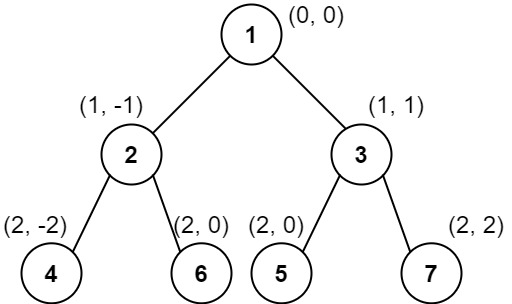
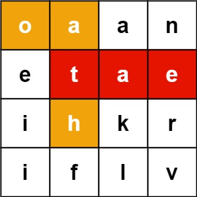

94. 二叉树的中序遍历
    给定一个二叉树的根节点 root ，返回 它的 中序 遍历

- 解法 1 递归

```js
var inorderTraversal = function (root) {
  if (!root) return []
  let left = inorderTraversal(root.left)
  let right = inorderTraversal(root.right)
  return [...left, root.val, ...right]
}
```

- 解法 2 迭代

```js
var inorderTraversal = function (root) {
  let res = []
  let stack = []
  while (root || stack.length) {
    while (root) {
      stack.push(root)
      root = root.left
    }
    root = stack.pop()
    res.push(root.val)
    root = root.right
  }
  return res
}
```

104. 二叉树的最大深度
     给定一个二叉树 root ，返回其最大深度。
     二叉树的 最大深度 是指从根节点到最远叶子节点的最长路径上的节点数。

- 去找左右子树的最大深度，取较大值加 1 即可。

```js
var maxDepth = function (root) {
  if (!root) return 0
  let left = maxDepth(root.left)
  let right = maxDepth(root.right)
  return Math.max(left, right) + 1
}
```

226. 翻转二叉树
     给你一棵二叉树的根节点 root ，翻转这棵二叉树，并返回其根节点。

- 解法 1 递归：

```js
var invertTree = function (root) {
  if (!root) return null
  let left = invertTree(root.left)
  let right = invertTree(root.right)
  root.left = right
  root.right = left
  return root
}
```

- 解法 2 队列模拟：

```js
var invertTree = function (root) {
  if (!root) return null
  const queue = [root]
  while (queue.length) {
    const node = queue.shift()
    ;[node.left, node.right] = [node.right, node.left]
    if (node.left) queue.push(node.left)
    if (node.right) queue.push(node.right)
  }
  return root
}
```

101. 对称二叉树
     给你一个二叉树的根节点 root ， 检查它是否轴对称

- 解法 1 递归

```js
var isSymmetric = function (root) {
  if (!root) return true
  return isMirror(root.left, root.right)
}
function isMirror(left, right) {
  if (!left && !right) return true
  if (!left || !right) return false
  return (
    left.val === right.val &&
    isMirror(left.left, right.right) &&
    isMirror(right.left, left.right)
  )
}
```

543. 二叉树的直径
     给你一棵二叉树的根节点，返回该树的 直径 。
     二叉树的 直径 是指树中任意两个节点之间最长路径的 长度 。这条路径可能经过也可能不经过根节点 root 。
     两节点之间路径的 长度 由它们之间边数表示。

- 其实就是求左右子树的深度和的最大值。

```js
var diameterOfBinaryTree = function (root) {
  let maxDiameter = 0
  const Depth = node => {
    if (!node) return 0
    const left = Depth(node.left)
    const right = Depth(node.right)
    maxDiameter = Math.max(maxDiameter, left + right)
    return Math.max(left, right) + 1
  }
  Depth(root)
  return maxDiameter
}
```

102. 二叉树的层序遍历
     给你二叉树的根节点 root ，返回其节点值的 层序遍历 。 （即逐层地，从左到右访问所有节点）。

```js
var levelOrder = function (root) {
  if (!root) return []
  let queue = [root]
  let traversal = []

  while (queue.length) {
    let currentLevel = []
    let levelSize = queue.length

    for (let i = 0; i < levelSize; i++) {
      const node = queue.shift()
      currentLevel.push(node.val)
      if (node.left) queue.push(node.left)
      if (node.right) queue.push(node.right)
    }

    traversal.push(currentLevel)
  }

  return traversal
}
```

108. 将有序数组转换为二叉搜索树
     给你一个整数数组 nums ，其中元素已经按 升序 排列，请你将其转换为一棵 平衡 二叉搜索树。

- 用二分法 root 是数组中间的元素

```js
var sortedArrayToBST = function (nums) {
  function dfs(left, right) {
    if (left === right) return null
    const mid = (left + right) >>> 1
    return new TreeNode(nums[mid], dfs(left, mid), dfs(mid + 1, right))
  }
  return dfs(0, nums.length)
}
```

98. 验证二叉搜索树
    节点的左子树只包含 小于 当前节点的数。
    节点的右子树只包含 大于 当前节点的数。
    所有左子树和右子树自身必须也是二叉搜索树。

- 思路就是去递归左边的 根 右边的，根的值一定要比前面的大。

```js
var isValidBST = function (root) {
  let pre = -Infinity
  function dfs(node) {
    if (!node) return true
    if (!dfs(node.left)) return false
    if (node.val <= pre) return false
    pre = node.val
    return dfs(node.right)
  }
  return dfs(root)
}
```

230. 二叉搜索树中第 K 小的元素
     给定一个二叉搜索树的根节点 root ，和一个整数 k ，请你设计一个算法查找其中第 k 小的元素（从 1 开始计数）。

- 既然是二叉搜索树，那么就应该去进行中序遍历，只不过中间访问根节点的改成--k 直到 k===0 的时候也就找到了第 k 小的元素

```js
var kthSmallest = function (root, k) {
  let ans = 0
  function dfs(node) {
    if (!node || k === 0) return
    dfs(node.left)
    if (--k === 0) {
      ans = node.val
    }
    dfs(node.right)
  }
  dfs(root)
  return ans
}
```

199. 二叉树的右视图
     给定一个二叉树的 根节点 root，想象自己站在它的右侧，按照从顶部到底部的顺序，返回从右侧所能看到的节点值。

- 其实就是层序遍历，但是只输出每一层的最后那个值

```js
var rightSideView = function (root) {
  if (!root) return []
  let queue = [root]
  let ans = []
  while (queue.length) {
    let levelSize = queue.length
    for (let i = 0; i < levelSize; i++) {
      let node = queue.shift()
      if (i === levelSize - 1) {
        ans.push(node.val)
      }
      if (node.left) queue.push(node.left)
      if (node.right) queue.push(node.right)
    }
  }
  return ans
}
```

114. 二叉树展开为链表

展开后的单链表应该同样使用 TreeNode ，其中 right 子指针指向链表中下一个结点，而左子指针始终为 null 。
展开后的单链表应该与二叉树 先序遍历 顺序相同。

- 可以先先序遍历一下二叉树，得到序列后，再逐个组装到新的二叉树，左子树为空，右子树指向下一个节点

```js
var flatten = function (root) {
  const stack = preorderTraversal(root)
  const size = stack.length
  for (let i = 1; i < size; i++) {
    const pre = stack[i - 1],
      cur = stack[i]
    pre.left = null
    pre.right = cur
  }
}
function preorderTraversal(root) {
  // 迭代写法
  const stack = [root]
  const res = []
  while (stack.length) {
    const node = stack.pop()
    res.push(node)
    if (node.right) stack.push(node.right)
    if (node.left) stack.push(node.left)
  }
  return res
}
// 递归写法
const preorderTraversal = (root, stack = []) => {
  if (root) {
    stack.push(root) // 直接操作外部数组
    preorderTraversal(root.left, stack)
    preorderTraversal(root.right, stack)
  }
  return stack
}
```

105. 从前序与中序遍历序列构造二叉树
     给定两个整数数组 preorder 和 inorder ，其中 preorder 是二叉树的先序遍历， inorder 是同一棵树的中序遍历，请构造二叉树并返回其根节点。

- 思路是在中序中找到前序的第一个值，即根节点，划分成左右两个部分，再依次去递归合成左右子树

```js
var buildTree = function (preorder, inorder) {
  const n = preorder.length
  if (n === 0) return null
  const leftSize = inorder.indexOf(preorder[0])
  const pre1 = preorder.slice(1, 1 + leftSize)
  const pre2 = preorder.slice(1 + leftSize, n)
  const in1 = inorder.slice(0, leftSize)
  const in2 = inorder.slice(leftSize + 1, n)
  const left = buildTree(pre1, in1)
  const right = buildTree(pre2, in2)
  return new TreeNode(preorder[0], left, right)
}
```

- 节省 slice 开销+映射：

```js
var buildTree = function (preorder, inorder) {
  const inorderMap = {}
  inorder.forEach((val, idx) => {
    inorderMap[val] = idx
  })
  const build = (pre1, pre2, in1, in2) => {
    if (pre1 > pre2) return null
    const rootVal = preorder[pre1]
    const root = new TreeNode(rootVal)
    const mid = inorderMap[rootVal]
    const leftSize = mid - in1
    root.left = build(pre1 + 1, pre1 + leftSize, in1, mid - 1)
    root.right = build(pre1 + leftSize + 1, pre2, mid + 1, in2)
    return root
  }
  return build(0, preorder.length - 1, 0, inorder.length - 1)
}
```

112. 路径总和
     给你二叉树的根节点 root 和一个表示目标和的整数 targetSum 。判断该树中是否存在 根节点到叶子节点 的路径，这条路径上所有节点值相加等于目标和 targetSum 。如果存在，返回 true ；否则，返回 false 。

叶子节点 是指没有子节点的节点。

- 思路是递归遍历更新 sum 值，这里是用 currentSum 去逼近 0

```js
var hasPathSum = function (root, targetSum) {
  if (!root) return false
  function dfs(node, currentSum) {
    currentSum -= node.val
    if (!node.left && !node.right) return currentSum === 0
    if (node.left && dfs(node.left, currentSum)) return true
    if (node.right && dfs(node.right, currentSum)) return true

    return false
  }
  return dfs(root, targetSum)
}
```

```js
var hasPathSum = function (root, targetSum) {
  if (!root) {
    return false
  }
  // 只有根节点的情况
  if (!root.left && !root.right) {
    return targetSum === root.val
  }
  return (
    hasPathSum(root.left, targetSum - root.val) ||
    hasPathSum(root.right, targetSum - root.val)
  )
}
```

113. 路径总和 II
     给你二叉树的根节点 root 和一个整数目标和 targetSum ，找出所有 从根节点到叶子节点 路径总和等于给定目标和的路径。

叶子节点 是指没有子节点的节点。

- 思路是递归遍历，每次减去当前节点的值，并且把当前结点压入结果中，如果当前值变成 0，那么找到了一组结果，递归左右子树，并且回溯

```js
var pathSum = function (root, targetSum) {
  if (!root) return []
  let ans = []

  function dfs(node, currentSum, path) {
    currentSum -= node.val
    path.push(node.val)
    if (!node.left && !node.right && currentSum === 0) ans.push([...path])
    if (node.left) dfs(node.left, currentSum, path)
    if (node.right) dfs(node.right, currentSum, path)

    path.pop()
  }

  dfs(root, targetSum, [])
  return ans
}
```

437. 路径总和 III
     给定一个二叉树的根节点 root ，和一个整数 targetSum ，求该二叉树里节点值之和等于 targetSum 的 路径 的数目。

路径 不需要从根节点开始，也不需要在叶子节点结束，但是路径方向必须是向下的（只能从父节点到子节点）。

- 思路是遍历更新 sum 值，这里是用 currentSum 去逼近 targetSum

```js
var pathSum = function (root, targetSum) {
  let ans = 0
  if (!root) return 0
  function dfs(node, currentSum) {
    if (!node) return
    currentSum += node.val
    if (currentSum === targetSum) ans++
    dfs(node.left, currentSum)
    dfs(node.right, currentSum)
  }
  function traversal(node) {
    if (!node) return
    dfs(node, 0)
    traversal(node.left)
    traversal(node.right)
  }
  traversal(root)
  return ans
}
```
236. 二叉树的最近公共祖先
给定一个二叉树, 找到该树中两个指定节点的最近公共祖先。

百度百科中最近公共祖先的定义为：“对于有根树 T 的两个节点 p、q，最近公共祖先表示为一个节点 x，满足 x 是 p、q 的祖先且 x 的深度尽可能大（一个节点也可以是它自己的祖先）。”

查看p、q在哪侧，如果一个在左一个在右，那么当前节点就是最近公共祖先
如果都在左，那么就是左子树当前结点
如果都在右，那么就是右子树当前结点
```js
var lowestCommonAncestor = function (root, p, q) {
    if (!root || p === root || q === root) return root;
    const left = lowestCommonAncestor(root.left, p, q);
    const right = lowestCommonAncestor(root.right, p, q);
    if (left && right) return root;
    return left ? left : right;
};
```
124. 二叉树中的最大路径和
二叉树中的 路径 被定义为一条节点序列，序列中每对相邻节点之间都存在一条边。同一个节点在一条路径序列中 至多出现一次 。该路径 至少包含一个 节点，且不一定经过根节点。

路径和 是路径中各节点值的总和。

给你一个二叉树的根节点 root ，返回其 最大路径和 。
- 类似于最大直径
```js
var maxPathSum = function (root) {
    let maxSum = -Infinity;
    function dfs(node) {
        if (!node) return 0;
        const leftSum = Math.max(dfs(node.left), 0);
        const rightSum = Math.max(dfs(node.right), 0);
        const currentPathSum = leftSum + rightSum + node.val;
        maxSum = Math.max(maxSum, currentPathSum);
        return Math.max(leftSum, rightSum) + node.val;
    }
    dfs(root);
    return maxSum;
};
```
 987. 二叉树的垂序遍历
给你二叉树的根结点 root ，请你设计算法计算二叉树的 垂序遍历 序列。

对位于 (row, col) 的每个结点而言，其左右子结点分别位于 (row + 1, col - 1) 和 (row + 1, col + 1) 。树的根结点位于 (0, 0) 。

二叉树的 垂序遍历 从最左边的列开始直到最右边的列结束，按列索引每一列上的所有结点，形成一个按出现位置从上到下排序的有序列表。如果同行同列上有多个结点，则按结点的值从小到大进行排序。

返回二叉树的 垂序遍历 序列。

- 主要思路是去记录每个结点的值、行坐标和列坐标，再分别按列坐标和行坐标排序
- 最后分组输出结果
```js
var verticalTraversal = function(root) {
    if (!root) return [];
    
    const nodes = [];
    
    // DFS遍历树，记录每个节点的值、行号和列号
    function dfs(node, row, col) {
        if (!node) return;
        nodes.push({val: node.val, row, col});
        dfs(node.left, row + 1, col - 1);
        dfs(node.right, row + 1, col + 1);
    }
    
    dfs(root, 0, 0);
    
    // 排序
    nodes.sort((a, b) => {
        if (a.col !== b.col) return a.col - b.col;  // 先按列排序
        if (a.row !== b.row) return a.row - b.row;  // 同列按行排序
        return a.val - b.val;                       // 同行同列按值排序
    });
    
    // 分组输出
    const result = [];
    let currentCol = null;
    let currentGroup = [];
    
    for (const node of nodes) {
        if (node.col !== currentCol) {
            if (currentGroup.length > 0) {
                result.push(currentGroup.map(n => n.val));
            }
            currentCol = node.col;
            currentGroup = [node];
        } else {
            currentGroup.push(node);
        }
    }
    
    // 添加最后一组
    if (currentGroup.length > 0) {
        result.push(currentGroup.map(n => n.val));
    }
    
    return result;
};
```
212. 单词搜索 II
给定一个 m x n 二维字符网格 board 和一个单词（字符串）列表 words， 返回所有二维网格上的单词 。

单词必须按照字母顺序，通过 相邻的单元格 内的字母构成，其中“相邻”单元格是那些水平相邻或垂直相邻的单元格。同一个单元格内的字母在一个单词中不允许被重复使用。

- 方法Trie（字典树） + DFS 回溯（推荐）
构建 Trie：将 words 中的所有单词插入字典树，方便快速匹配前缀。

DFS 搜索：遍历 board 的每个单元格，以该单元格为起点，在 Trie 中搜索可能的单词。

剪枝优化：如果当前路径不在 Trie 中，提前终止搜索。
```js
class TrieNode {
    constructor() {
        this.children = {};
        this.word = null;
    }
}

function buildTrie(words) {
    const root = new TrieNode();
    for (const word of words) {
        let node = root;
        for (const char of word) {
            if (!node.children[char]) {
                node.children[char] = new TrieNode();
            }
            node = node.children[char];
        }
        node.word = word;
    }
    return root;
}

function findWords(board, words) {
    const result = [];
    const trie = buildTrie(words);
    const m = board.length, n = board[0].length;

    const dfs = (i, j, node) => {
        if (i < 0 || i >= m || j < 0 || j >= n || board[i][j] === '#') {
            return;
        }
        const char = board[i][j];
        if (!node.children[char]) {
            return;
        }
        const nextNode = node.children[char];
        if (nextNode.word !== null) {
            result.push(nextNode.word);
            nextNode.word = null; // 避免重复添加
        }
        board[i][j] = '#';
        dfs(i + 1, j, nextNode);
        dfs(i - 1, j, nextNode);
        dfs(i, j + 1, nextNode);
        dfs(i, j - 1, nextNode);
        board[i][j] = char;
    };

    for (let i = 0; i < m; i++) {
        for (let j = 0; j < n; j++) {
            dfs(i, j, trie);
        }
    }
    return result.sort();
}
```
