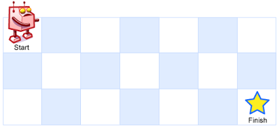

### 动态规划（Dynamic Programming, DP）是一种解决复杂问题的方法，它将问题分解为更小的子问题，并存储这些子问题的解以避免重复计算。
#### 一维
70. 爬楼梯
假设你正在爬楼梯。需要 n 阶你才能到达楼顶。

每次你可以爬 1 或 2 个台阶。你有多少种不同的方法可以爬到楼顶呢？
- 动态规划 **数组表示爬当前台阶数的不同方法有多少种**,而爬到当前n级台阶数的不同方法数量是爬到上一个台阶的数量➕上上个的数量
也就是说 要到达第n个台阶，最后一步只有两种可能：

**从第n-1个台阶爬1个台阶上来。 从第n-2个台阶爬2个台阶上来。**

因此，到达第n个台阶的所有方法可以分成两类：

所有到达第n-1个台阶的方法，然后爬1个台阶。

所有到达第n-2个台阶的方法，然后爬2个台阶。

- 状态转移方程: dp[i] = dp[i - 1] + dp[i - 2]
- 初始化: dp[0] = 1, dp[1] = 1
- 遍历顺序: 从前往后
```js
var climbStairs = function (n) {
    if (n === 1) return 1;
    if (n === 2) return 2;
    let dp = Array(n+1);
    dp[0] = 1, dp[1] = 1, dp[2] = 2;
    for (let i = 3; i <= n; i++) {
        dp[i] = dp[i - 1] + dp[i - 2];
    }
    return dp[n];
};
```
- 优化 用两个数来存最近两个状态，本质是斐波那契数列
```js
var climbStairs = function (n) {
    if (n <= 2) return n;

    let prev1 = 2, prev2 = 1;

    for (let i = 3; i <= n; i++) {
        let cur = prev1 + prev2;
        prev2 = prev1;
        prev1 = cur;
    }
    return prev1;
};
```

118. 杨辉三角
给定一个非负整数 numRows，生成「杨辉三角」的前 numRows 行。  

  

- 动态规划 **数组表示当前行的数字**,当前行的数字等于左上方的数字与上方数字之和
- 状态转移方程: dp[i][j] = dp[i - 1][j - 1] + dp[i - 1][j]
- 初始化: 第一列和对角线是1,即 dp[i][0] = 1, dp[i][i] = 1
- 遍历顺序: 从前往后
```js
var generate = function (numRows) {
    const arr = Array(numRows);
    for (let i = 0; i < numRows; i++) {
        arr[i] = Array(i + 1);
        arr[i][0] = arr[i][i] = 1;
        for (let j = 1; j < i; j++) {
            arr[i][j] = arr[i - 1][j - 1] + arr[i - 1][j];
        }
    }
    return arr;
};
```
- 行更新，依靠上一行的前一个和当前的这个更新当前这行的值
```js
var generate = function (numRows) {
    const res = [];
    let row = [1];
    for (let i = 0; i < numRows; i++) {
        res.push([...row]);
        for (let j = row.length - 1; j > 0; j--) {
            row[j] = row[j] + row[j - 1];
        }
        row.push(1);
    }
    return res;
};
```

198. 打家劫舍
你是一个专业的小偷，计划偷窃沿街的房屋。每间房内都藏有一定的现金，影响你偷窃的唯一制约因素就是相邻的房屋装有相互连通的防盗系统，如果两间相邻的房屋在同一晚上被小偷闯入，系统会自动报警。

给定一个代表每个房屋存放金额的非负整数数组，计算你 不触动警报装置的情况下 ，一夜之内能够偷窃到的最高金额。

- 动态规划 **数组表示当前房屋能够偷到的最高金额** 是在 前一个房间能够偷到的最高金额和上上个房间能够偷到的最高金额 + 当前房屋的金额 之中的最大值
- 状态转移方程: dp[i] = Math.max(dp[i - 1], dp[i - 2] + nums[i])
- 初始化: dp[0] = nums[0], dp[1] = Math.max(nums[0], nums[1])
- 遍历顺序: 从前往后
```js
var rob = function (nums) {
    const n = nums.length;
    const dp = Array(n);
    dp[0] = nums[0], dp[1] = Math.max(nums[0], nums[1]);
    for (let i = 2; i < n; i++) {
        dp[i] = Math.max(dp[i - 1], dp[i - 2] + nums[i]);
    }
    return dp[n - 1];
};
```
- 优化 靠两个数来记录前一个房屋的最大值和前前一个房屋的最大值
```js
var rob = function (nums) {
    const n = nums.length;
    if (n === 1) return nums[0];
    let prev1 = nums[0], prev2 = Math.max(nums[0], nums[1]);
    for (let i = 2; i < n; i++) {
        let cur = Math.max(prev1, prev2 + nums[i]);
        prev2 = prev1;
        prev1 = cur;
    }
    return prev1;
};
```

279. 完全平方数
给你一个整数 n ，返回 和为 n 的完全平方数的最少数量 。

完全平方数 是一个整数，其值等于另一个整数的平方；换句话说，其值等于一个整数自乘的积。例如，1、4、9 和 16 都是完全平方数，而 3 和 11 不是。
- 类似于01背包问题,相当于是用一些数字去填满这个整数n
**定义 dp[i] 表示组成数字 i 所需的最少完全平方数的数量**。我们的目标是找到 dp[n]。
对于每个 i，我们可以尝试所有可能的完全平方数 j²（其中 j² ≤ i），然后：

dp[i] = min(dp[i], dp[i - j²] + 1) 加1是因为相当于是用了一个完全平方数j²

```js
var numSquares = function (n) {
    const dp = new Array(n + 1).fill(Infinity);
    dp[0] = 0;

    for (let i = 1; i <= n; i++) {
        for (let j = 1; j * j <= i; j++) {
            dp[i] = Math.min(dp[i], dp[i - j * j] + 1);
        }
    }
    return dp[n];
};
```

322. 零钱兑换
给你一个整数数组 coins ，表示不同面额的硬币；以及一个整数 amount ，表示总金额。

计算并返回可以凑成总金额所需的 最少的硬币个数 。如果没有任何一种硬币组合能组成总金额，返回 -1 。

你可以认为每种硬币的数量是无限的。

- 动态规划 **数组表示组成金额i所需的最少硬币数** 和上一题是一样的思路 也是类似的01背包问题,相当于用不同金额的coins去填满一个amount大小的背包
- 状态转移方程: dp[i] = Math.min(dp[i], dp[i - coin] + 1)
- 初始化: dp[0] = 0,其他初始化为Infinity
- 遍历顺序: 从前往后

```js
var coinChange = function (coins, amount) {
    if (amount === 0) return 0;

    let dp = Array(amount + 1).fill(Infinity);
    dp[0] = 0;

    for (let i = 1; i <= amount; i++) {
        for (const coin of coins) {
            if (coin <= i) {
                dp[i] = Math.min(dp[i], dp[i - coin] + 1);
            }
        }
    }

    return dp[amount] === Infinity ? -1 : dp[amount];
};
```
139. 单词拆分
给你一个字符串 s 和一个字符串列表 wordDict 作为字典。如果可以利用字典中出现的一个或多个单词拼接出 s 则返回 true。

注意：不要求字典中出现的单词全部都使用，并且字典中的单词可以重复使用。
- 动态规划 **数组表示字符串s的前i个字符是否可以被wordDict中的单词拼接出** 本质上还是背包问题,
  即: 用wordDict中的单词去填满字符串s, 看是否能够填满 所以要判断的是分割出来的是不是单词列表的单词,还要判断之前的单词是否能够被拼接出
  - s.slice(i - wordDict[j].length, i) === wordDict[j]：检查从 i - word.length 到 i 的子串是否是字典中的单词。
  - dp[i - wordDict[j].length]：检查这个单词前面的部分是否可以拼接。
- 状态转移方程: dp[i] = dp[j] && wordDict.includes(s.slice(j, i))
- 初始化: dp[0] = true
- 遍历顺序: 从前往后
```js
var wordBreak = function (s, wordDict) {
    let dp = Array(s.length + 1).fill(false);
    dp[0] = true;
    for (let i = 0; i <= s.length; i++) {
        for (let j = 0; j < wordDict.length; j++) {
            if (i >= wordDict[j].length) {
                if (s.slice(i - wordDict[j].length, i) === wordDict[j] && dp[i - wordDict[j].length]) {
                    dp[i] = true;
                }
            }
        }
    }
    return dp[s.length];
};

```
300. 最长递增子序列
给你一个整数数组 nums ，找到其中最长严格递增子序列的长度。

子序列 是由数组派生而来的序列，删除（或不删除）数组中的元素而不改变其余元素的顺序。例如，[3,6,2,7] 是数组 [0,3,1,6,2,2,7] 的子序列。

- 动态规划 **数组表示以i结尾的最长递增子序列的长度** 递增的话也就是后一个数比前一个数大,如果大的话,
  那么就可以把前一个数的最长递增子序列的长度加1,选择最大的一个
- 状态转移方程: dp[i] = Math.max(dp[i], dp[j] + 1)
- 初始化: dp[0] = 1
- 遍历顺序: 从前往后
```js
var lengthOfLIS = function (nums) {
    const n = nums.length;
    if (n === 0) return 0;
    let dp = Array(n).fill(1);
    let ans = 1;
    for (let i = 0; i < n; i++) {
        for (let j = 0; j < i; j++) {
            if (nums[i] > nums[j]) {
                dp[i] = Math.max(dp[j] + 1, dp[i]);
            }
        }
        ans = Math.max(ans, dp[i]);
    }
    return ans;
};
```

152. 乘积最大子数组
给你一个整数数组 nums ，请你找出数组中乘积最大的非空连续 子数组（该子数组中至少包含一个数字），并返回该子数组所对应的乘积。

测试用例的答案是一个 32-位 整数。
- 动态规划 **数组表示以i结尾的乘积最大的子数组的乘积** 
- 需要考虑正负数的情况
对于每个 nums[i]，有三种情况：

从 nums[i] 重新开始一个新的子数组（即子数组长度为1）。

将 nums[i] 乘以前一个子数组的最大乘积 maxDP[i-1]。

将 nums[i] 乘以前一个子数组的最小乘积 minDP[i-1]（因为负数乘以负数会变成正数）。 负数越小，与负数相乘乘积越大

因此：

maxDP[i] = max(nums[i], nums[i] * maxDP[i-1], nums[i] * minDP[i-1])

minDP[i] = min(nums[i], nums[i] * maxDP[i-1], nums[i] * minDP[i-1])
- 初始化: maxDP[0] = nums[0], minDP[0] = nums[0]
- 遍历顺序: 从前往后
```js
var maxProduct = function (nums) {
    const n = nums.length;
    if (n === 0) return 0;

    let maxDP = Array(n).fill(0);
    let minDP = Array(n).fill(0);
    maxDP[0] = minDP[0] = nums[0];
    let res = nums[0];

    for (let i = 1; i < n; i++) {
        maxDP[i] = Math.max(nums[i], nums[i] * maxDP[i - 1], nums[i] * minDP[i - 1]);// 以i结尾的乘积最大的子数组的乘积
        minDP[i] = Math.min(nums[i], nums[i] * maxDP[i - 1], nums[i] * minDP[i - 1]);// 以i结尾的乘积最小的子数组的乘积
        res = Math.max(maxDP[i], res);
    }
    return res;
};
```
416. 分割等和子集
给你一个 只包含正整数 的 非空 数组 nums 。请你判断是否可以将这个数组分割成两个子集，使得两个子集的元素和相等。
- 动态规划 
二维数组
```js
dp[i][j]：表示从前 i 个元素中是否能选出一些数，使得它们的和等于 j。

最终目标是 dp[n][target]，其中 target = sum / 2。

状态转移
对于每个元素 nums[i-1]（因为 i 从 1 开始）：

如果不选 nums[i-1]，则 dp[i][j] = dp[i-1][j]。

如果选 nums[i-1]，则 dp[i][j] = dp[i-1][j - nums[i-1]]（前提是 j >= nums[i-1]）。
```

```js
var canPartition = function (nums) {
    const sum = nums.reduce((a, b) => a + b, 0);
    if (sum % 2 !== 0) return false;
    const target = sum / 2;
    const n = nums.length;

    const dp = Array.from({ length: n + 1 }, () => Array(target + 1).fill(false));
    dp[0][0] = true;

    for (let i = 1; i <= n; i++) {
        for (let j = 0; j <= target; j++) {
            if (j < nums[i - 1]) dp[i][j] = dp[i - 1][j];
            else dp[i][j] = dp[i - 1][j] || dp[i - 1][j - nums[i - 1]];
        }
    }
    return dp[n][target];
};
```
- 优化
  - 空间优化：由于 dp[i][j] 只与 dp[i-1][j] 和 dp[i-1][j - nums[i-1]] 有关，所以可以将二维数组优化为一维数组。
  - 时间优化：可以在遍历 nums 时，直接更新 dp[j]，而不是遍历所有的 j。
```js
var canPartition = function (nums) {
    const sum = nums.reduce((a, b) => a + b, 0);
    if (sum % 2 !== 0) return false;
    const target = sum / 2;

    const dp = Array(target + 1).fill(false);
    dp[0] = true;

    for (const num of nums) {
        for (let j = target; j >= num; j--) {
            dp[j] = dp[j] || dp[j - num];
        }
    }
    return dp[target];
};
``` 
32. 最长有效括号
给你一个只包含 '(' 和 ')' 的字符串，找出最长有效（格式正确且连续）括号子串的长度。
```js
- 定义状态：dp[i] 表示以 s[i] 结尾的最长有效括号子串的长度。

- 初始化：dp 数组初始化为 0。

状态转移：

如果 s[i] = ')'：

如果 s[i-1] = '('，则 dp[i] = dp[i-2] + 2。
//遇到连续的右括号，去找再前面，左括号能否匹配  j = i - dp[i-1] - 1（即跳过 dp[i-1] 的长度，找前面的字符）。
如果 s[i-1] = ')' 且 s[i - dp[i-1] - 1] = '('，则 dp[i] = dp[i-1] + 2 + dp[i - dp[i-1] - 2]。
结果：dp 数组中的最大值。
```


```js
var longestValidParentheses = function (s) {
    let maxLen = 0;
    const n = s.length;
    const dp = new Array(n).fill(0);
    for (let i = 1; i < n; i++) {
        if (s[i] === ')') {
            if (s[i - 1] === '(') {
                dp[i] = (i >= 2 ? dp[i - 2] : 0) + 2;
            } else {
                const j = i - dp[i - 1] - 1;
                if (j >= 0 && s[j] === '(') {
                    dp[i] = dp[i - 1] + 2 + (j >= 1 ? dp[j - 1] : 0);
                }
            }
            maxLen = Math.max(maxLen, dp[i])
        }
    }
    return maxLen;
};
```

- 栈的解法 
```js
var longestValidParentheses = function(s) {
    let maxLen = 0;
    const stack = [-1];
    for (let i = 0; i < s.length; i++) {
        if (s[i] === '(') {
            stack.push(i);
        } else {
            stack.pop();
            if (stack.length === 0) {
                // 当遇到无法匹配的 ')' 时，会将当前索引压入栈，作为新的边界。
                stack.push(i);
            } else {
                // stack[stack.length - 1] 是栈顶的索引值，表示当前有效子串的前一个位置。
                maxLen = Math.max(maxLen, i - stack[stack.length - 1]);
            }
        }
    }
    return maxLen;
};
```

- 双指针
左右遍历：

从左到右：统计 '(' 和 ')' 的数量，当 left == right 时更新最大长度，当 right > left 时重置计数器。

从右到左：同理，处理 left > right 的情况。

结果：两次遍历中的最大长度。

```js
var longestValidParentheses = function (s) {
    let maxLen = 0;
    let left = 0, right = 0;
    const n = s.length;
    for (let i = 0; i < n; i++) {
        if (s[i] === '(') left++;
        else right++;
        if (left === right) maxLen = Math.max(maxLen, 2 * right);
        else if (right > left) left = right = 0;
    }

    left = right = 0;
    for (let i = n - 1; i >= 0; i--) {
        if (s[i] === '(') left++;
        else right++;
        if (left === right) maxLen = Math.max(maxLen, 2 * left);
        else if (left > right) left = right = 0;
    }

    return maxLen;
};
```
#### 二维
62. 不同路径
一个机器人位于一个 m x n 网格的左上角 （起始点在下图中标记为 “Start” ）。

机器人每次只能向下或者向右移动一步。机器人试图达到网格的右下角（在下图中标记为 “Finish” ）。

问总共有多少条不同的路径？

- 定义状态：**dp[i][j] 表示从起点 (0, 0) 到达 (i, j) 的不同路径数**。 那么dp[i][j]的数量就是从上面走下来和从左边走过来的两种方案数量之和
- 初始化：第一行和第一列的路径数都为 1。
- 状态转移：dp[i][j] = dp[i-1][j] + dp[i][j-1]。
- 结果：dp[m-1][n-1]。
```js
var uniquePaths = function (m, n) {
    let dp = Array(m).fill(0).map(() => Array(n).fill(1));
    for (let i = 1; i < m; i++) {
        for (let j = 1; j < n; j++) {
            dp[i][j] = dp[i - 1][j] + dp[i][j - 1];
        }
    }
    return dp[m - 1][n - 1];
};
```
- 优化成一维数组
```js
var uniquePaths = function (m, n) {
    let dp = Array(n).fill(1);
    for (let i = 1; i < m; i++) {
        // 逐行更新，dp[j] 表示当前行第 j 列的路径数。 所以是需要和左边的进行累加的
        for (let j = 1; j < n; j++) {
            dp[j] += dp[j - 1];
        }
    }
    return dp[n - 1];
};
```

64. 最小路径和
给定一个包含非负整数的 m x n 网格 grid ，请找出一条从左上角到右下角的路径，使得路径上的数字总和为最小。

说明：每次只能向下或者向右移动一步。
- 定义状态：**dp[i][j] 表示从起点 (0, 0) 到达 (i, j) 的最小路径和**。
二维数组来记录，当前位置的最小路径和，要么是左边格子的最小路径和加上当前格子的值，要么是上边格子的最小路径和加上当前的格子的值
```js
var minPathSum = function (grid) {
    const m = grid.length;
    const n = grid[0].length;
    let dp = Array.from({ length: m }, () => Array(n).fill(0));

    dp[0][0] = grid[0][0];
    for (let i = 1; i < m; i++) {
        dp[i][0] = dp[i - 1][0] + grid[i][0];
    }

    for (let j = 1; j < n; j++) {
        dp[0][j] = dp[0][j - 1] + grid[0][j];
    }

    for (let i = 1; i < m; i++) {
        for (let j = 1; j < n; j++) {
            dp[i][j] = Math.min(dp[i - 1][j], dp[i][j - 1]) + grid[i][j];
        }
    }

    return dp[m - 1][n - 1];
}
```
- 优化 原本需要二维数组记录每个位置的最小和，但我们发现：计算当前行时，只需要知道上一行的结果

```js
var minPathSum = function (grid) {
    const m = grid.length;
    const n = grid[0].length;
    let dp = Array(n).fill(0);

    dp[0] = grid[0][0];
    for (let j = 1; j < n; j++) {
        dp[j] = dp[j - 1] + grid[0][j];
    }

    for (let i = 1; i < m; i++) {
        dp[0] += grid[i][0];
        for (let j = 1; j < n; j++) {
            dp[j] = Math.min(dp[j], dp[j - 1]) + grid[i][j];
        }
    }
    return dp[n - 1];
}
```
5. 最长回文子串
给你一个字符串 s，找到 s 中最长的 回文 子串。
- 定义状态：**dp[i][j] 表示 s[i...j] 是否为回文子串**。
- 初始化：单个字符一定是回文：dp[i][i] = true。两个相同字符是回文：dp[i][i+1] = (s[i] == s[i+1])。
- 状态转移：如果 s[i] == s[j] 且 dp[i+1][j-1] 为回文子串，则 dp[i][j] 为回文子串。
- 结果：遍历 dp 数组，找到最长的回文子串。
```js
function longestPalindrome(s) {
    const n = s.length;
    if (n === 0) return "";
    let dp = Array.from({ length: n }, () => Array(n).fill(false));
    let start = 0, maxLen = 1;

    // 单个字符一定是回文
    for (let i = 0; i < n; i++) dp[i][i] = true;

    // 检查长度为 2 的子串
    for (let i = 0; i < n - 1; i++) {
        if (s[i] === s[i + 1]) {
            dp[i][i + 1] = true;
            start = i;
            maxLen = 2;
        }
    }

    // 检查长度 >= 3 的子串
    for (let len = 3; len <= n; len++) {
        for (let i = 0; i <= n - len; i++) {
            let j = i + len - 1;
            if (s[i] === s[j] && dp[i + 1][j - 1]) {
                dp[i][j] = true;
                if (len > maxLen) {
                    start = i;
                    maxLen = len;
                }
            }
        }
    }

    return s.substring(start, start + maxLen);
}
```
- 中心扩展 从每个字符向两边扩展，找到最长的回文子串。
```js
function longestPalindrome(s) {
    const n = s.length;
    if (n === 0) return "";
    let start = 0, maxLen = 1;

    function expandArroundCenter(left, right) {
        while (left >= 0 && right < n && s[left] === s[right]) {
            left--;
            right++;
        }
        // 退出循环时，left 和 right 已经多移动了一次（因为最后一次扩展不满足条件，但 left 和 right 已经更新）。

        // 因此，真正的回文边界是 left + 1 和 right - 1。
        return right - left - 1; //实际回文长度是 (right - left + 1) - 2
    }

    for (let i = 0; i < n; i++) {
        let len1 = expandArroundCenter(i, i);
        let len2 = expandArroundCenter(i, i + 1);
        let len = Math.max(len1, len2);
        if (len > maxLen) {
            start = i - ((len - 1) >>> 1);
            maxLen = len;
        }
    }
    return s.substring(start, start + maxLen);
}
```

- manacher  

1143. 最长公共子序列
给定两个字符串 text1 和 text2，返回这两个字符串的最长 公共子序列 的长度。如果不存在 公共子序列 ，返回 0 。

一个字符串的 子序列 是指这样一个新的字符串：它是由原字符串在不改变字符的相对顺序的情况下删除某些字符（也可以不删除任何字符）后组成的新字符串。

例如，"ace" 是 "abcde" 的子序列，但 "aec" 不是 "abcde" 的子序列。
两个字符串的 公共子序列 是这两个字符串所共同拥有的子序列。

- 定义状态：**dp[i][j] 表示 text1 的前 i 个字符和 text2 的前 j 个字符的最长公共子序列长度**。
- 初始化：dp[0][j] = 0, dp[i][0] = 0。（一个空字符串和任何字符串的 LCS 长度为 0）
- 状态转移:如果 text1[i-1] === text2[j-1]，则 dp[i][j] = dp[i-1][j-1] + 1（当前字符匹配，长度加 1）。
否则，dp[i][j] = Math.max(dp[i-1][j], dp[i][j-1])（取左边或上边的最大值）。

```js
var longestCommonSubsequence = function (text1, text2) {
    const m = text1.length, n = text2.length;
    const dp = Array.from({ length: m + 1 }, () => Array(n + 1).fill(0));

    for (let i = 1; i <= m; i++) {
        for (let j = 1; j <= n; j++) {
            if (text1[i - 1] === text2[j - 1]) {
                dp[i][j] = dp[i - 1][j - 1] + 1;
            } else {
                dp[i][j] = Math.max(dp[i - 1][j], dp[i][j - 1]);
            }
        }
    }
    return dp[m][n];
};
```
- 优化空间
```js
var longestCommonSubsequence = function (text1, text2) {
    const m = text1.length, n = text2.length;
    if (n > m) return longestCommonSubsequence(text2, text1);
    const dp = Array(n + 1).fill(0);

    for (let i = 1; i <= m; i++) {
        let prev = 0;
        for (let j = 1; j <= n; j++) {
            let temp = dp[j];
            if (text1[i - 1] === text2[j - 1]) {
                dp[j] = prev + 1;
            } else {
                dp[j] = Math.max(dp[j], dp[j - 1]);
            }
            prev = temp;
        }
    }
    return dp[n];
};
``` 

72. 编辑距离
给你两个单词 word1 和 word2， 请返回将 word1 转换成 word2 所使用的最少操作数  。

你可以对一个单词进行如下三种操作：

插入一个字符
删除一个字符
替换一个字符
- 定义状态：**dp[i][j] 表示 word1 的前 i 个字符转换为 word2 的前 j 个字符的最少操作数**。
- 初始化：dp[0][j] = j, dp[i][0] = i。（一个空字符串转换为任意字符串的操作数为插入操作数）
- 状态转移：如果 word1[i-1] === word2[j-1]，则 dp[i][j] = dp[i-1][j-1]（当前字符匹配，操作数不变）。
插入：dp[i][j-1] + 1（在 word1 插入 word2[j-1]）。

删除：dp[i-1][j] + 1（删除 word1[i-1]）。

替换：dp[i-1][j-1] + 1（将 word1[i-1] 替换为 word2[j-1]）。

```js
var minDistance = function (word1, word2) {
    const m = word1.length, n = word2.length;
    const dp = Array.from({ length: m + 1 }, () => Array(n + 1).fill(0));

    for (let i = 0; i <= m; i++) dp[i][0] = i;
    for (let j = 0; j <= n; j++) dp[0][j] = j;

    for (let i = 1; i <= m; i++) {
        for (let j = 1; j <= n; j++) {
            if (word1[i - 1] === word2[j - 1]) {
                dp[i][j] = dp[i - 1][j - 1];
            } else {
                dp[i][j] = Math.min(
                    dp[i][j - 1] + 1,
                    dp[i - 1][j] + 1,
                    dp[i - 1][j - 1] + 1
                );
            }
        }
    }
    return dp[m][n];
};
```
