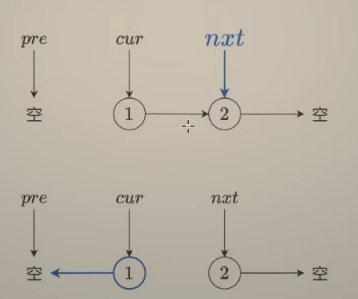
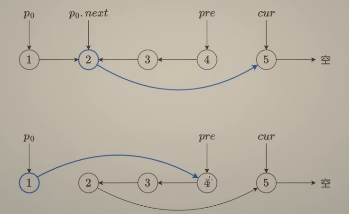
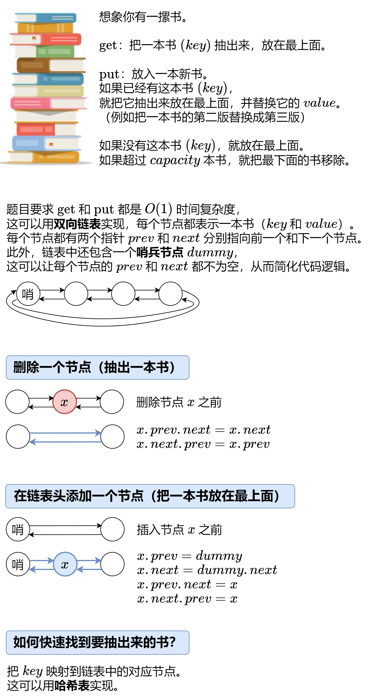

160. 相交链表
给你两个单链表的头节点 headA 和 headB ，请你找出并返回两个单链表相交的起始节点。如果两个链表不存在相交节点，返回 null 。
- 思路：初始化两个指针 pA 和 pB，分别指向 headA 和 headB。
同时移动 pA 和 pB，每次各移动一步。
当 pA 到达链表 A 的末尾时，将其重定向到 headB；同理，当 pB 到达链表 B 的末尾时，将其重定向到 headA。
如果 pA 和 pB 相遇，则该节点就是相交节点；如果它们都到达末尾（即 null），则说明没有相交。
```js
var getIntersectionNode = function (headA, headB) {
    if (!headA || !headB) return null;
    let pA = headA, pB = headB;
    while (pA !== pB) {
        pA = pA === null ? headB : pA.next;
        pB = pB === null ? headA : pB.next;
    }
    return pA;
};
```
206. 反转链表
给你单链表的头节点 head ，请你反转链表，并返回反转后的链表。
- 思路：初始化三个指针 prev、curr 和 next，分别指向 null、head 和 head.next。
遍历链表，将 curr.next 指向 prev，然后将 prev、curr 和 next 分别向右移动一步。
重复上述步骤，直到 curr 为 null。
返回 prev，即为反转后的链表头节点。
```js
var reverseList = function (head) {
    let prev = null, curr = head, next = null;
    while (curr !== null) {
        next = curr.next;
        curr.next = prev;
        prev = curr;
        curr = next;
    }
    return prev;
};
```
234. 回文链表
给你一个单链表的头节点 head ，请你判断该链表是否为回文链表。如果是，返回 true ；否则，返回 false 。
- 快慢指针 + 反转后半部分 再去比较 空间复杂度是 O(1)；也可以是遍历完一遍链表存在数组里再用双指针比较 这样的话空间复杂度是O(n)
```js
var isPalindrome = function (head) {
    if (!head || !head.next) return true;
    let slow = head, fast = head;
    while (fast && fast.next) {
        slow = slow.next;
        fast = fast.next.next;
    }
    let pre = null, cur = slow, next = null;
    while (cur) {
        next = cur.next;
        cur.next = pre;
        pre = cur;
        cur = next;
    }
    const reversedHead = pre;

    let p1 = head, p2 = reversedHead;
    while (p2) {
        if (p1.val !== p2.val) return false;
        p1 = p1.next;
        p2 = p2.next;
    }
    return true;
};
```

141. 环形链表
给你一个链表的头节点 head ，判断链表中是否有环。

如果链表中有某个节点，可以通过连续跟踪 next 指针再次到达，则链表中存在环。 为了表示给定链表中的环，评测系统内部使用整数 pos 来表示链表尾连接到链表中的位置（索引从 0 开始）。注意：pos 不作为参数进行传递 。仅仅是为了标识链表的实际情况。

如果链表中存在环 ，则返回 true 。 否则，返回 false 。
- 直接用快慢指针，如果有环，快慢指针最终会相遇
```js
var hasCycle = function (head) {
    let fast = head, slow = head;
    while (fast && fast.next) {
        fast = fast.next.next;
        slow = slow.next;
        if (slow === fast) return true;
    }
    return false;
};
```
142. 环形链表 II
给定一个链表的头节点  head ，返回链表开始入环的第一个节点。 如果链表无环，则返回 null。

如果链表中有某个节点，可以通过连续跟踪 next 指针再次到达，则链表中存在环。 为了表示给定链表中的环，评测系统内部使用整数 pos 来表示链表尾连接到链表中的位置（索引从 0 开始）。如果 pos 是 -1，则在该链表中没有环。注意：pos 不作为参数进行传递，仅仅是为了标识链表的实际情况。

不允许修改 链表。
- 快慢指针相遇后，将慢指针指向头节点，快指针指向相遇点，然后两个指针同时移动一步，直到它们再次相遇，相遇点就是入环的第一个节点。
```js
var detectCycle = function (head) {
    let fast = head, slow = head;
    while (fast && fast.next) {
        slow = slow.next;
        fast = fast.next.next;
        if (slow === fast) {
            while (slow !== head) {
                slow = slow.next;
                head = head.next;
            }
            return slow;
        }
    }

    return null;
};
```
21. 合并两个有序链表
将两个升序链表合并为一个新的 升序 链表并返回。新链表是通过拼接给定的两个链表的所有节点组成的。 
- 思路是类似于归并排序
```js
var mergeTwoLists = function (list1, list2) {
    const dummy = new ListNode(-1);
    let cur = dummy;
    while (list1 && list2) {
        if (list1.val < list2.val) {
            cur.next = list1;
            list1 = list1.next;
        }
        else {
            cur.next = list2;
            list2 = list2.next;
        }
        cur = cur.next;
    }
    cur.next = list1 || list2;
    return dummy.next;
};
```

19. 删除链表的倒数第 N 个结点
给你一个链表，删除链表的倒数第 n 个结点，并且返回链表的头结点。
- 思路：快指针先走N步，然后和慢指针一起往后走到底，当 fast 走到末尾时，slow 正好指向倒数第 n+1 个节点，直接 slow.next = slow.next.next 即可删除倒数第 n 个节点。
```js
var removeNthFromEnd = function (head, n) {
    const dummy = new ListNode(-1);
    dummy.next = head;
    let fast = dummy, slow = dummy;
    for (let i = 0; i < n; i++) {
        if (!fast) return head;
        fast = fast.next;
    }
    while (fast && fast.next) {
        fast = fast.next;
        slow = slow.next;
    }
    slow.next = slow.next.next;
    return dummy.next;
};
```
24. 两两交换链表中的节点
给你一个链表，两两交换其中相邻的节点，并返回交换后链表的头节点。你必须在不修改节点内部的值的情况下完成本题（即，只能进行节点交换）。
- 递归调用法:既然是1-2-3-4变成2-1-4-3，那么可以用递归去两两解决问题，初始化first=head,seond=head.next,但是实际上first.next应该指向第三个值了，也就是原本的second.next,而原本second.next应该指向前面
```js
var swapPairs = function (head) {
    if (!head || !head.next) return head;
    const first = head;
    const second = head.next;

    first.next = swapPairs(second.next);
    second.next = first;

    return second;
};
```
- 迭代法：
使用虚拟头节点（dummy）：简化头节点的交换操作。

维护三个指针：

prev：指向当前要交换的两个节点的前一个节点。

first：指向第一个要交换的节点。

second：指向第二个要交换的节点。

交换过程：

prev.next 指向 second。

first.next 指向 second.next。

second.next 指向 first。

移动指针：

prev 移动到 first（因为 first 已经是交换后的第二个节点）。

```js
var swapPairs = function (head) {
    const dummy = new ListNode(-1);
    dummy.next = head;
    let prev = dummy;
    while (prev.next && prev.next.next) {
        const first = prev.next;
        const second = prev.next.next;
        prev.next = second;
        first.next = second.next;
        second.next = first;
        prev = first;
    }
    return dummy.next;
};
```
148. 排序链表
给你链表的头结点 head ，请将其按 升序 排列并返回 排序后的链表 。
- 分割链表：每次找到链表的中点需要 O(n) 时间（通过快慢指针）。

递归排序：每次递归将链表分成两半，递归深度为 O(log n)。

合并链表：合并两个有序链表的时间是 O(n)。

```js
var sortList = function (head) {
    if (!head || !head.next) return head;
    let slow = head, fast = head, prev = null;
    while (fast && fast.next) {
        prev = slow;
        slow = slow.next;
        fast = fast.next.next;
    }
    prev.next = null;
    const left = sortList(head);
    const right = sortList(slow);
    return merge(left, right);
};
function merge(list1, list2) {
    if (!list1) return list2;
    else if (!list2) return list1;
    else if (list1.val < list2.val) {
        list1.next = merge(list1.next, list2);
        return list1;
    }
    else {
        list2.next = merge(list2.next, list1);
        return list2;
    }
}
```
138：复制带随机指针的链表（Copy List with Random Pointer）
题目描述：
给定一个链表的头节点 head，链表的每个节点除了 val 和 next 指针外，还有一个 random 指针，它可能指向链表中的任意节点，也可能为 null。
要求：深拷贝这个链表，并返回新链表的头节点。
-  第一次遍历：创建所有新节点，并建立原节点到新节点的映射 第二次遍历：设置新链表的next和random指针
```js 
var copyRandomList = function (head) {
    if (!head) return null;
    const map = new Map();

    let curr = head;
    while (curr) {
        map.set(curr, new Node(curr.val));
        curr = curr.next;
    }

    curr = head;
    while (curr) {
        map.get(curr).next = map.get(curr.next) || null;
        map.get(curr).random = map.get(curr.random) || null;
        curr = curr.next;
    }

    return map.get(head)
};
```
23. 合并 K 个升序链表

请你将所有链表合并到一个升序链表中，返回合并后的链表。
- 分治法：将 k 个链表分成两半，递归合并，最后合并两个有序链表。

```js
var mergeKLists = function (lists) {
    if (!lists || lists.length === 0) return null;

    return mergeLists(lists, 0, lists.length - 1);
};

function mergeLists(lists, left, right) {
    if (left === right) return lists[left];

    const mid = (left + right) >>> 1;
    const l1 = mergeLists(lists, left, mid);
    const l2 = mergeLists(lists, mid + 1, right);

    return merge2Lists(l1, l2);
}

function merge2Lists(list1, list2) {
    const dummy = new ListNode(-1);

    let cur = dummy;
    while (list1 && list2) {
        if (list1.val < list2.val) {
            cur.next = list1;
            list1 = list1.next;
        } else {
            cur.next = list2;
            list2 = list2.next;
        }
        cur = cur.next;
    }

    cur.next = list1 || list2;

    return dummy.next;
}
```
25. K 个一组翻转链表
给你链表的头节点 head ，每 k 个节点一组进行翻转，请你返回修改后的链表。

k 是一个正整数，它的值小于或等于链表的长度。如果节点总数不是 k 的整数倍，那么请将最后剩余的节点保持原有顺序。

你不能只是单纯的改变节点内部的值，而是需要实际进行节点交换。
- k个一组的进行翻转，每次翻转完将p0.next的next指向current，p0的next指向pre


```js
var reverseKGroup = function (head, k) {
    let n = 0;
    for (let cur = head; cur; cur = cur.next) n++;
    
    const dummy = new ListNode(0, head);
    let p0 = dummy;
    let pre = null;
    let cur = head;
    for (; n >= k; n -= k) {
        for (let i = 0; i < k; i++) {
            const next = cur.next;
            cur.next = pre;
            pre = cur;
            cur = next;
        }

        const next = p0.next;
        p0.next.next = cur;
        p0.next = pre;
        p0 = next;
    }
    
    return dummy.next;
};
```
146. LRU 缓存
请你设计并实现一个满足  LRU (最近最少使用) 缓存 约束的数据结构。
实现 LRUCache 类：
LRUCache(int capacity) 以 正整数 作为容量 capacity 初始化 LRU 缓存
int get(int key) 如果关键字 key 存在于缓存中，则返回关键字的值，否则返回 -1 。
void put(int key, int value) 如果关键字 key 已经存在，则变更其数据值 value ；如果不存在，则向缓存中插入该组 key-value 。如果插入操作导致关键字数量超过 capacity ，则应该 逐出 最久未使用的关键字。
函数 get 和 put 必须以 O(1) 的平均时间复杂度运行。

- 哈希表 + 双向链表 

```js
class Node {
    constructor(key, val) {
        this.key = key;
        this.val = val;
        this.prev = null;
        this.next = null;
    }
}

class LRUCache {
    constructor(capacity) {
        this.capacity = capacity;
        this.map = new Map();
        this.head = new Node(-1, -1);
        this.tail = new Node(-1, -1);
        this.head.next = this.tail;
        this.tail.prev = this.head;
    }

    addToHead(node) {
        node.next = this.head.next;
        node.prev = this.head;
        this.head.next.prev = node;
        this.head.next = node;
    }

    removeNode(node) {
        node.prev.next = node.next;
        node.next.prev = node.prev;
    }

    moveToHead(node) {
        this.removeNode(node);
        this.addToHead(node);
    }

    removeTail() {
        const tailNode = this.tail.prev;
        this.removeNode(tailNode);
        return tailNode.key;
    }

    get(key) {
        if (!this.map.has(key)) return -1;
        const node = this.map.get(key);
        this.moveToHead(node);
        return node.val;
    }

    put(key, value) {
        if (this.map.has(key)) {
            const node = this.map.get(key);
            node.val = value;
            this.moveToHead(node);
        } else {
            const newNode = new Node(key, value);
            this.map.set(key, newNode);
            this.addToHead(newNode);
            if (this.map.size > this.capacity) {
                const tailKey = this.removeTail();
                this.map.delete(tailKey);
            }
        }
    }
}
```
