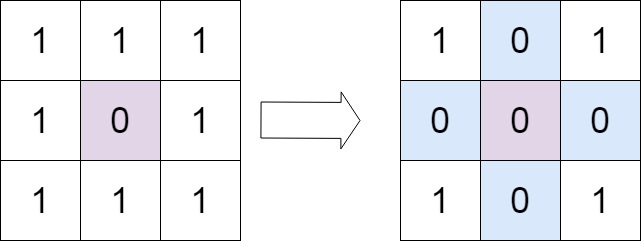
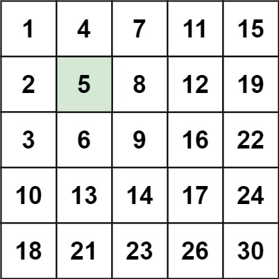

73. 矩阵置零
给定一个 m x n 的矩阵，如果一个元素为 0 ，则将其所在行和列的所有元素都设为 0 。请使用 原地 算法。

- 先去遍历看哪些行和列有0
- 然后再去遍历，把有0的行和列的元素都设为0

```js
var setZeroes = function (matrix) {
    const m = matrix.length, n = matrix[0].length;
    const rows = new Set(), cols = new Set();
    for (let i = 0; i < m; i++) {
        for (let j = 0; j < n; j++) {
            if (matrix[i][j] === 0) {
                rows.add(i);
                cols.add(j);
            }
        }
    }

    for (let i = 0; i < m; i++) {
        for (let j = 0; j < n; j++) {
            if (rows.has(i) || cols.has(j)) {
                matrix[i][j] = 0;
            }
        }
    }
    return matrix;
};
```
48. 旋转图像
给定一个 n × n 的二维矩阵 matrix 表示一个图像。请你将图像顺时针旋转 90 度。

你必须在 原地 旋转图像，这意味着你需要直接修改输入的二维矩阵。请不要 使用另一个矩阵来旋转图像。

- 顺时针旋转90度： 对角线翻转。行逆置

```js
var rotate = function (matrix) {
    // 对角线翻转，行逆置
    const n = matrix.length;
    for (let i = 0; i < n; i++) {
        for (let j = 0; j < i; j++) {
            const tmp = matrix[i][j];
            matrix[i][j] = matrix[j][i];
            matrix[j][i] = tmp;
        }
    }
    for (const row of matrix) row.reverse();
};
```
240. 搜索二维矩阵 II
编写一个高效的算法来搜索 m x n 矩阵 matrix 中的一个目标值 target 。该矩阵具有以下特性：

每行的元素从左到右升序排列。
每列的元素从上到下升序排列。

- 从右上角看 是一个二叉搜索树，如果找的数字比当前数字小，那么就向左走；如果找的数字比当前数字大，那么就向下走。

```js
var searchMatrix = function (matrix, target) {
    let m = matrix.length, n = matrix[0].length;
    if (!matrix || n === 0 || m === 0) return false;

    let row = 0, col = n - 1;

    while (row < m && col >= 0) {
        const current = matrix[row][col];
        if (current === target) return true;
        else if (current > target) col--;
        else row++;
    }
    return false;
};
```
54. 螺旋矩阵
给你一个 m 行 n 列的矩阵 matrix ，请按照 顺时针螺旋顺序 ，返回矩阵中的所有元素。

- 模拟，从左到右，从上到下，从右到左，从下到上
```js
var spiralOrder = function(matrix) {
    if (!matrix.length || !matrix[0].length) return [];
    const result = [];
    let top = 0, bottom = matrix.length - 1;
    let left = 0, right = matrix[0].length - 1;
    
    while (top <= bottom && left <= right) {
        // 从左到右遍历上边界
        for (let i = left; i <= right; i++) {
            result.push(matrix[top][i]);
        }
        top++;
        
        // 从上到下遍历右边界
        for (let i = top; i <= bottom; i++) {
            result.push(matrix[i][right]);
        }
        right--;
        
        if (top > bottom) break; // 防止单行情况
        // 从右到左遍历下边界
        for (let i = right; i >= left; i--) {
            result.push(matrix[bottom][i]);
        }
        bottom--;
        
        if (left > right) break; // 防止单列情况
        // 从下到上遍历左边界
        for (let i = bottom; i >= top; i--) {
            result.push(matrix[i][left]);
        }
        left++;
    }
    
    return result;
};
```
- 用一个数组来维护方向，访问过的元素做标记，如果碰到了边界或者是已访问的元素，那么就改变为下一个方向

```js
var spiralOrder = function(matrix) {
    if (!matrix.length || !matrix[0].length) return [];
    const DIRS = [[0, 1], [1, 0], [0, -1], [-1, 0]]; // 右、下、左、上
    const m = matrix.length, n = matrix[0].length;
    const ans = Array(m * n);
    let i = 0, j = 0, di = 0;
    for (let k = 0; k < m * n; k++) {
        ans[k] = matrix[i][j];
        matrix[i][j] = Infinity; // 标记已访问
        const x = i + DIRS[di][0];
        const y = j + DIRS[di][1];
        // 遇到边界或者当前元素已访问，则改变为下一个方向
        if (x < 0 || x >= m || y < 0 || y >= n || matrix[x][y] === Infinity) {
            di = (di + 1) % 4; // 改变方向
        }
        i += DIRS[di][0];
        j += DIRS[di][1];
    }
    return ans;
};
```
