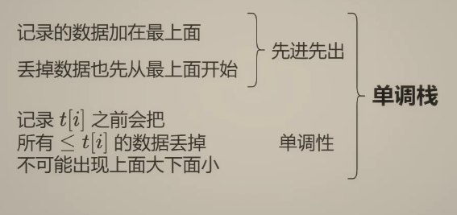
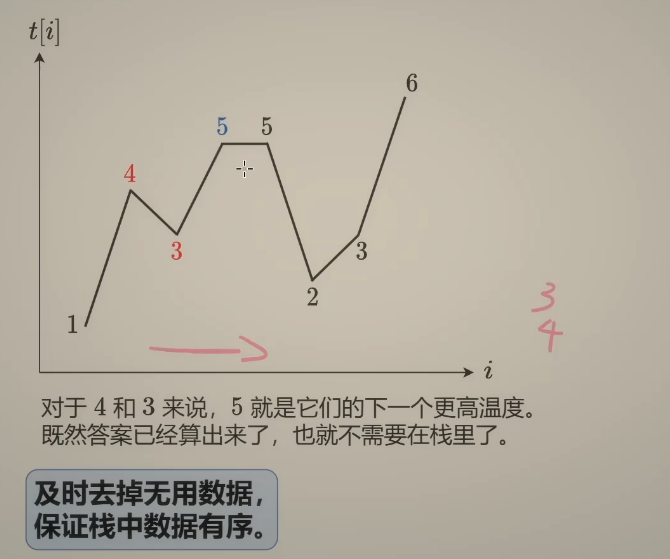
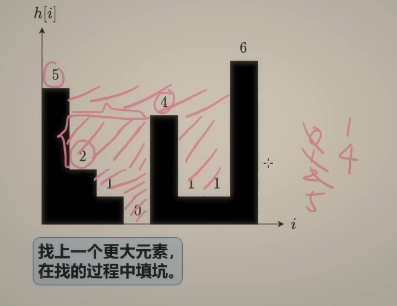

20. 有效的括号
给定一个只包括 '('，')'，'{'，'}'，'['，']' 的字符串 s ，判断字符串是否有效。

有效字符串需满足：

左括号必须用相同类型的右括号闭合。
左括号必须以正确的顺序闭合。
每个右括号都有一个对应的相同类型的左括号。
- 遇到左括号就入栈，如果最后栈里有多的括号 或者 栈顶左括号与当前右括号不匹配，则false
```js
var isValid = function (s) {
    const stack = [];
    const bracketMap = {
        ')': '(',
        '}': '{',
        ']': '['
    }
    for (let i = 0; i < s.length; i++) {
        const char = s[i];
        if (char === '(' || char === '{' || char === '[') {
            stack.push(char);
        } else {
            if (stack.length === 0 || stack.pop() !== bracketMap[char]) return false;
        }
    }
    return stack.length === 0;
};
```
394. 字符串解码

编码规则为: k[encoded_string]，表示其中方括号内部的 encoded_string 正好重复 k 次。注意 k 保证为正整数。

你可以认为输入字符串总是有效的；输入字符串中没有额外的空格，且输入的方括号总是符合格式要求的。

此外，你可以认为原始数据不包含数字，所有的数字只表示重复的次数 k ，例如不会出现像 3a 或 2[4] 的输入。

- 栈模拟经过每一个元素：数字、字母、[、]
```js
var decodeString = function (s) {
    const stack = [];
    let currentStr = '';
    let currentNum = 0;
    for (const char of s) {
        if (!isNaN(char)) currentNum = currentNum * 10 + parseInt(char);
        else if (char === '[') {
            stack.push(currentStr);
            stack.push(currentNum);
            currentNum = 0;
            currentStr = '';
        } else if (char === ']') {
            const num = stack.pop();
            const prevStr = stack.pop();
            currentStr = prevStr + currentStr.repeat(num);
        } else currentStr += char;
    }
    return currentStr;
};
```

#### 单调栈

739. 每日温度
给定一个整数数组 temperatures ，表示每天的温度，返回一个数组 answer ，其中 answer[i] 是指对于第 i 天，下一个更高温度出现在几天后。如果气温在这之后都不会升高，请在该位置用 0 来代替。

**单调栈**
- 栈里只存储元素的下标，元素下标对应的温度是严格递增的，如果栈中存在元素，并且当前温度比栈顶元素下标对应的温度高，那么不符合严格递增的条件，需要弹出栈顶元素，直到栈为空或者栈顶元素下标对应的温度大于当前温度。  反之，则当前要得到的下一个高温在几天后的结果 就等于当前栈顶元素减现在的下标，并且要把下标push进栈中

1. 栈中记录下一个更大元素的「候选项」的下标。

每次循环，我们可以在「候选项」中找到答案。

```js
var dailyTemperatures = function (temperatures) {
    const n = temperatures.length;
    const ans = Array(n).fill(0);
    const st = [];
    for (let i = n - 1; i >= 0; i--) {
        const t = temperatures[i];
        while (st.length && t >= temperatures[st[st.length - 1]]) st.pop();
        if (st.length) ans[i] = st[st.length - 1] - i;
        st.push(i);
    }
    return ans;
};
```
2. 
栈中记录还没算出下一个更大元素的那些数的下标。
```js
var dailyTemperatures = function (temperatures) {
    const n = temperatures.length;
    const ans = Array(n).fill(0);
    const st = [];
    for (let i = 0; i < n; i++) {
        const t = temperatures[i];
        while (st.length && t > temperatures[st[st.length - 1]]) {
            const j = st.pop();
            ans[j] = i - j;
        }
        st.push(i);
    }
    return ans;
};
```
42. 接雨水
给定 n 个非负整数表示每个宽度为 1 的柱子的高度图，计算按此排列的柱子，下雨之后能接多少雨水。

```js
var trap = function (height) {
    const n = height.length;
    let ans = 0;
    const st = [];
    for (let i = 0; i < n; i++) {
        while (st.length && height[i] >= height[st[st.length - 1]]) {
            const bottomH = height[st.pop()];
            if (st.length === 0) break;
            const left = st[st.length - 1];
            const dh = Math.min(height[left], height[i]) - bottomH;
            ans += dh * (i - left - 1)
        }
        st.push(i);
    }
    return ans;
};
```
分享一个简单易懂的思路，将实例图中的蓝色也看成实心的，算出每一层的面积，加起来，然后减去height的总和，剩下的就是水量。
定义一个双指针，以及层数h=1，双指针在两头往中间移动，只要指针大于等于h，就停下来
目的：当两边指针都停下来的时候，计算第一层的面积（直接左指针减右指针+1），然后h++计算第二层的面积，以此类推计算每一层的面积，然后用这个面积减去height的和，剩下的就是水量了
但是遇到层数特别高的就会超时了

```js
var trap = function(height) {
    const n = height.length;
    if (n === 0) return 0;

    let totalWater = 0;
    let layerArea = 0;
    let h = 1; // 当前层数
    const maxH = Math.max(...height); // 最高层数

    while (h <= maxH) {
        let left = 0;
        let right = n - 1;

        // 移动 left 到第一个 >= h 的位置
        while (left < n && height[left] < h) {
            left++;
        }

        // 移动 right 到第一个 >= h 的位置
        while (right >= 0 && height[right] < h) {
            right--;
        }

        if (left <= right) {
            layerArea += right - left + 1;
        }

        h++; // 进入下一层
    }

    // 总雨水 = 所有层的面积 - 柱子的总面积
    const sumHeight = height.reduce((acc, val) => acc + val, 0);
    totalWater = layerArea - sumHeight;

    return totalWater;
};
```
