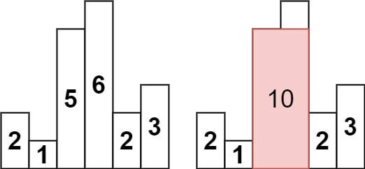

20. 有效的括号
给定一个只包括 '('，')'，'{'，'}'，'['，']' 的字符串 s ，判断字符串是否有效。

有效字符串需满足：

左括号必须用相同类型的右括号闭合。
左括号必须以正确的顺序闭合。
每个右括号都有一个对应的相同类型的左括号。
- 遇到左括号就入栈，如果最后栈里有多的括号 或者 栈顶左括号与当前右括号不匹配，则false
```js
var isValid = function (s) {
    const stack = [];
    const bracketMap = {
        ')': '(',
        '}': '{',
        ']': '['
    }
    for (let i = 0; i < s.length; i++) {
        const char = s[i];
        if (char === '(' || char === '{' || char === '[') {
            stack.push(char);
        } else {
            if (stack.length === 0 || stack.pop() !== bracketMap[char]) return false;
        }
    }
    return stack.length === 0;
};
```
394. 字符串解码

编码规则为: k[encoded_string]，表示其中方括号内部的 encoded_string 正好重复 k 次。注意 k 保证为正整数。

你可以认为输入字符串总是有效的；输入字符串中没有额外的空格，且输入的方括号总是符合格式要求的。

此外，你可以认为原始数据不包含数字，所有的数字只表示重复的次数 k ，例如不会出现像 3a 或 2[4] 的输入。

- 栈模拟经过每一个元素：数字、字母、[、]
- 处理数字字符：遇到数字时，累积计算多位数（如 "23" → 23）；currentNum = currentNum * 10 + parseInt(char)

- 遇到 [ 左括号：将当前字符串和数字压入栈；重置 currentStr 和 currentNum；开始记录新的嵌套字符串

- 遇到 ] 右括号：弹出栈顶数字作为重复次数 num；弹出栈顶字符串作为前缀 prevStr；将当前字符串重复 num 次并与前缀拼接

- 普通字母字符：直接追加到 currentStr
```js
var decodeString = function (s) {
    const stack = [];
    let currentStr = '';
    let currentNum = 0;
    for (const char of s) {
        if (!isNaN(char)) {
            currentNum = currentNum * 10 + parseInt(char);
        } else if (char = '[') {
            stack.push(currentNum);
            stack.push(currentStr);
            currentNum = 0;
            currentStr = '';
        } else if (char = ']') {
            const prevStr = stack.pop();
            const num = stack.pop();
            currentStr = prevStr + currentStr.repeat(num);
        } else {
            currentStr += char;
        }
    }
    return currentStr;
};
```

#### 单调栈

- 寻找边界：
找下一个更大/更小元素（如每日温度问题）。
找当前元素作为最大/最小值时的左右边界（如柱状图最大矩形问题）。

- 计算最值或面积：
利用找到的边界计算最大面积、最大宽度等（如接雨水、最大矩形问题）。
通常与区间最小值/最大值结合（如滑动窗口最大值）。

739. 每日温度
给定一个整数数组 temperatures ，表示每天的温度，返回一个数组 answer ，其中 answer[i] 是指对于第 i 天，下一个更高温度出现在几天后。如果气温在这之后都不会升高，请在该位置用 0 来代替。

**单调栈**
- 栈里只存储元素的下标，元素下标对应的温度是严格递增的，如果栈中存在元素，并且当前温度比栈顶元素下标对应的温度高，那么不符合严格递增的条件，需要弹出栈顶元素，直到栈为空或者栈顶元素下标对应的温度大于当前温度。  反之，则当前要得到的下一个高温在几天后的结果 就等于当前栈顶元素减现在的下标，并且要把下标push进栈中

1. 栈中存储的是尚未找到更高温度的天的索引

保持栈中索引对应的温度是单调递减的（栈顶温度最低）


```js
var dailyTemperatures = function(temperatures) {
    const n = temperatures.length;
    const ans = Array(n).fill(0);  // 初始化结果数组
    const st = [];                 // 单调栈（存储的是索引）
    
    for (let i = 0; i < n; i++) {
        const t = temperatures[i];  // 当前温度
        
        // 维护单调递减栈（栈顶到栈底温度递增）
        while (st.length && t > temperatures[st[st.length - 1]]) {
            const j = st.pop();     // 弹出栈顶元素（某天的索引）
            ans[j] = i - j;         // 计算等待天数
        }
        
        st.push(i);  // 将当前索引入栈
    }
    
    return ans;
};
```
2. 
栈中记录还没算出下一个更大元素的那些数的下标。
```js
var dailyTemperatures = function (temperatures) {
    const n = temperatures.length;
    const ans = Array(n).fill(0);
    const st = [];
    for (let i = 0; i < n; i++) {
        const t = temperatures[i];
        while (st.length && t > temperatures[st[st.length - 1]]) {
            const j = st.pop();
            ans[j] = i - j;
        }
        st.push(i);
    }
    return ans;
};
```
42. 接雨水
给定 n 个非负整数表示每个宽度为 1 的柱子的高度图，计算按此排列的柱子，下雨之后能接多少雨水。


<!-- 
    底部高度：弹出的栈顶元素高度

    左边界：新的栈顶元素

    右边界：当前遍历到的柱子

    积水高度：左右边界较小值 - 底部高度

    积水宽度：右边界索引 - 左边界索引 - 1
 -->
```js
var trap = function (height) {
    const n = height.length;
    let ans = 0;
    const st = [];
    for (let i = 0; i < n; i++) {
        while (st.length && height[i] >= height[st[st.length - 1]]) {
            const bottomH = height[st.pop()];
            if (st.length === 0) break;
            const left = st[st.length - 1];
            const dh = Math.min(height[left], height[i]) - bottomH;
            ans += dh * (i - left - 1)
        }
        st.push(i);
    }
    return ans;
};
```
分享一个简单易懂的思路，将实例图中的蓝色也看成实心的，算出每一层的面积，加起来，然后减去height的总和，剩下的就是水量。
定义一个双指针，以及层数h=1，双指针在两头往中间移动，只要指针大于等于h，就停下来
目的：当两边指针都停下来的时候，计算第一层的面积（直接左指针减右指针+1），然后h++计算第二层的面积，以此类推计算每一层的面积，然后用这个面积减去height的和，剩下的就是水量了
但是遇到层数特别高的就会超时了

```js
var trap = function(height) {
    const n = height.length;
    if (n === 0) return 0;

    let totalWater = 0;
    let layerArea = 0;
    let h = 1; // 当前层数
    const maxH = Math.max(...height); // 最高层数

    while (h <= maxH) {
        let left = 0;
        let right = n - 1;

        // 移动 left 到第一个 >= h 的位置
        while (left < n && height[left] < h) {
            left++;
        }

        // 移动 right 到第一个 >= h 的位置
        while (right >= 0 && height[right] < h) {
            right--;
        }

        if (left <= right) {
            layerArea += right - left + 1;
        }

        h++; // 进入下一层
    }

    // 总雨水 = 所有层的面积 - 柱子的总面积
    const sumHeight = height.reduce((acc, val) => acc + val, 0);
    totalWater = layerArea - sumHeight;

    return totalWater;
};
```
84. 柱状图中最大的矩形
给定 n 个非负整数，用来表示柱状图中各个柱子的高度。每个柱子彼此相邻，且宽度为 1 。

求在该柱状图中，能够勾勒出来的矩形的最大面积。

- 维护一个单调递增的栈，用于快速找到每个柱子左右两边第一个比它矮的柱子。
```js
var largestRectangleArea = function(heights) {
    let maxArea = 0;
    const stack = [];
    heights = [0, ...heights, 0]; // 前后添加哨兵节点
    
    for (let i = 0; i < heights.length; i++) {
        // 当前柱子高度小于栈顶柱子高度时，计算栈顶柱子的最大面积
        while (stack.length && heights[i] < heights[stack[stack.length - 1]]) {
            const h = heights[stack.pop()]; // 弹出栈顶柱子的高度
            const w = i - stack[stack.length - 1] - 1; // 计算宽度
            maxArea = Math.max(maxArea, h * w); // 更新最大面积
        }
        stack.push(i); // 当前索引入栈
    }
    
    return maxArea;
};
```

#### 最小栈
155. 最小栈
设计一个支持 push ，pop ，top 操作，并能在常数时间内检索到最小元素的栈。

实现 MinStack 类:

MinStack() 初始化堆栈对象。
void push(int val) 将元素val推入堆栈。
void pop() 删除堆栈顶部的元素。
int top() 获取堆栈顶部的元素。
int getMin() 获取堆栈中的最小元素。

- 用一个辅助栈的方式来进行存储，具体是使用一个二元组，第一个值表示当前元素的值，第二个值表示在当前情况下的最小值
```js
class MinStack {
    constructor() {
        this.stack = [[0, Infinity]];
    }

    getMin() {
        return this.stack[this.stack.length - 1][1];
    }

    push(val) {
        this.stack.push([val, Math.min(this.getMin(), val)]);
    }

    pop() {
        this.stack.pop();
    }

    top() {
        return this.stack[this.stack.length - 1][0];
    }
}
```

